# Git - a distributed version control system

**Last update**: 20251105-3


### Table of Contents
1. [Introduction to version control system](#introduction.to.version.control.system)

2. [Git design and main goals](#git.design.and.main.goals)

    * [The first Git repository from scratch](#the.first.git.repository.from.scratch)  		

3. [Configuring Git](#configuring.git)

    * [Configuration variables](#configuration.variables)  		
    * [Configuration files](#configuration.files)  		

4. [Typical Git workflows](#typical.git.workflows)

	* [Quick setup of standalone local repository](#quick.setup.of.standalone.local.repository)
	* [Quick setup of local and remote online repository](#quick.setup.of.local.and.remote.online.repository)
	* [Transfer](#transfer)
	* [Collaborating online using GitHub](#collaborating.online.using.github)
	* [Collaborating locally](#collaborating.locally)
	* [Developing in parallel on different operating systems](#developing.in.parallel.on.different.operating.systems)
	* [Combining changes: merge, rebase and cherry-pick](#combining.changes.merge.rebase.and.cherry.pick)
		* [a) merge](#merge)
		* [b) rebase](#rebase)
		* [c) cherry-pick](#cherry-pick) 
	* [Resolving merging conflicts](#resolving.merging.conflicts)
6. [Executive and exemplary summary of main Git commands ](#executive.and.exemplary.summary.of.main.git.commands)
	* [The most commonly used Git commands](#the.most.commonly.used.git.commands)
	* [Git examples](#git.examples)
7. [Git how-tos](#git.how.tos)
8. [Further reading](#further.reading)

   


### 1. Introduction to version control system <a name="introduction.to.version.control.system"></a>
When developing a source code in a particular programming language, writing a thesis, etc., one frequently encounters the requirements which deal with the specific version of that project, i.e. with the status of all of its files at a specified time. One example is creating a backup of current version of all files in the project, before progressing with a further development. Another example is a request to revert back the latest changes introduced in the project, because it turned out those changes were erroneous. Frequently, one wants to be able to develop concurrently in parallel multiple versions of the same project, maintaining in parallel the main line of development and the separate line(s) in which all new features are being tested. Finally, especially when working on a large-scale projects, it is important to set up the workflow for project development in such a way so that different individuals can collaborate on it.

All these requests can be attained with the software category dubbed _version control system_. Currently, by far the most popular software in this category is an open-source distributed version control system called _Git_, and in this lecture it is used exclusively.

Conceptually, after a change has been introduced in the repository (e.g. an existing file was modified or deleted, a new file was created, etc.) one can make a "named snapshot" of the current status of all files in the repository. To illustrate these steps, we start off from the terminal:

```bash
# create a new directory for the project:
$ mkdir someDir
$ cd someDir

# step 1: make two new files:
$ touch file1 file2 

# step 2: edit "file1" and add a new "file3", "file2" remains unchanged:
$ echo "some text" >> file1
$ touch file3

# step 3: add new subdirectory and a new file named "file4" in it:
$ mkdir subDir
$ cd subDir
$ touch file4
```

After all 3 steps were performed, we would like to be able any time later to recover the status of all files in the top-level directory "someDir", as they were in each of these steps.

Schematically, the above example is illustrated with the following diagram (made using open-source [Mermaid](https://mermaid.js.org/)): 

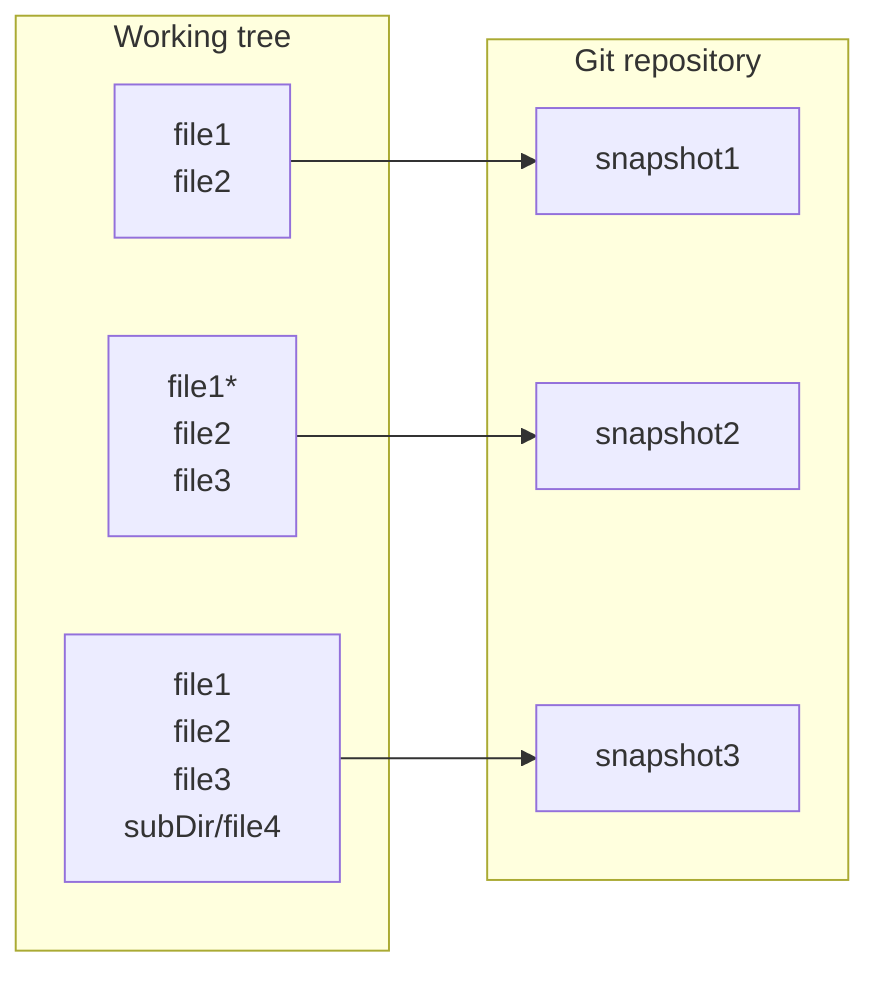

To each working step in this example, we have allocated a "named snapshot" to denote the specific status of all files in the repository at the time that working step was made. The version control system enables us to recover the status of the repository at a previous time simply by using a "named snapshot", or _commit identifier_ in a more technical language, that was made at that time. A particular version of the source code is also called _revision_, and in Git different revisions can be retrieved through corresponding commit identifiers.

Another important conceptual goal is to organize the exchange of information between different repositories. This is particularly important when two or more people collaborate on the same project. In that case, the central repository is defined, typically online on a server, and each collaborator has a copy (or _clone_) of that central repository. That situation is illustrated with the following diagram:

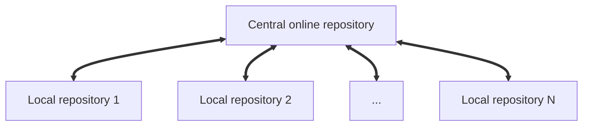

For instance, when there is a change in the "Local repository 1", the owner of that local repository propagates (or _pushes_) that change in the "Central online repository", from where it can be taken (or _pulled_) into the remaining local repositories of other collaborators working on the same project. In this respect, "Central online repository" serves as a gate through which developers can exchange updates on the joint project. Central repositories are typically only "bare" repositories, i.e. they do not have a working tree and are used only to share changes between developers. In Git, by design each local repository is an exact copy of the central repository. To maintain central repository sane, it is important to set among developers a workflow with an authorization procedure, which typically amounts to code review and approving _pull requests_, before changes can be incorporated into the central repository.


### 2. Git design and main goals <a name="git.design.and.main.goals"></a>

To leading order, and covering only its essential features, Git design can be summarized with the following diagram:


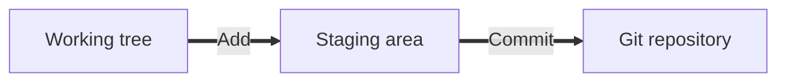

**Working tree** denotes the current collection of all physical files in a directory, after that directory was placed under the Git version control system using command **git init**. From Git perspective, each file in the working tree can have one of these states:

* _untracked_ &mdash; the file is in the working tree, but was never either added to the staging area or committed to the Git repository;
* _tracked_ &mdash; the file that was once added to the staging area or committed;
* _staged_ &mdash; the file is added to the staging area, but not yet committed to the Git repository;
* _modified_ &mdash; the file is tracked already, has been modified afterward, but that modification is not staged yet;
* _ignored_ &mdash; these are files which were added to the special file _.gitignore_ (discussed in detail later). Although these files physically exist in the working tree, Git will not report them as _untracked_. 


**Staging area** represents an intermediate step towards making the changes introduced in the working tree final and permanently added in the Git repository. Staging area is an important part of Git design and it serves few important purposes. Firstly, it distills trivial from important changes in the working tree and permanently records in repository only important changes. Secondly, it enables a user to add multiple files to the staging area, and commit all files accumulated in the staging area to Git repository in one go with the same commit identifier. Files from working tree are added to the staging area with the Git command **git add**.    


**Git repository** comprises a working tree and information about all changes made in the working tree. Git keeps track of all changes in a directory added to its revision in the hidden subdirectory named _.git_ . One can think of a Git repository being the content of a subdirectory _.git_ . This subdirectory contains the complete history of the repository, and the repository can be thought of as a collection of all files and all changes of each file (i.e. complete history of all files). The user works in the working tree and, at specific intervals (typically after important development has been accomplished), commits the changes in the repository. Then, at any point afterward, solely from information stored in the Git repository, a user can restore the status of the working tree as it was at any particular commit by using the commit identifier. It is the user's responsibility to commit changes in the repository each time an important change in the working tree has been achieved. Files from the staging area are added permanently to the Git repository with the Git command **git commit**. Deleting the Git repository is equivalent to executing **rm -rf .git** command.


**Commit** identifier corresponds conceptually to the "named snapshot" of the content of all files in the working tree at the time when that commit was made using the Git command **git commit**. After this command was executed, the staging area was emptied, and we have the following situation in the repository:

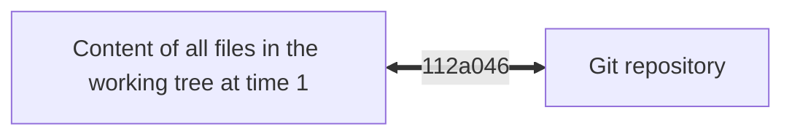

If a user continues to work on files in the working tree, adds at some point later changes to the staging area and commits them, we have

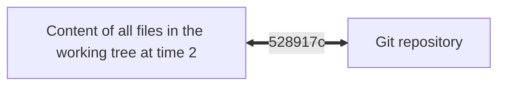

Commit identifiers (```112a046``` and ```528917c``` in the diagrams above) are not randomly generated by Git. Instead, they are generated via very sophisticated algorithms using a _hash function_, which maps data of arbitrary size to fixed-size values. Git uses hash function known as **SHA-1 (Secure Hash Algorithm 1)**, which generates as a commit identifier a hexadecimal number 40 digits long from several independent sources related to that particular commit (for instance, content of all files, directories, the name of committer, the content of commit message, etc.). In practice, however, one can refer uniquely to commits by using the shortened form, as was done above. For completeness' sake, in this example, the relation between the short and full form of commit identifiers is:

```bash
112a046 <=> 112a046a0cb834a1c50ff7b2cd98b6ebf6915cbd 
528917c <=> 528917c49e5dfb581a3e4cd906df86faf2f50961
```

Of course, one does not need to memorize these cryptic commit identifiers. While it is simply impossible to memorize the full form even for a single commit, memorizing short form beyond a few commits is not easy either. And in fact, memorizing commits identifiers is not needed at all, because Git allows specifying a human-readable message when a new commit is made, with the command **git commit -m "some message"**. At any point later, both commit identifiers and the corresponding human-readable messages can be retrieved by using commands **git log** and/or **git reflog**.

Commit identifier works both directions: one uses commit identifier to record the status of all files at a given time in the repository, and then at some pointer later when the content of files in working tree changes, one can use that same commit identifier to recover the status of all files at the time that commit identifier was created. For simplicity, in what follows next we will refer to commit identifier simply as _commit_.


**Branches** are symbolic names for an independent *line of development* in the Git repository. One can think of a branch as being the named pointer to the commit. When a new commit is made within that branch, a branch name automatically advances to that new commit. Diagrammatically, if one is developing in the branch named "main", it looks as follows after 3 commits were made at times t0 < t1 < t2:

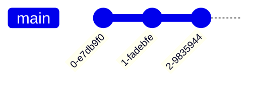

The branch named pointer "main" automatically advances, pointing to newer and newer commits. In the above diagram, "main" corresponds to the latest commit created at time t2.

Branches enable a user to work in parallel on different versions of the collection of all files in the working tree. It is possible to switch from one branch to another, i.e. from one state of all files to another state, by using Git command **git checkout**. Before switching from one branch to another, it is mandatory to commit, revert or stash all changes in the current branch, otherwise the command **git checkout** will fail. The first time this command is used a new branch is created.

#### The first Git repository from scratch <a name="the.first.git.repository.from.scratch"></a>

All Git concepts introduced in this section are now supported with concrete step-by-step example. First, one creates a new directory and places it under Git version control system with **git init** command: 

```bash
$ mkdir someDir
$ cd someDir
$ git init 
Initialized empty Git repository in /home/abilandz/someDir/.git/
```

To inspect the status of all files in the working tree at any time, the command **git status** can be used:

```bash
$ git status
On branch master

No commits yet

nothing to commit (create/copy files and use "git add" to track)
```

In this example, Git has used "master" as the name for the initial (default) branch. If necessary, the just-created branch can be renamed via this command:

```bash
$ git branch -m main
$ git status
On branch main

No commits yet

nothing to commit (create/copy files and use "git add" to track)
```

Continuing with the above example, we create in the default branch "main" a new file. After editing that file, in the first step that file needs to be staged, and in the second step all modifications in that file are committed permanently to the Git repository:

```bash
# create a new file:
$ touch someFile.txt

# edit the file:
$ echo "some text" >> someFile.txt

# add the modified file to the staging area:
$ git add someFile.txt

# make the first commit in repository for "main" branch:
$ git commit -m "first commit"
[main (root-commit) 4d8b7b8] first commit
 1 file changed, 1 insertion(+)
 create mode 100644 someFile.txt 

# Remark: "100644" stands for "Regular non-executable file" 
#         "100755" stands for "Regular executable file", etc. 

# check the status:
$ git status
On branch main
nothing to commit, working tree clean
```

We can now continue to develop the file "someFile.txt" in two independent branches. The new branch named "devel" is made using the command **git checkout -b** _newBranchName_ (newer Git versions also support **git switch -c** _newBranchName_):

```bash 
# make new branch and switch to it:
$ git checkout -b devel
Switched to a new branch 'devel'

# enlist all branches in the current repository:
$ git branch
* devel
  main
```

The command **git branch** lists all branches in the current Git repository. The asterisk ```*``` is prepended to the branch name on which we are currently developing. We now continue the development on "devel" branch:

```bash
$ echo "adding some new text" >> someFile.txt

# check the content of file on "devel" branch:
$ cat someFile.txt
someText
adding some new text
```

After we are satisfied with new additions in the file, we can commit them, but this time on "devel" branch:

```bash
$ git add someFile.txt
$ git commit -m "example commit on devel branch"
[devel e8e9a54] example commit on devel branch
1 file changed, 1 insertion(+)
```

And now comes the important point. We can now switch back to the default branch "main" and inspect the content of "someFile.txt" on that branch:

```bash
$ git checkout main
Switched to branch 'main'

# check the content of file on "main" branch:
$ cat someFile.txt
someText
```

The work done on the file "someFile.txt" in the "devel" branch did not affect the content of that file in the "main" branch, and vice versa. It is in this sense that branches enable concurrent and independent development within the same Git repository. 

At the most elementary level, one has the default branch typically named "main" or "master" for the main line of development and a separate branch named "devel" for testing new features, schematically:


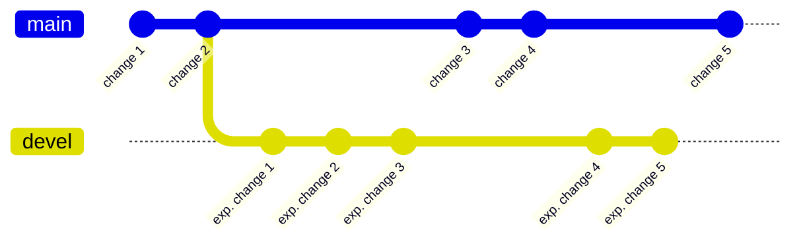

After the tests in "devel" branch were successful, all new development from that "devel" branch can be merged into the "main" branch:

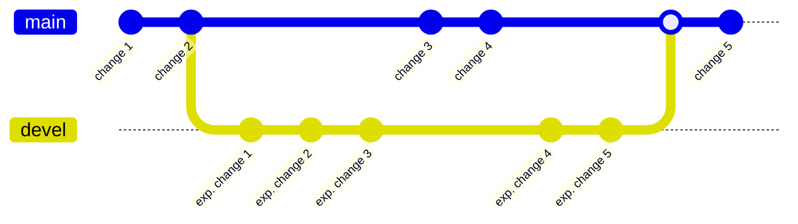

How such merging is performed in practice using Git commands is discussed in detail and supported with concrete examples in later section "[Combining changes: merge, rebase and cherry-pick](#combining.changes.merge.rebase.and.cherry.pick)."


We finalize discussion on the Git design by introducing **tags**, **HEAD**, and **detached HEAD**, which are closely related to branches. 


**tag :** A tag represents a version of a particular branch at a moment in time. Tags are symbolic names for a given revision. They always point to the same commit (usually to the same revision), i.e. they do not change (as apposed to branches). Tags are typically used to mark and announce an important new milestone in the project development (e.g. a new release, etc.). A widely adopted naming convention for release tags is ```[major].[minor].[patch]```, where three counters are increased if: 

* ```major``` &mdash; any backward incompatible change is introduced;
* ```minor``` &mdash; new backward compatible functionality is introduced;
* ```patch``` &mdash; new backward compatible fix (typically a minor bug fix) is introduced.

Further details on these conventions can be found at https://semver.org/ . For instance, the current ROOT release is ```6.34.08``` and introduces new, but backward compatible, functionalities with respect to ```6.32.00```, and only minor bug fixes with respect to ```6.34.06```. On the other hand, an upcoming ROOT 7 release ```7.00.00``` is basically a new project, with a lot of new functionalities developed from scratch and introduced for the first time with this version.  

Tags can be lightweight (just a pointer to the commit without any additional information) or annotated (contains additional information):

```bash
# lightweight tag:
git tag 2.0.4

# annotated tag:
git tag 2.0.4 -m "some additional text describing the content of this particular tag"
```

Diagrammatically, relation between tag, branch and commits on that branch, can be illustrated as follows:

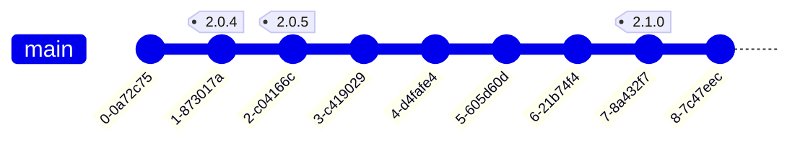

With each new commit, the branch named pointer "main" automatically advances, pointing to newer and newer commits on that branch. On the other hand, tags ```2.0.4```, ```2.0.5```, ```2.1.0```, etc., remain fixed to commits for which they were made. Using tags it is much easier to trace back the version of the project at particular point in the past, than using commit identifiers. To checkout version of the project corresponding to particular tag, one uses simply:

```bash 
# checkout the status of the project at particular tag in the past:
git checkout 2.0.4
```


**HEAD** is a symbolic reference usually pointing to the branch which is currently checked out. Since the branch name is a named pointer to the latest commit on that branch, indirectly, **HEAD** usually points to the latest commit on the current branch. One can see its current content directly by inspecting the content of a special file ".git/HEAD" in the repository, e.g.

```bash
# Checkout the branch "master":
$ git checkout master
... some additional info ...
$ cat .git/HEAD 
ref: refs/heads/master

# Checkout the specific commit:
$ git checkout 33f4fc7
... some additional info ...
$ cat .git/HEAD 
33f4fc75e4e3382f3a6c027baa375ddebcfaf41c
```


**detached HEAD** : If you checkout a commit ID or tag, you are in _detached HEAD_ state. While it is possible to make new commits in _detached HEAD_ state, those commits will not cause the branch pointer to automatically advance with them, and therefore committed changes in this mode are difficult to track later. If you switch to another branch, **HEAD** points to that new branch, i.e. it will automatically advance to a new commit on that new branch. 


### 3. Configuring Git <a name="configuring.git"></a>

There are files and variables which have a special meaning to Git and which can be used to modify its default behavior. Before setting up the workflow and making the first commit in a Git repository, it is necessary to review, set or adapt some of these special files and variables, i.e. it is necessary to configure Git.


#### Configuration variables <a name="configuration.variables"></a>
All special configuration variables to Git can be listed in the following way:

```bash
$ git help --config
add.interactive.useBuiltin
advice.addEmbeddedRepo
... not showing ~ 700 lines ...
user.email
user.name
user.signingKey
user.useConfigOnly
versionsort.suffix
web.browser
worktree.guessRemote

'git help config' for more information
```

It is, of course, not mandatory to deal directly with all these configuration variables. In fact, only two configuration variables, namely "user.name" and "user.email", must be set explicitly before the first commit can be made in a Git repository (see below for a concrete syntax and example). 

In general, the configuration variables can be grouped based on their scope into three categories:

* "local" &mdash; applies only to a specific Git repository. Within each repository, local variables are defined in the special file _someGitRepository/.git/config_;
* "global" &mdash; applies to all Git repositories of an individual user on a given computer. For each user, global variables are defined in the home directory in the special hidden file _${HOME}/.gitconfig_. Typically, in this configuration file a user stores his credentials (name and email), instead of specifying them individually for each Git repository on the same computer;
* "system" &mdash; applies to all repositories of all users on a shared computer. System-wide configuration variables are saved in the file _/etc/gitconfig_, and to edit this file, the admin privileges are needed. This configuration option is rarely used in practice because different users have different preferences for Git configuration.  

A given configuration variable can be defined in all three special configuration files above: _someGitRepository/.git/config_, _${HOME}/.gitconfig_ and _/etc/gitconfig_. In that case, the "local" setting will take precedence over both "global" and "system" settings, while the "global" setting will take precedence over the setting at the "system" level. 

The current settings at each configuration level can be listed as follows:

```bash
# list all set local configuration variables for a specific repository:
$ cd someGitRepository
$ git config --local --list

# list all set global configuration variables:
$ git config --global --list

# list all set system-wide configuration variables:
$ git config --system --list
```

For instance, by default Git is typically configured to use **nano** editor internally. If a user prefers another editor to be used within Git (e.g. to write commit messages) in all his repositories, the configuration variable "core.editor" needs be set at "global" level as follows:

```bash
# set default Git editor to "gedit":
$ git config --global core.editor "gedit -w"

# check if the change was propagated:
$ git config --global --list
core.editor=gedit
```

The flag "-w" is important, because Git now will wait until the commit message is written in the custom editor, and the file holding that message is closed (without that flag, there will be an error message "_Aborting commit due to empty commit message._").  

To unset some variable at "global" level, e.g. in this example "core.editor", the following syntax can be used:

```bash
# unset "core.editor" variable at "global" configuration level:
$ git config --global --unset core.editor
```

In the same way, configuration variables can be defined and set at "local" and "system" level, by replacing **git config --global** with **git config --local** and **sudo git config --system**, respectively (in the latter case, admin privileges are needed, therefore **sudo** must be used as well).

Before making the first commit, only the following two variables must be configured: "user.name" and "user.email". Naturally, they are configured at the "global" level as long as a user keeps his credentials the same across different Git repositories on the same computer. Therefore, the lines below represent the mandatory and minimum action to configure Git, before the first commit can be made in any repository:

```bash
# mandatory and minimum Git configuration:
$ git config --global user.name "First Last" # use the real name, not the acronym
$ git config --global user.email "someEmail@tum.de" # use the valid email address
```

Related to this, one can prevent Git for annoyingly prompting for credentials too frequently by setting:

```bash
$ git config --global credential.helper "cache --timeout=86400" 
# You will be prompted for credentials only once in 86400s, i.e. once per year
```

In the next section, the most important Git configuration files are addressed.


#### Configuration files <a name="configuration.files"></a>

In addition to the configuration variables, there are also configuration files that have a special meaning to Git. Arguably, the most frequently used configuration file is a hidden file named _.gitignore_ . In this file, all files and/or directories in the working tree that Git shall not track can be listed. It is very important to realize that this mechanism can be used only for the new files (i.e. untracked files) in the working tree, but it can not be used to stop tracking already tracked files (in this case, one has to use first **git rm --cached**, see later sections). Finally, both the creation of _.gitignore_ itself in the working tree and any changes in _.gitignore_ afterward need to be staged and committed as well, for its current content to be taken into account by Git.

Each Git repository has its own set of _.gitignore_ files, whose scope can be interpreted as follows:

* _someGitRepository/.gitignore_ &mdash; When placed in the root of Git repository, the content of that _.gitignore_ file applies to the whole repository;
* _someGitRepository/subDir/.gitignore_ &mdash; When placed in a specific subdirectory of working tree in Git repository, that _.gitignore_ file applies only to that subdirectory and below. This is rarely used in practice.

As a concrete example, we consider the Git repository named "mscThesis" in which a student is using LaTeX for writing his master's thesis in a file "source.tex":

```bash 
# initialize Git repository for M.Sc. thesis project:
$ mkdir mscThesis
$ cd mscThesis 
$ git init
Initialized empty Git repository in /home/abilandz/mscThesis/.git/

# start the thesis write-up: 
$ touch source.tex
# ... write some LaTeX content into source.tex ...

# add "source.tex" to Git revision:
$ git add source.tex 
$ git commit -m "starting off"
[master (root-commit) 5f6ca89] starting off
 1 file changed, 6 insertions(+)
 create mode 100644 source.tex

# compile source.tex into pdf: 
$ pdflatex source.tex

# inspect the status of working tree:
$ git status
On branch master
Untracked files:
  (use "git add <file>..." to include in what will be committed)
	source.aux
	source.log
	source.pdf

nothing added to commit but untracked files present (use "git add" to track)
```

The compilation has produced three files &mdash; the needed compiled and final output is in "source.pdf"; however, there are also two auxiliary files, namely "source.aux" and "source.log", which bear no special meaning or importance to the student. Upon each compilation, these two auxiliary files will change, but a student is not interested in those changes, and therefore would like to ask Git not to track and store changes for these two auxiliary files. To achieve that, the following has to be done (continuing with the previous example):

```bash
# initiate .gitignore file in the root directory of Git repository "mscThesis":
$ cd mscThesis
$ touch .gitignore

# edit .gitignore so that its content reads as follows:
$ cat .gitignore
source.aux
source.log

# add .gitignore to the revision:
$ git add .gitignore
$ git commit -m "added .gitignore"
[master adc9d0f] added .gitignore
 1 file changed, 2 insertions(+)
 create mode 100644 .gitignore

# inspect the status of working tree:
$ git status
On branch master
Untracked files:
  (use "git add <file>..." to include in what will be committed)
	source.pdf

nothing added to commit but untracked files present (use "git add" to track)
```

As it can be seen, the LaTeX auxiliary files "source.aux" and "source.log", although still present in the working tree, are ignored now by Git after they have been enlisted in the special configuration file ".gitignore", and after ".gitignore" was committed with that new information to the revision itself.

A few concluding remarks on the usage of ".gitignore":

* Comments are supported in ".gitignore" and they start with "#" (similar as in Bash);

* It is not necessary to enlist all files and/or directories using the full names, because a certain number of wildcards are supported by Git. For instance, to ignore files named "someFile_1.log", "anotherFile_2.log" and "alsoThisFile.log", one can add to ".gitignore" only the pattern "\*.log", where the metacharacter ```*``` matches any sequence of characters except a slash ```/``` (a detailed explanation of Git metacharacters which can be used in ".gitignore" can be found online under section [Pattern Format](https://git-scm.com/docs/gitignore) in the official documentation;

* To ignore all files in a specific directory, use the directory name followed by a slash "/". For instance, if there is a directory named "temp" in the working tree, all files in that directory can be ignored at once with the following lines added to ".gitignore":

  ```bash	
  # ignore all files in "temp" dir:
  temp/
  ```

* By default Git does not track empty directories. To preserve the overall design and directory structure of project in a Git repository, one typically adds dummy ".gitkeep" files (any other name would also work) in otherwise empty directories. These files are not special and their sole purpose is to populate a directory so that Git adds it to the repository from the very beginning;

* When a new Git repository is initiated on GitHub (an online developer platform for code development and sharing using Git), it is possible to choose which files not to track from the list of predefined ".gitignore" templates. For instance, when a new repository is made on GitHub for the C++ code development, immediately when that repository is being initiated on GitHub one can choose the specifically prepared ".gitignore" template for C++, which contains the line like this:

	```bash
	# Prerequisites
	*.d
	
	# Compiled Object files
	*.slo
	*.lo
	*.o
	*.obj
	
	# Compiled Dynamic libraries
	*.so
	*.dylib
	*.dll
	
	... many more lines ...
	```
	
	On the other hand, predefined ".gitignore" template for LaTeX looks like this on GitHub:
	
	```bash
	## Core latex/pdflatex auxiliary files:
	*.aux
	*.lof
	*.log
	*.lot
	*.fls
	*.out
	*.toc
	*.fmt
	*.fot
	*.cb
	*.cb2
	.*.lb
	
	## Intermediate documents:
	*.dvi
	*.xdv
	*-converted-to.*
	
	... many more lines ...
	```
	
	Clearly, it is rather impractical writing such lengthy and detailed ".gitignore" files from scratch, therefore the usage of predefined templates is recommended.
	
	


### 4. Typical Git workflows <a name="typical.git.workflows"></a>


#### Quick setup of standalone local repository <a name="quick.setup.of.standalone.local.repository"></a>

This is the simplest Git workflow, and corresponds to the case when the whole project development will take place on the same computer. Only the standalone local Git repository is needed on that computer for the project, and the Git workflow for this case can be established as follows:

```bash
# initialize Git repository for some local directory:
$ mkdir someDirectory
$ cd someDirectory
$ git init
Initialized empty Git repository in /home/abilandz/someDirectory/.git/
```
With the above initialization, local directory "someDirectory" will host all files of the project in question. After it was added to the Git repository, in subdirectory ".git" the history of all committed changes of all files is kept. Most importantly, at any point later, we can recover any previous version of any file.

The current status can be inspected with the command **git status**: 
```bash
# check the current status:
$ git status
On branch master

No commits yet

nothing to commit (create/copy files and use "git add" to track)
```
The output of this command is very verbose and usually gives helpful hints what can be done next.

Now we create and edit some content in the project, typically by adding new or editing existing files. In Git parlance, we are changing the status of its _working tree_ (by definition the collection of all files in the project):


```bash
# create and edit some content in the project:
$ echo "some text" >> someFile.txt

# check the current status:
$ git status
On branch master

No commits yet

Untracked files:
  (use "git add <file>..." to include in what will be committed)
        someFile.txt

nothing added to commit but untracked files present (use "git add" to track)
```

We have introduced new files and changes in the working tree physically, but they are still not part of the Git repository, and therefore Git will not track and record the changes in those files. Using another vocabulary, the example file "someFile.txt" is still not added to the version control provided by Git. To change that, we need to add all files to the staging area that we want Git to track with **git add** command:  

```bash
# add new or modified files to the staging area:
$ git add someFile.txt

# check the current status:
$ git status
On branch master

No commits yet

Changes to be committed:
  (use "git rm --cached <file>..." to unstage)
        new file:   someFile.txt
```

If one or more files were added to the staging area by mistake, they can be removed simply with the command **git rm --cached** as the above message says. On the other hand, if after adding a file to the staging area we still want to make some changes in that file before making the final commit, we first edit that file, and then stage it again with the **git add** command. 

Finally, when no further changes for the time being are planned in the staged files, we can commit all staged files permanently to the Git repository using the **git commit** command : 


```bash
# finally, commit all staged files permanently to the repository:
$ git commit -m "first commit"
[master (root-commit) f57d8ad] first commit
 Committer: Ante <abilandz@zero>
 1 file changed, 1 insertion(+)
 create mode 100644 someFile.txt

# check the current status:
$ git status
On branch master
nothing to commit, working tree clean
```

At any time later, we can recover the version of all tracked files in the working tree when this commit was made by using the commit identifier (```f57d8ad``` in the example above). This is the main feature of any version control system. 

Since it is very difficult, if not impossible, to memorize cryptic commit identifiers for each commit, we can associate a user-friendly message by using the command **git commit** with the flag "-m", accompanied by some insightful message. The message is typically a short descriptive message, which should clearly indicate what was that important new change in the code which was worth making a new commit in the Git repository. A few examples:

```bash
$ git commit -m "added new histograms for particle distributions"
$ git commit -m "fixed bug in function Rebin()"
```

The point is that any time later, we can trace back easily what was introduced in the project with each commit from those descriptive messages, for instance using **git log**:


```bash
# check all commits:
commit 7afe0a75db243fbe05fa0c503f333528aa0c491e (HEAD -> WS2025_2026, origin/WS2025_2026)
Author: abilandz <Ante.Bilandzic@cern.ch>
Date:   Thu Oct 23 08:30:32 2025 +0200

    one more examples for grouping operator regex

commit 386caed493bb1613d8722a20c8d4976312821e8b
Author: abilandz <Ante.Bilandzic@cern.ch>
Date:   Thu Oct 23 07:57:29 2025 +0200

    added few more examples for regex

commit 253d8f5a3845808fb0dc7d3c75997c73143e45fc
Author: abilandz <Ante.Bilandzic@cern.ch>
Date:   Wed Oct 22 13:24:07 2025 +0200

    finalized Sec. 4.1
    
... many more commits not shown ...    
```

Alternatively, such information can be extracted also from **git reflog** command, albeit in a more condensed format:

```bash
7afe0a7 (HEAD -> WS2025_2026, origin/WS2025_2026) HEAD@{0}: commit: one more examples for grouping operator regex
386caed HEAD@{1}: commit: added few more examples for regex
253d8f5 HEAD@{2}: commit: finalized Sec. 4.1

... many more commits not shown ... 
```

The commands **git log** and **git reflog** are not entirely equivalent, and their differences are clarified in later sections.


#### Quick setup of local and remote online repository <a name="quick.setup.of.local.and.remote.online.repository"></a>

However, much more frequently, as a central repository one establishes an online repository, using some of freely available online developer platforms for code development and sharing, which rely on Git. Two such very popular online platforms are [GitHub](https://github.com/) and [GitLab](https://about.gitlab.com/). In what follows next, all examples will be illustrated using GitHub, but a very similar procedure applies to GitLab as well.

One starts by establishing an online repository on GitHub, which is then cloned into a local repository on one or more different computers. This way, one can continuously work on the same project using a desktop computer in the office and/or a laptop at home, and in addition, always have a safe backup in the online repository itself. This is particularly beneficial when ones uses different operating systems and corresponding software to develop the same project (e.g. Linux on desktop computer and Windows on laptop) because the online Git repository takes care automatically of different line endings (```'\n'``` on Linux vs. ```'\r\n'``` on Windows, etc.).

To establish such a workflow, it's much easier to start by creating an online repository first directly on GitHub and clone it locally, then to first create it locally, then move it to GitHub. Therefore, we summarize step-by-step only the former approach:

1. Go to [GitHub](https://github.com/) and in case you already do not have an account, sign up for free and create one

2. Make a new repository online in GitHub: 

   * Click on "+" menu in bottom right corner;
   * Choose from drop-down menu "New repository";
   * Type in the empty box marked with "Repository name" the name for your new repository, e.g. "testRepo";
   * Optionally add a description of what this repository is meant for, and choose whether you want this repository to be "Public" or "Private" (can be changed at any time later, in case of doubt choose "Private");
   * Choose to initialize the repository with special file "README.md". The file "README.md" can be edited either online or offline. This file is read first by default, i.e. if there are both "README.md" and "READMe.md", the former is read. The file "READMe.md" is read as an educated guess only if there is no "README.md", and so on;
   * Choose ".gitignore" template file, which is specific to your project (if you are writing a thesis in LaTeX choose "TeX" from drop-down menu, if you are developing project in C++ in this repository choose "C++" as a template, etc.). This is important, because Git will automatically ignore and not add to the revision all auxiliary and temporary files which pop up in the repository during compilation;
   * Optionally, add a license for your project &mdash; it's perfectly fine if you set up the repository with "No license";
   * Finally, click "Create repository". Now you have created your first online Git repository on GitHub, which is sitting at the URL https://github.com/yourUserNameOnGitHub/testRepo .

3. Clone the online repository "testRepo" locally, by executing in the terminal (using your GitHub username in the path below): 

   ```bash
   $ git clone https://github.com/abilandz/testRepo.git testRepo
   Cloning into 'testRepo'...
   ... You will be prompted for your GitHub credentials ...
   remote: Enumerating objects: 3, done.
   remote: Counting objects: 100% (3/3), done.
   remote: Total 3 (delta 0), reused 0 (delta 0), pack-reused 0 (from 0)
   Receiving objects: 100% (3/3), done.
   ```

   A few important things are automatically set after cloning: _push_ and _pull_ are set, and the local name for the remote repository is defaulted to "origin". You can inspect that with the command **git remote -v** as follows:

   ```bash
   $ cd testRepo
   $ git remote -v
   origin  https://github.com/abilandz/testRepo.git (fetch)
   origin  https://github.com/abilandz/testRepo.git (push)
   ```

   After cloning, your local _master_ branch is created automatically as a **tracking branch** for the _master_ branch of the remote repository. The tracking branch allows you to use **git pull** and **git push** commands directly, without specifying either the branch names or repository paths afterward.

4. After both local and remote online repositories are established, one can start working. After making a change in the local repository, one needs to stage and commit that change in the local repository, and finally push that commit to the online repository: 

   ```bash
   # make some change in the working tree in the local repository:
   $ echo "some text" > file.txt
   
   # stage that change:
   $ git add file.txt
   
   # commit that change:
   $ git commit -m "some change"
   [master e47db10] some change
   ... some more irrelevant lines ...
    1 file changed, 1 insertion(+)
    create mode 100644 file.txt
   
   # finally, push that change to the remote repository:
   $ git push
   Enumerating objects: 4, done.
   Counting objects: 100% (4/4), done.
   Delta compression using up to 8 threads
   Compressing objects: 100% (2/2), done.
   Writing objects: 100% (3/3), 266 bytes | 266.00 KiB/s, done.
   Total 3 (delta 1), reused 0 (delta 0), pack-reused 0
   remote: Resolving deltas: 100% (1/1), completed with 1 local object.
   ... some more irrelevant lines ...
      27ab7b4..e47db10  master -> master
   ```

   This procedure works straightforwardly only when pushing the commits can be trivially merged into the current status of the remote repository. 

5. On the other hand, to pull the new commits from online repository locally, one simply in the local repository executes:

   ```bash
   # pill all new commits from the remote repository into local repository:
   $ git pull
   remote: Enumerating objects: 9, done.
   remote: Counting objects: 100% (8/8), done.
   remote: Compressing objects: 100% (2/2), done.
   remote: Total 5 (delta 3), reused 5 (delta 3), pack-reused 0 (from 0)
   Unpacking objects: 100% (5/5), 988 bytes | 247.00 KiB/s, done.
   ... some more irrelevant lines ...
      e47db10..d95598d  master     -> origin/master
   Updating e47db10..d95598d
   Fast-forward
    git.md | 30 ++++++++++++++++++++++++++----
    1 file changed, 26 insertions(+), 4 deletions(-)
   ```

   This is relevant when one clones the same central online repository on two local computers, e.g. on desktop and laptop, and then develops a project concurrently in parallel on desktop computer and laptop, using the central online repository both to exchange information and to maintain safe online backup of the project.


We summarize the workflow in this example with the following diagram:

* If the new development was made in a Git repository on a desktop computer:

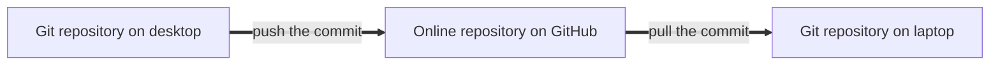

* If the new development was made in a Git repository on a laptop:

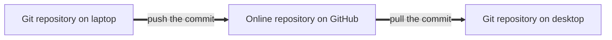

* Before starting a new development either on desktop or laptop, one first executes **git pull** to integrate all changes from online repository.


#### Transfer <a name="transfer"></a>
In this case, the Git workflow is outlined which can be used to copy files from one computer to another, even if one computer is behind the firewall (in the sense that direct login to it is not possible). Such a configuration frequently occurs in practice when one wants to utilize remotely some large-scale computing facility, as the following diagram illustrates:


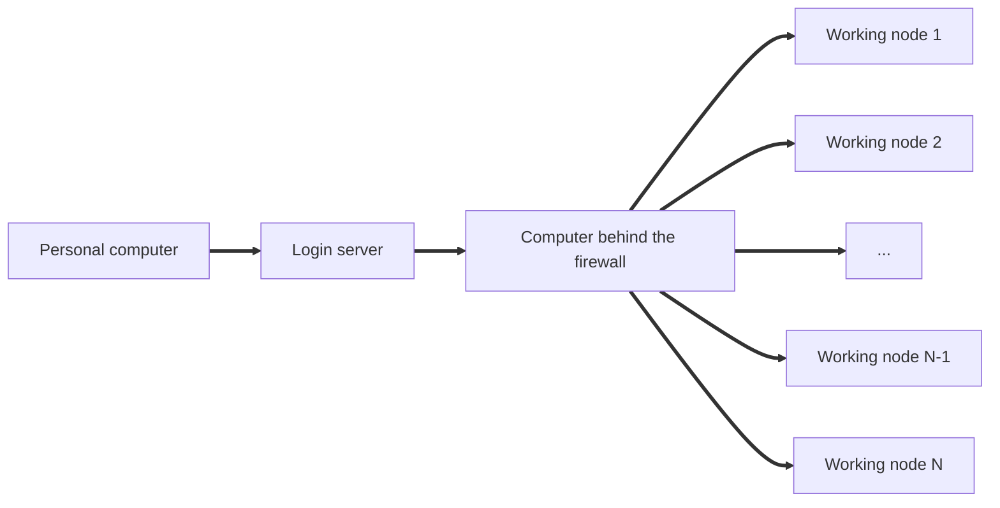

In the above configuration, one wants to copy files back and forth from the "Personal computer" to the "Computer behind the firewall", without being prompted each time for credentials, and bypassing entirely the "Login server". Typically, one develops the analysis code locally on a "Personal computer", then copies and compiles it on "Computer behind the firewall", and the resulting executable is then used on computers "Working node 1", "Working node 2", ... "Working node N", out of which the large-scale computing facility is built. The output of this large-scale analysis is then copied back from "Computer behind the firewall" to the "Personal computer", for the final post-processing of the obtained results. 

To achieve that, one creates an online repository (e.g. on [GitHub](https://github.com/), as detailed in the previous section) named "Transfer", and clones it from the terminal both on "Personal computer" and on "Computer behind the firewall":

```bash
# Execute on "Personal computer": 
$ cd $HOME
$ git clone https://github.com/abilandz/Transfer.git Transfer
$ git config --global credential.helper "cache --timeout=86400" 

# Login remotely, and execute on "Computer behind the firewall": 
$ cd $HOME
$ git clone https://github.com/abilandz/Transfer.git Transfer
$ git config --global credential.helper "cache --timeout=86400"
```

The shell function ```Transfer``` which will automate copying back and forth from "Personal computer" to "Computer behind the firewall" using the Git repository "Transfer" may look as follows:

```bash
function Transfer
{
 # Example usage:
 ## 1. Transfer --push file1 file2 # push file1 file2 to Git repository 
 ## 2. cd SomeDir && Transfer --pull # pull new files from Git repository into SomeDir

 ## a) Local variables: 
 local GitTransferDir=$HOME/Transfer # precisely such directory must exist on both machines on which this function is used
 local ModusOperandi=$1 # either '--push' or '--pull'

 ## b) Insanity checks:
 which git &> /dev/null || { echo  "No git installed."; return 1; }
 # ... some more insanity checks ...

 ## c) Option '--push':
 if [[ $ModusOperandi == '--push' ]]; then
   # Check if the Git repository 'Transfer' is up to date. 
   # If not, pull.
   ( cd $GitTransferDir && git pull ) &>/dev/null || { echo "pull failed"; return 1; }

   # Copy requested files and dirs into Git repository 'Transfer', 
   # and establish array of files and dirs to be commited:
   shift 1 # the first argument is either "--pull" or "--push", strip it off
   local ToCommit=( )
   local FilesAndDirs=( "$@" )
   local fad
   for fad in "${FilesAndDirs[@]}"; do
     [[ -f $fad ]] && cp "$fad" $GitTransferDir/ && ToCommit[${#ToCommit[*]}]="$(basename "$fad")"
     [[ -d $fad ]] && cp -r "$fad" $GitTransferDir/ && ToCommit[${#ToCommit[*]}]="$(basename "$fad")"
   done # for fad in "${FilesAndDirs[@]}"; do

   # Add, commit and push:
   ( 
     cd $GitTransferDir/
     git add "${ToCommit[@]}" || { echo "git add failed"; return 1; }
     git commit -m 'auto transfer' || { echo "git commit failed"; return 1; }
     git push || { echo "git push failed"; return 1; }
   ) 

 fi # if [[ $ModusOperandi == '--push' ]]; then 

 ## d) Option '--pull':
 if [[ $ModusOperandi == '--pull' ]]; then 
   local CopyDest=$PWD
   # Pull, get the list of files from the last commit, and copy them in the current workig dir:
   (
     cd $GitTransferDir/ || { echo "cd $GitTransferDir/ failed"; return 1; }
     CurrentLastCommitID=$(git rev-parse --short HEAD) || { echo "git rev-parse --short HEAD failed"; return 1; }
     git pull || { echo "git pull failed"; return 1; }
     NewLastCommitID=$(git rev-parse --short HEAD) || { echo "git rev-parse --short HEAD failed"; return 1; }
     if [[ $CurrentLastCommitID == $NewLastCommitID ]]; then 
       echo "After git pull was executed, nothing changed in the git repo, there are no new files."
       return 1
     fi  
     FilesInLastCommit=( $( git diff-tree --no-commit-id --name-only $NewLastCommitID ) )
     local filc
     for filc in "${FilesInLastCommit[@]}"; do
       [[ -f $filc ]] && cp "$filc" $CopyDest/ && echo "File $filc is here."
       [[ -d $filc ]] && cp -r "$filc" $CopyDest/ && echo "Directory $filc is here."
     done
   ) 

 fi # if [[ $ModusOperandi == '--pull' ]]; then 

 return 0;

}
```

One deploys the above shell function ```Transfer``` both on "Personal computer" and "Computer behind the firewall", e.g. in the file ```~/myFunctions.sh```, and enables it permanently by adding to ```~/.bashrc``` the following lines:

```bash
source ~/myFunctions.sh
alias tl='Transfer --pull'
alias th='Transfer --push'
```

After that, when one wants to copy files from "Personal computer" to "Computer behind the firewall" without getting promoted for credentials, bypassing entirely the "Login server", it suffices to execute in the terminal on a  "Personal computer":

```bash
$ th file1 file2
```

And in the terminal on "Computer behind the firewall":

```bash
$ cd SomeDir # the new files will be copied into this directory
$ tl
```

Analogously, one copies the files in the other direction. 

This approach to copying files from one computer to another using Git is recommended if the size of the files is not too large. Otherwise, an alternative is to use a multi-stage version of **scp** via proxy jump. However, the Git approach has another significant advantage &mdash; all copied files (and their different versions) are securely backed-up in the Git repository, and can be retrieved at any time later.


#### Collaborating online using GitHub or GitLab <a name="collaborating.online.using.github"></a>

In this section, we illustrate the workflow that is frequently used in major collaborations worldwide, including those in high-energy physics. The basic requirements set upon this workflow are:

* a large number of developers (typically more than 100) shall be able to develop the project on a daily basis concurrently;
* each new commit must be reviewed and approved by an expert, and automatically tested with various test suites, before being merged into the central repository. This requirement is essential, to prevent scenarios in which an error introduced by one developer hinders the work of the rest;
* common programming style (formatting, naming conventions, etc.).

This can be achieved with _forks_ and _pull requests_. Schematically, this workflow is illustrated with the following diagram for two collaborators developing concurrently, which can be trivial generalized:

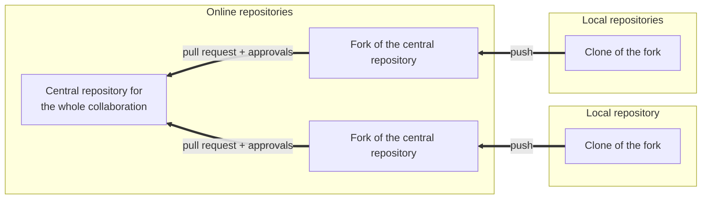

Each developer first creates an online fork of the central repository, and then clones that fork locally. Each developer works directly only in a local repository. Any new commit in the local repository is pushed first to his personal online fork, and then he makes online a pull request in his fork. This is the step where the developer requests his commit to be reviewed and tested, and finally approved for merging into the central repository. 

Both in GitHub and GitLab, it is straightforward to establish such a workflow, and all steps won't be detailed here. 


#### Collaborating locally <a name="collaborating.locally"></a>
Even though in most cases of practical interest work on a collaborative project is set up up via an online developer platform using Git software (e.g. GitHub or GitLab), it is also possible to set up a collaborative project using Git locally. For instance, when two or more developers have access to the same shared disk area (e.g. on the computer from which jobs on a local batch farm can be submitted using commonly developed software), they can set up central repository on that shared disk area. For completeness' sake and in order to introduce a few additional Git-related concepts, in this section all steps needed to establish such a workflow are illustrated, even though in practice this is rarely used. 


```bash
# Make a new bare repository locally, named e.g. "headquarter":
$ git init --bare headquarter
Initialized empty Git repository in /home/abilandz/headquarter/
```

This is a central repository which will be used to exchange information related to the project development among all developers. We remark that this central repository has to be _bare_ (i.e. it has no working tree and no default remote repository). One can think of a bare Git repository having nothing but the .git folder inside your local working repository.

From developer's point of view, we can now proceed in two ways: "clone" and "init". We illustrate the "clone" approach because it is easier, starting with the developer named "Marcel":

```bash
# Clone the central bare repository into developer's repository named "Marcel": 
$ git clone headquarter Marcel 
Cloning into 'Marcel'...
warning: You appear to have cloned an empty repository.
done.
# Remark 1: Instead of the relative path "headquarter", you can also specify the absolute path to
#           central repository, this is NOT the name of remote repository (see below)
# Remark 2: After cloning, the repository "Marcel" knows automatically that "headquarter" 
#           is a remote repository, with a default name "origin".

# Inspect the status of cloned repository with:
$ cd Marcel && git config --local -l
core.repositoryformatversion=0
core.filemode=true
core.bare=false
core.logallrefupdates=true
remote.origin.url=/home/abilandz/headquarter
remote.origin.fetch=+refs/heads/*:refs/remotes/origin/*
branch.master.remote=origin
branch.master.merge=refs/heads/master

# Do some work in the cloned repository "Marcel" and commit all changes, e.g.:
$ touch README.md && git add README.md && git commit -m "added file README.md" 
[master (root-commit) cf49854] added file README.md
 1 file changed, 0 insertions(+), 0 deletions(-)
 create mode 100644 README.md

# After the first commit, the local branch with the default name "master" is automatically created:
$ git branch
* master

# By this point, it is still not clear which local branch is tracking which remote branch.
# Therefore, as you push, you need to set the upstream config:
$ git push --set-upstream origin master
Enumerating objects: 3, done.
Counting objects: 100% (3/3), done.
Writing objects: 100% (3/3), 207 bytes | 207.00 KiB/s, done.
Total 3 (delta 0), reused 0 (delta 0)
To /home/abilandz/headquarter
 * [new branch]      master -> master
Branch 'master' set up to track remote branch 'master' from 'origin'.
# After this step, the local branch you are currently on (by default "master"), is tracking the "master" branch in the remote repository named "origin". 

# Cross-check:
$ git branch -a
* master
  remotes/origin/master

# Another way to cross-check:  
$ git branch -vv
* master eac42f0 [origin/master] added file README.md

# From this point onward, all changes can be pushed directly into the central repository:
$ touch temp.log && git add temp.log && git commit -m "added file temp.log"
[master 853290a] added file temp.log
 1 file changed, 0 insertions(+), 0 deletions(-)
 create mode 100644 temp.log
$ git push 
Enumerating objects: 3, done.
Counting objects: 100% (3/3), done.
Delta compression using up to 2 threads
Compressing objects: 100% (2/2), done.
Writing objects: 100% (2/2), 233 bytes | 233.00 KiB/s, done.
Total 2 (delta 0), reused 0 (delta 0)
To /home/abilandz/headquarter
   cf49854..853290a  master -> master

# Adding another contributor named "Cindy" in the same way:
$ cd ..
$ ls
headquarter  Marcel
$ git clone headquarter Cindy
Cloning into 'Cindy'...
done.
$ cd Cindy && ls
README.md  temp.log
$ echo "some text" >> temp.log && git add temp.log && git commit -m "modified file temp.log" 
[master 805def4] modified file temp.log
 1 file changed, 1 insertion(+)
$ git push # this works automatically after cloning
Enumerating objects: 5, done.
Counting objects: 100% (5/5), done.
Delta compression using up to 2 threads
Compressing objects: 100% (2/2), done.
Writing objects: 100% (3/3), 274 bytes | 274.00 KiB/s, done.
Total 3 (delta 0), reused 0 (delta 0)
To /home/abilandz/headquarter
   853290a..805def4  master -> master
   
# Now any other developer can pull the changes:
$ cd Marcel
$ git pull
remote: Enumerating objects: 5, done.
remote: Counting objects: 100% (5/5), done.
remote: Compressing objects: 100% (2/2), done.
remote: Total 3 (delta 0), reused 0 (delta 0)
Unpacking objects: 100% (3/3), 255 bytes | 255.00 KiB/s, done.
From /home/abilandz/headquarter
   2b80dae..8ac0933  master     -> origin/master
Updating 2b80dae..8ac0933
Fast-forward
 temp.log | 1 +
 1 file changed, 1 insertion(+)
```

The above workflow is summarized with the following diagram:

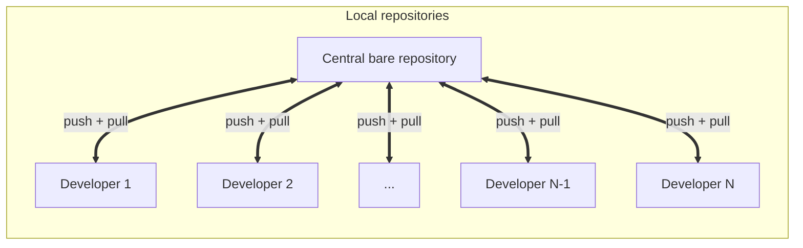


#### Combining changes on different branches: merge, rebase and cherry-pick <a name="combining.changes.merge.rebase.and.cherry.pick"></a>

In this section, we illustrate the workflow that can be used to combine changes on two different branches. This material is relevant for two frequently encountered cases when into the current local branch one wants to incorporate changes from: 

* another local branch from the same repository;
* remote-tracking branch.

This can be achieved in Git using three conceptually different strategies: _merge_, _rebase,_ or _cherry-pick_. In what follows, we illustrate each of these with concrete examples. For clarity, we assume that changes can be combined without encountering merging conflicts, which have to be treated separately.

##### a) merge  <a name="merge"></a>
There are several ways changes on different branches can be combined by using _merging_, the full overview can be found in the online documentation under [git-merge](https://git-scm.com/docs/git-merge) . While each of these ways has its own pros and cons, we discuss in detail only the two most frequently used cases: _fast-forward merge_ and a _three-way-merge_ or _ort ("Ostensibly Recursive’s Twin") merge_. 

**Fast-forward merge** is illustrated with the following diagram:

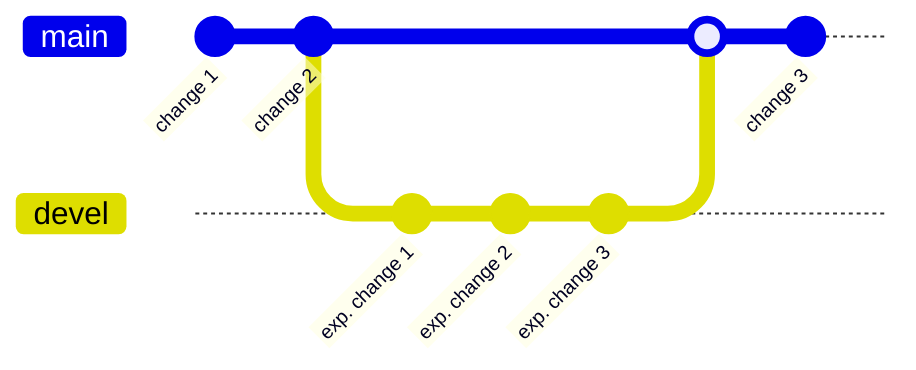

This case corresponds to the situation where one works on the _main_ branch, then checks out the new _devel_ branch and continues experimental development on the _devel_ branch. Once development is satisfactory, all commits from the _devel_ branch can be merged into the _main_ branch. If all commits on a _devel_ branch are direct successors of HEAD on the _main_ branch, Git performs a _fast-forward merge_ by simply moving (i.e. fast-forwarding) HEAD to the tip of the _devel_ branch which is being merged. Programmatically:

```bash
# pause the development on the 'main' branch, checkout new 'devel' branch, 
# and continue with experimental development the 'devel' branch:
$ git checkout -b devel

... make some development and corresponding few commits on branch 'devel' ...

# switch back to the 'main' branch:
$ git checkout main

# incorporate all development from 'devel' into 'main':
$ git merge devel
Updating 8442595..a31b43a
Fast-forward
... summary of specific changes ...

# ctd. with development on the 'main' branch
```

Immediately after fast-forward merging is performed, both the _main_ branch and the _devel_ branch have all commits the same (check by using **git log** on either branch), and the HEAD of both branches points to the same commit ID. This is illustrated with the following diagram (corresponding to the above example):

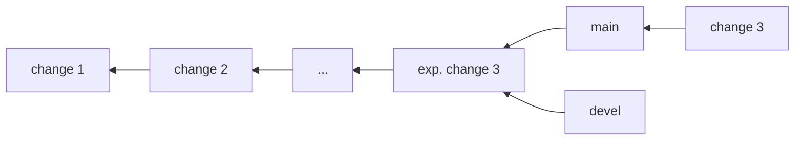

**Three-way-merge (a.k.a. 'ort' strategy)** is a more general merging strategy, and it is a default strategy when pulling or merging one branch. The name for this algorithm is an acronym for _"Ostensibly Recursive’s Twin"_ and it was developed as a replacement for the previous default algorithm, simply named _"recursive"_. It is illustrated with the following diagram:

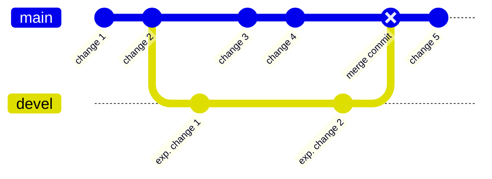

Unlike in the fast-forward merge case, here after the _devel_ branch was made, for some time the development was done concurrently in both the _main_ and the _devel_ branch. In this case, all commits on the _devel_ branch are not direct successors of HEAD on the _main_ branch, and Git will merge all commits from _devel_ into _main_ by using the following approach: 

1. find the most recent common commit in both branches (in the above diagram and example, that would be the commit named "change 2");
2. make a new _merge commit_ on the _main_ branch that combines all changes from two branches being merged.

Diagrammatically, immediately after _three-way-merge_ is performed, we have a situation like this on the _main_ branch:

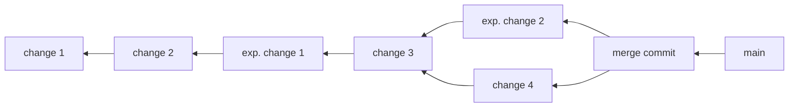

And on the _devel_ branch:


Programmatically:

```bash
# pause the development on the 'main' branch, checkout new 'devel' branch 
# for the first time, and continue with development the 'devel' branch:
$ git checkout -b devel

... make some development and corresponding few commits on branch 'devel' ...

# switch back to the 'main' branch:
$ git checkout main

... make some development and corresponding few commits on branch 'main' ...

# switch back to the 'devel' branch:
$ git checkout devel

... make some development and corresponding few commits on branch 'devel' ...

# switch back to the 'main' branch:
$ git checkout main

# merge all development from 'devel' into 'main':
$ git merge devel
Merge made by the 'ort' strategy.
... summary of specific changes ...

# ctd. with development on the 'main' branch
```

With this approach, merging conflicts can occur if the same file is modified in two branches in an incompatible way, and this typically needs to be resolved manually by editing the file to the final version during merging. 


##### b) rebase  <a name="rebase"></a>

Another way to incorporate changes from one branch into another is to use _rebase_. If you rebase a branch named A onto another branch named B, **git** will take all commits of branch A and replay them on the HEAD of branch B. This technique is particularly suitable for incorporating changes from the remote repository into the currently active local branch.

We use the following diagram to illustrate the repository that contains two branches, named _main_ and _devel_, in which development is carried out in parallel:

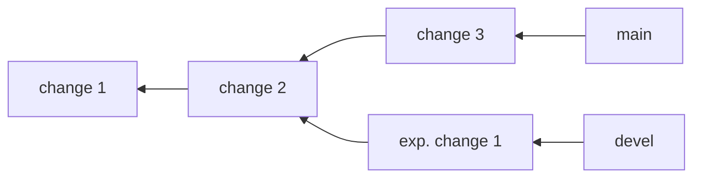

After the 2nd commit named "change 2" was made in the _main_ branch, a new _devel_ branch was checked out, and from that point onward, the development was carried out in parallel in both branches. If one executes now:

```bash
$ git checkout devel
$ git rebase main
```

all changes introduced with the _devel_ branch will be applied on the HEAD of the _main_ branch. In the above example, **git** will: 

* establish first the common ancestor of the two branches (the commit named "change 2");
* determine with respect to this commit the diff file (i.e. patch of the change) introduced by each subsequent commit of the branch we are on (the _devel_ branch in this case; the diff file will be created between commits named "exp. change 1" and "change 2");
* save those diffs to temporary files; 
* reset the current _devel_ branch to the HEAD of the _main_ branch we are rebasing onto ("change 3" in this case);
* finally, apply each diff on top of this commit.

The situation in both branches after the rebase is performed is shown in the following diagram:

```mermaid
%%{init: {"flowchart": {"htmlLabels": false}} }%%
flowchart RL
	commit1["change 1"]
    commit2["change 2"]
    commit3["change 3"]
    commitExp1Star["diff of exp. change 1 vs change 2 applied on top of change 3"]
    main --> commit3 --> commit2 --> commit1
    devel --> commitExp1Star --> commit3
```

Since we were working on the _devel_ branch and rebased it on the _main_ branch, after rebasing only the _devel_ branch was changed. To change correspondingly also the _main_ branch, we can use the standard _fast-forward merge_ technique:

```bash
$ git checkout main
$ git merge devel
```

After this step, the situation in both branches is the same, i.e.:

```mermaid
%%{init: {"flowchart": {"htmlLabels": false}} }%%
flowchart RL
	commit1["change 1"]
    commit2["change 2"]
    commit3["change 3"]
    commitExp1Star["diff of exp. change 1 vs change 2 applied on top of change 3"]
    main --> commitExp1Star --> commit3 --> commit2 --> commit1
    devel --> commitExp1Star 
```


##### c) cherry-pick  <a name="cherry-pick"></a>

Occasionally, one wants to select changes introduced only by specific commits on one branch, and propagate only those changes to another branch. This way, only these specific changes are cherry-picked and propagated. This procedure is illustrated with the following diagram: 


```mermaid
	gitGraph
       commit id: "change 1"
       commit id: "change 2"
       branch devel
       commit id: "exp. change 1"
       checkout main
       commit id: "change 3"
       commit id: "change 4"
       checkout devel
	   commit id: "exp. change 2"
	   commit id: "exp. change 3"
	   commit id: "exp. change 4"
       checkout main
       cherry-pick id:"exp. change 2"
       commit id: "change 5"
```

In the above example, the development is carried out concurrently on two branches, named _main_ and _devel_. After the commit named "change 4" was made on the _main_ branch, and before continuing with further development on this branch, the changes introduced by the commit "exp. change 2" on the _devel_ branch are also desired and needed on the _main_ branch. There is no need to propagate changes introduced by any other commit on the _devel_ branch, i.e. we want literally to cherry-pick changes only from one very specific commit.

Programmatically:

```bash
... make some development and corresponding two commits named ...
... 'change 1' and 'change 2' on 'main' branch ... 

# pause the development on the 'main' branch, checkout new 'devel' branch:
$ git checkout -b devel # Reminder: flag -b is needed only when new branch is created
... make some development with commits 'exp. change 1' on 'devel' branch ... 

# pause the development on 'devel' branch, checkout again 'main' branch:
$ git checkout main
... make some development with two commits 'change 3' and 'change 4' on 'main' branch ... 

# pause the development on 'main' branch, and continue development on 'devel' branch:
$ git checkout devel
... make some development with commits 'exp. change 2', 'exp. change 3', ...
... and 'exp. change 4' on 'devel' ... 

# inspect the status of all commits on the 'devel' branch:
$ git log --oneline
7b88d86 (HEAD -> devel) exp. change 4
0c36839 exp. change 3
3d85507 exp. change 2
49682e6 exp. change 1
1192d2b change 2
009e81b change 1

# switch back to the 'main' branch:
$ git checkout main

# inspect the status of all commits on the 'main' branch:
$ git log --oneline
15e8839 (HEAD -> master) change 4
137f5e2 change 3
1192d2b change 2
009e81b change 1

# finally, cherry-pick the changes introduced on the 'devel' branch with commit
# named 'exp. change 2' (its commit id is '3d85507', see above), and introduce
# only those changes (i.e. cherry-pick) on the 'main' branch:
$ git cherry-pick 3d85507
[master 8f79132] exp. change 2
... some more Git messages specific to changes introduced with this commit ...

# inspect the status of all commits on the 'main' branch after cherry-picking:
$ git log --oneline
8f79132 (HEAD -> master) exp. change 2
15e8839 change 4
137f5e2 change 3
1192d2b change 2
009e81b change 1

# continue development on the 'main' branch, make new commit 'change 5', etc.
```


### 5. Executive and exemplary summary of main Git commands <a name="executive.and.exemplary.summary.of.main.git.commands"></a>
In this section, we list in alphabetical order the most commonly used **git** commands with an executive summary of their meaning. This summary is followed up with a series of examples illustrating their simple use cases in practice. 

The generic usage of **git** command is: 

```bash
git commandName optionsOrArguments
```

where _optionsOrArguments_ are specific to particular _commandName_. 

The list of all **git** commands can be generated using the standard auto-complete mechanism by hitting two consecutive "TAB" after **git** at the command line:

```Bash
$ git + TAB + TAB
add               clang-format-10   grep              range-diff        show 
am                clean             gui               rebase            show-branch 
apply             clone             help              reflog            sparse-checkout 
archive           commit            init              remote            stage 
bisect            config            instaweb          repack            stash 
blame             describe          log               replace           status 
branch            diff              merge             request-pull      submodule 
bundle            difftool          mergetool         reset             switch 
checkout          fetch             mv                restore           tag 
cherry            format-patch      new-workdir       revert            whatchanged 
cherry-pick       fsck              notes             rm                worktree 
citool            gc                pull              send-email        
clang-format      gitk              push              shortlog
```

The list of all **git** commands, with a short one-line summary of their meaning, can be generated as follows:

```bash  
$ git help -a
See 'git help <command>' to read about a specific subcommand

Main Porcelain Commands
   add                  Add file contents to the index
   am                   Apply a series of patches from a mailbox
   archive              Create an archive of files from a named tree... many more lines in the printout ...
   bisect               Use binary search to find the commit that introduced a bug
   branch               List, create, or delete branches
   bundle               Move objects and refs by archive
   checkout             Switch branches or restore working tree files
   cherry-pick          Apply the changes introduced by some existing commits

... many more lines in the printout ...
```

Finally, the detailed documentation of any **git** command, basically the individual man page of each **git** command, can be obtained with:

```bash
git help commandName
```

For instance:

```bash
$ git help fetch
GIT-FETCH(1)                                                                                  Git Manual                                                                                 GIT-FETCH(1)

NAME
       git-fetch - Download objects and refs from another repository

SYNOPSIS
       git fetch [<options>] [<repository> [<refspec>...]]
       git fetch [<options>] <group>
       git fetch --multiple [<options>] [(<repository> | <group>)...]
       git fetch --all [<options>]

DESCRIPTION
       Fetch branches and/or tags (collectively, "refs") from one or more other repositories, along with the objects necessary to complete their histories. Remote-tracking branches are updated (see
       the description of <refspec> below for ways to control this behavior).

... many more lines in the printout ...
```

In what follows next, we discuss in more detail only the most commonly used **git** commands.


#### The most commonly used Git commands <a name="the.most.commonly.used.git.commands"></a>

In the table below, we summarize the most frequently used Git commands, with an executive summary of their usage:


| Command name      | Description |
| :---         |    :----   |
| **add**      | Add file contents to the stage area|
| **bisect**   | Use binary search to find the commit that introduced a bug |
| **blame**    | Show what revision and author last modified each line of a file |
| **branch**   | List, create, or delete branches |
| **checkout** | Switch branches or restore working tree files |
| **clone**    | Clone a repository into a new directory |
| **commit**   | Record changes to the repository |
| **cherry-pick** | Apply the changes introduced by some existing commits |
| **config** | Get and set repository or global options |
| **diff**     | Show changes between commits, commit and working tree, etc. |
| **fetch**    | Download objects and refs from another repository |
| **filter-branch** | Rewrite branches |
| **grep**     | Print lines matching a pattern |
| **help**     | Display help information about Git |
| **init**     | Create an empty Git repository or reinitialize an existing one |
| **log**      | Show commit logs |
| **merge**    | Join two or more development histories together |
| **mv**    | Move or rename a file, a directory, or a symlink |
| **pull**     | Fetch from and integrate with another repository or a local branch |
| **push**     | Update remote refs along with associated objects |
| **rebase**   | Reapply commits on top of another base tip |
| **reflog**   | Manage reflog information |
| **remote** | Manage set of tracked repositories |
| **reset**   | Reset current HEAD to the specified state |
| **revert**   | Revert some existing commits |
| **rm**   | Remove files from the working tree and from the stage area |
| **show**   | Show various types of objects |
| **shortlog**   | Summarize 'git log' output |
| **stash**   | Stash the changes in a dirty working directory away |
| **status**   | Show the working tree status |
| **switch**   | Switch branches |
| **tag** | Create, list, delete or verify a tag object signed with GPG |

For each of these commands, we provide an example use case in the next section.


#### Git examples <a name="git.examples"></a>

With a series of examples, sorted in alphabetical order, we now illustrate how these Git commands can be used in practice. They were successfully tested and validated with **git 2.34.1** version.


**A**

**git add** _someFile_ &mdash; Add a file named _someFile_ from the current working tree to the staging area.

**git add .** &mdash; Add all modified or new (untracked) files from the current working tree to the staging area.


**B**

**git bisect** &mdash; TBI 20241006 Check the book + see https://thoughtbot.com/blog/git-bisect

**git blame** _someFile_ &mdash; Inspect which commit and author modified this file on a per-line basis, showing only lines which were modified or added. Works for committed and not committed yet changes.

**git blame -L 1,5** _someFile_ &mdash; Inspect which commit and author modified this file on a per-line basis,  showing only lines which were modified or added, and showing only lines 1 through 5. The typical output could look like this:

```bash
$ git blame -L 1,5 Lecture_2/git.md
cfd0b003 (abilandz 2025-09-15 09:35:15 +0200 1) 
46ac50dc (abilandz 2025-09-08 11:41:51 +0200 2)
46ac50dc (abilandz 2025-09-08 11:41:51 +0200 3) # Git - a distributed version control system
46ac50dc (abilandz 2025-09-08 11:41:51 +0200 4)
44cd023b (abilandz 2025-11-01 08:19:41 +0100 5) **Last update**: 20251101-1
```

**git branch** &mdash; List available branches in the local repository. This command works only after the first commit:

```bash
$ git branch
* devel
  master
```

The currently enabled branch in the working tree is indicated with "*". Typically, and only as a matter of convention, the branch named "devel" captures ongoing development, gets the latest bug fixes, and is where new features appear. The "master" branch is typically updated only for stable releases and important patches. A new addition in the "devel" branch, which passed all the tests, is ported to the "master" branch, and when a lot of newly approved features appear in the "master" branch, the "master" is tagged into a new release (see **git tag** below).

**git branch -a** &mdash; List available branches both in the local repository and including the remote-tracking branches. This command works only after the first commit is made in the repository:

```bash
$ git branch -a
* master
  remotes/origin/HEAD -> origin/master
  remotes/origin/master
```

TBI 20241010 Clarify the meaning of above output. Check the book

**git branch -d** _someBranch_ &mdash; Delete the local branch named _someBranch_. This command will not work if: 

* that is the branch you are currently on;

* the branch contains uncommitted changes.

  TBI 20241010 I need to clarify what happens to remote-tracking branch (if any) of local branch which was just deleted

**git branch -D** _someBranch_ &mdash; Force delete of the local branch named _someBranch_, even if there are uncommitted changes.

**git branch -d -r origin/[remote_branch]** &mdash; Stop track a remote branch without deleting the remote branch in the repository. Same (or similar!? TBI) as git branch --unset-upstream <local-branch-name> (but check further). To delete the branch in remote repo, use instead 'git push origin :<branch-name>' TBI 20240310 check this example and re-word TBI 20250529 See again Chapter 42

```bash
# delete in the remote repository named "origin" a branch named "someBranch":
$ git push origin :someBranch
TBI 20250529 test this example + move it better to How to's
```

**git branch -m** _newBranchName_ &mdash; If you are on that branch you want to rename, this command will rename it into _newBranchName_.

**git branch -m** _oldBranchName_ _newBranchName_ &mdash; Rename branch.

**git branch -r** &mdash; List available branches in remote repository:

```bash
$ git branch -r
  origin/HEAD -> origin/master
  origin/master
```

TBI 20241010 This is example from MVC paper, explain above lines.

**git branch -v** &mdash; List available local branches, with more info. 

```bash
$ git branch -v
* master 5cf889d0 [ahead 1] additional event cuts
```

TBI 20241010 explain meaning of "[ahead 1]"

**git branch -vv** &mdash; List available local branches and the corresponding remote branches, with more info.

```bash
$ git branch -vv
* master 5cf889d0 [upstream/master: ahead 1] additional event cuts
```

TBI 20241010 explain meaning of "[ahead 1]" or point to the previous example

**git branch** _someName_ &mdash; Make new branch with the name _someName_ and stay on the current branch. By default, the starting point is the commit to which the current HEAD points to. If you want to achieve the same, but also immediately switch to a new branch, use **git checkout -b** _someName_ instead.

**git branch** _someName_ _someHash_ &mdash; Make new branch with the name _someName_, and non-default starting point (commit ID, remote, or local branch). AB : just as previous, this is analogy: git checkout -b <some-name> <hash> TBI 20241003 check until the end + provide examples

**git branch** _someBranch_ **origin/**_someBranch_ &mdash; Makes a new tracking branch for the one existing in the remote repository named "origin". This means that in the same local repository, we can have multiple tracking branches for the one remote. However, when pushing, I will then have to specify the name of the remote branch explicitly, in the example construct like: git push origin HEAD:20190925 . AB: Analogy is git checkout -b <some-branch> origin/<some-branch>  TBI 20241003 check until the end + provide examples

**git branch --no-track** _someBranch_ **origin/**_someBranch_ &mdash; Makes a new branch, no tracking initially. TBI 20241003 check until the end + provide examples

**git branch -u origin/**_someBranch_ _someBranch_ &mdash; No tracking initially, but after this command, start tracking. TBI 20241003 check until the end + provide examples 

​	o **git branch -u origin/20190925_tris 20190925_tris** 

  	\# Branch 20190925_tris set up to track remote branch 20190925_tris from origin.


**C**

**git checkout** _someBranch_ &mdash; In order to start working on the branch, we need to checkout that branch first. After checkout, HEAD points to the last commit in _someBranch_, and the files in the working tree are set to the state of that last commit. Two important remarks:

 *  Use with care, because **git checkout** deletes the unstaged and uncommitted changes of tracked files in the working tree, and it is not possible to restore deletion of those changes via **git**; TBI 20241011 I cannot reproduce this one, in the test I am doing locally, modifed files are carried over in the checked out branch
*  But it doesn't delete the untracked new files? TBI 2024103 check and document this further

**git checkout -b** _someBranch_ &mdash; Make new branch and start to work on it immediately. AB: Shall be the same as git branch <some-branch> TBI 20241003 it's not see the explanation above for **git branch**

**git checkout -b** _someBranch_ master~1 &mdash; Make a new branch named _someBranch_ and start to work on it immediately, from 'master' without the last commit. TBI 20241003 make the notation more general + add some concrete examples

**git checkout -b** _someBranch_ origin/_someBranch_ &mdash; Makes a new tracking branch, for the the one existing in remote repo named 'origin'. AB: Shall be the same as git branch <some-branch> origin/<some-branch> , with the difference that the former automatically switches to the new branch TBI 20241003 check and document further + perhaps add examples

**git checkout --** _someFileOrDirectory_ &mdash; Use to discard changes in working directory on a given file, by default to the latest staged version. If the file was never staged, then to the latest committed version. Two consecutive dashes "--" are important and ensure that _someFileOrDirectory_ is interpreted as path to that file or directory, not parameter. When _someFileOrDirectory_ is a directory, then this functionality is applied to all files in the directory. TBI 20241003 check if I can use more than 1 file or directory as an argument. If so, simply rename _someFileOrDirectory_ into _someFilesOrDirectories_ + add some concrete examples

**git checkout HEAD --** _someFileOrDirectory_ &mdash; Use to discard changes both in the working tree, and in the staging area. Instead of HEAD, you can use another commit pointer (e.g. short 7-char. identifier). AB: Even corresponding to some other branch! TBI 20241003 check if I can use more than 1 file or directory as an argument. If so, simply rename _someFileOrDirectory_ into _someFilesOrDirectories_ + add some concrete examples + check and provide some concrete examples

**git checkout** _commitID_ _someFile_ &mdash; Restores the status of file _someFile_ in the current working tree as it was in the working tree corresponding to the commit named _commitID_. TBI 20241003 see if I need to improve the wording

**git checkout** _commitID_ &mdash; This command will reset your complete working tree to the status described by this commit. After this, you are in **detached head mode (DHM)**, commits in this mode are harder to find, after you checkout another branch. It's a good practice before committing in this mode to create a new branch, to leave the DHM. For a more differential treatment of what needs to be reset either on the staging area or in the working tree, see below the usage of **git reset** _committID_ for available options.  

**git checkout** _commitID_ ^ -- _someFile-path_ &mdash; trick to restore deleted file, using predecessors operator ```^ ``` 

TBI 20241003 finalize this description

TBI 20241127 see Sec. 7.4 for the usage of parent operator ^ and ancestor operator ~ => document here or elsewhere

**git checkout --orphan** _someBranchName_ &mdash; This creates a new and clean branch with 0 commits; however, all inherited files from the previous branch are staged! So you still need to do: **git reset --hard**, to clean up the working tree. TBI 20241003 check and finalize this description

**git cherry-pick** _commitID_ &mdash; Cherry-pick the changes introduced with the commit _commitID_ on some other branch, and introduce only those changes (therefore cherry-pick) into the current branch.

**git clean** &mdash; Remove in one go all *untracked* files from the working tree (use with care, as there is no way back). If the **git** configuration variable _clean.requireForce_ is not set to false, **git clean** will refuse to clean untracked files, unless it's additionally forced with flag '-f'.

```bash
# remove all untracked files:
$ git clean

# dry run for git clean, execute to see what would happen in that case:
$ git clean -n
Would remove file.55
Would remove file44.txt

# example when git clean fails:
$ git clean
fatal: clean.requireForce defaults to true and neither -i, -n, nor -f given; refusing to clean
$ git clean -f # force clean neverthelss
Removing file.55
Removing file44.txt

# delete untracked directories:
$ git clean -d
... 
```

**git clone** **<abs-or-relative-or-URL-path-to-original-repo> <abs-or-relative-path-to-new-repo>**

 \# Example 1 : git clone https://github.com/abilandz/Bash_Starterkit.git Bash_Starterkit

 \# Example 2 : **git clone** **[https://gitlab.com/abilandz/<](https://gitlab.com/abilandz/test)repo-name>.git <repo-name>**

A cloned repository contains a complete history of the original repository, and after cloning, it can be used for independent development without affecting the original repository's status.

**git commit** &mdash; . This command is typically used in conjunction with one of the options listed in the following examples.

**git commit --amend** &mdash; Replace literally the last commit (and edit the commit message). TBI 20241003 add example + suggestion from the book, to use this only before pushed to the remote.

**git commit --amend --reset-author** &mdash; Edit the the last commit (including the commit message), by changing the author. TBI 20241003 validate and finalize

**git commit -m** "_some descriptive message_" &mdash; Commit all changes permanently into the repository, accompanied by the message. The message should be written in a clear, concise, and distinct manner, summarizing the changes introduced by this particular commit. 

**git commit -a <some files>** &mdash; Will commit only the modified files automatically, not the new ones. TBI 20241003 validate and document until the end

**git config -l** &mdash; List the configuration variables, both local (flag **--local**) and global (flag **--global**). There is also a flag **--system** . TBI 20241003 validate and document until the end

**git config -e** &mdash; Opens up the editor to change the configuration variables, with current settings showed automatically TBI 20241003 validate and document until the end + document how to change the default editor

```bash
$ git config -e
[core]
        repositoryformatversion = 0
        filemode = true
        bare = false
        logallrefupdates = true
```


**D**
**git diff** _branch_1_ _branch_2_ &mdash; Show differences between two branches. For each file which differs in _branch_1_ and _branch_2_, the detailed line by line summary of its differences in two branches is shown. Only commited changes are taken into account (i.e. modified files in the working tree which are only staged are ignored). 

**git diff** _commit_1_ _commit_2_ &mdash; Show differences between two commits. For each file which differs in _commit_1_ and _commit_2_, the detailed line by line summary of its differences in two commits is shown. TBI 20241014 sync with the previous one

**git diff** master origin/master &mdash; AB test further TBI 2024

**git diff** <branch> origin/<some-other-branch> &mdash; this also works # AB test further

**git diff  HEAD~1 HEAD** &mdash; Show differences introduced in the last commit.

**git diff HEAD~5..HEAD** &mdash;  Show differences TBI 20250305 validate + generalize this example

**git diff** _dir_1_ _dir_2_ ... &mdash; Show differences in the files in the working tree, but only for files in the specified directories, and the corresponding committed version (AB: check the second part, it should be like in the example below, i.e. compared to staged, and only then to committed). More than one directory can be specified as an argument. TBI 20241004 What happens to unstaged files?

**git diff** _file_1_ _file_2_ ... &mdash; Show differences in the specified files in the working tree, and their corresponding staged version. If there is no staged version, then committed version TBI 20240410 check, and make in sync with previous one

**git diff origin/master** -- _file_1_ _file_2_ ... &mdash; If you are on a "master" branch, show differences for the specified files in the working tree, and their corresponding  versions in the remote-tracking branch "master". TBI 20241014 finalize + provide example + check if I can compare files from one branch locally and another branch + see this SO thread https://stackoverflow.com/questions/21101572/difference-between-file-in-local-repository-and-origin 

**git diff --cached** &mdash; Use to see the differences which are already staged, i.e. basically changes that are ready to be committed. However, this command cannot be used to see the changes in the working tree that are ready to be staged.

**git diff --name-only --cached** &mdash; Tou get the changes between the index (a.k.a. stage area) and your last commit and Show only names of changed files. TBI 20241004 What is this

**git diff-tree --name-only -r _commitID_** &mdash; Show only names of all files which changed in commit identifier _commitID_


**F**

**git fetch** &mdash; Update remote-tracking branches in a local repository, but without affecting the content of local branches. In other words, this command updates the local copy of branches stored in a remote repository, but without changing the files in the local working tree. After running this command, you typically get the following message after executing **git status**: 

```bash
$ git fetch origin
Your branch is behind 'origin/20190925' by 1 commit, and can be fast-forwarded.
  (use "git pull" to update your local branch)
```

   => after reviewing the changes in remote-tracking branches, we can decide to: a) merge; b) rebase TBI 20241004 validate and finalize, see Sec. 43.1 + 43.4

TBI 20250529 how to review the changes, see Sec. 43.3

TBI 20250529 add diagram for both cases

**git filter-branch** &mdash; Use if the file which we want to stop tracking shall be removed also from commit history. TBI 20241004 never used this one


**G**

**git grep** &mdash; Print lines matching a pattern. The main differences compared to the standard **grep** are:

* by default, it searches recursively in all files tracked by Git in the current working tree (untracked files are ignored);
* it can perform search in the working tree corresponding to another branch or some previous commit of the current branch, without a need to checkout first that branch or commit.

```bash
# search resursively for "somePattern" in all tracked files
# in the current working tree:
$ git grep "somePattern"

# search resursively for "somePattern" in all tracked files
# in the working tree of previous commit of current branch:
$ git grep "somePattern" HEAD~1

# search resursively for "somePattern" in all tracked files
# in the working tree of branch named "devel":
$ git grep "somePattern" devel
```

Most of the options supported by standard **grep** work in the same way for **git grep** (e.g. flag "-E" to support syntax for "Extended Regular Expressions", etc.).


**H**

**git help**  &mdash; TBI 2024105 finalize

  a) git <command> help # if within the repo

  b) man git-<command> # anywhere 


**I**

**git init** &mdash; Add current working directory under revision control.

```bash
# make a new directory:
$ mkdir someDir

# do some work in that directory:
$ cd someDir
$ touch someFile

# add current working directory under revision control:
$ git init
Initialized empty Git repository in /home/abilandz/someDir/.git/

# check the status:
$ git status
On branch master

No commits yet

Untracked files:
  (use "git add <file>..." to include in what will be committed)
	someFile

nothing added to commit but untracked files present (use "git add" to track)
```

**git init** _someDir_ &mdash; Make a new directory and add it under revision control. The directory doesn't have to exist beforehand, it is created with this command. Only one directory can be specified as an argument:

```bash
# make a new directory named "myRepo" and add it under revision control:
$ git init myRepo
Initialized empty Git repository in /home/abilandz/myRepo/.git/

$ cd myRepo
$ git status
On branch master

No commits yet

nothing to commit (create/copy files and use "git add" to track)
```


**git init --bare** _someDir_ &mdash; Make new directory as a local central remote repo. TBI 20241004 finalize and validate


**L**

**git log** &mdash; Shows the history of repository, but only what concerns its current branch, i.e. list of commits. TBI 20241004 check and validate

**git log --abbrev-commit** &mdash; Same as previous, just use shorthand commit values (the first 7 characters).

**git log** _file_1_ _file_2_ ... &mdash; Shows all commits in the current branch, but only for the specified files.

**git log --** <path-to-file> # appears to be the same as the one above (TBI 20241004 check further)

**git log -p** _file_1_ _file_2_ ... &mdash; Shows the diffs for each commits for thes files TBI 20241004 yes it works, but improve the wording here

**git log -N** &mdash; Shows only last **N** commits in the current branch.

**git log -N** _file_1_ _file_2_ ... &mdash; Shows only last **N** commits in the current branch, but only for the specified files.

**git log --oneline** &mdash; Shows history of commits in one line, with shorthand commit values. TBI 20241004 add example

**git log --oneline --graph** &mdash; Shows history as graph including branches TBI finalize and add example TBI 20250503 do I really need this?

**git log --oneline --grep=<some pattern>** &mdash; Shows only commits which have <some pattern> in commit message. Regex is fine TBI 20241004 not sure about the regex part, i.e. if it really works, I need to specify which regex, BRE or ERE or ...

**git log --author=<some author>** &mdash; Shows only commits of <some author>  TBI 20241004 validate and finalize

**git log --committer=<some committer>** &mdash; Shows only commits of <some committer> TBI 20241004 validate and finalize

**git log --pretty** &mdash; TBI see again p 92

**git log** origin/master &mdash; Shows the commits in remote repo TBI 20241004 validate and finalize


**M**

**git merge** &mdash; How to combine changes done on two different branches? TBI 20241004

**git merge -s** <strategy> <branch-name> &mdash; Strategy can be: 'recursive' (the default one!), 'ours', 'octopus', 'subtree', etc. TB

```bash
   # Example 1: git merge -s recursive -X ours <branch-to-merge> # TBI see again pages 143 and 144
   # Example 2: git merge -s recursive -X theirs <branch-to-merge> # TBI see again pages 143 and 144
```

**git mv TBI** &mdash; TBI 20241005 finalize this one 


**P** TBI 20241004 basically, all in "P" I need to review and finalize

**git pull** &mdash; Propagate new commits available in the remote repository into the local repository. Basically, the combination of **git fetch** + **git rebase** OR **git fetch** + **git merge** (depending on your local configuration). Typically, if merge commits are avoided for pulling, pulling corresponds to fetch + rebase.

**git push [name-of-remote-repo-eg.-origin] [branch-name]** &mdash; Link local branch with new remote branch. After this step, changes in the local branch can be pushed in the remote repository, and those changes will end up in the branch with name **[branch-name]** defined here.

 Example: git push origin 20190925_tris TBI 20241004 validate and finalize

**git push --all** <local-name-of-remote-repo> &mdash; Push all commits from all branches in one go.  TBI 20241004 validate and finalize

**git push [name-of-remote-repo-eg.-origin] :[branch-name]** &mdash; Delete branch in remote repo. Example: git push origin :20190925  TBI 20241004 validate and finalize

​	To delete remote branch: git push origin :<branch-name>

​	* TBI 20241006 Can I push from local branch, to an arbitrary remote branch? Or only to the one for which the local branch is a tracking branch?

**git push [name-of-remote-repo-eg.-origin] --delete :[branch-name]** &mdash; Delete branch in remote repo.

**git push [name-of-remote-repo-eg.-origin] :[old-name] [new-name]** &mdash; Delete the old-name remote branch and push the new-name local branch. This is not renaming (AB)

**git push --set-upstream [name-of-remote-repo] [branch-name]** &mdash; To set up remote tracking branch for the local one. Example: git push --set-upstream origin 20191003 # Remark: 20191003 is the name of local branch, not the name I want for remote branch 

**git push [name-of-remote-repo-eg.-origin] -u [new-name]** &mdash; Reset the upstream branch for the new-name local branch.

**git push origin HEAD:<branch-name>** &mdash; If local branch and remote branch have different names, then I need to 'push' this way, even if they are already set to 'tracking'.

**git push origin <tag-name>** &mdash; This will push tag, if there is no branch with the same name.

**git push origin tag <tag-name>** &mdash; This will push tag, and not the branch with the same name.

**git push --tags** &mdash; Push all tags.

**git push origin :refs/tags/<tag-name>** &mdash; Deletes tag in remote repository called 'origin'.


**R** TBI 20241004 basically, all in "P" I need to review and finalize

**git rebase** &mdash; Rebase local branch based on the latest fetch
```bash
     Example:
     1/ git checkout master # switch to particular branch
     2/ git fetch # update remote-tracking branches
     3/ git rebase origin/master # if you are fine with the changes, rebase
```


**git reflog** &mdash; Lists the history of all commits, using either HEAD (default) or the branch name as the reference. It lists also the commits which were removed. When you reset the branch pointer to some older commit ID, **git log** does not show the new commits, but **git reflog** does. It's usage is illustrated with the following two examples:

```bash
# lists all commits using HEAD as a reference:
$ git reflog # or git reflog HEAD
a0f5246 (HEAD -> SS2025, origin/SS2025) HEAD@{0}: commit: Lecture #8 reviewed and public
f468e22 HEAD@{1}: commit: Lecture #8 reviewed and public
c3eeded HEAD@{2}: commit: minor update 
430a2ab HEAD@{3}: commit: minor fix
82f94a8 HEAD@{4}: commit: hw 2 public
...

# lists all commits using branch as a reference:
$ git reflog someBranchName
a0f5246 (HEAD -> SS2025, origin/SS2025) someBranchName@{0}: commit: Lecture #8 reviewed and public
f468e22 someBranchName@{1}: commit: Lecture #8 reviewed and public
c3eeded someBranchName@{2}: commit: minor update 
430a2ab someBranchName@{3}: commit: minor fix
82f94a8 someBranchName@{4}: commit: hw 2 public
...
```

Using HEAD as a reference will lists all commits across different branches, while using branch name as a reference will lists only the commits made on that branch.


**git remote** &mdash; just prints the chosen name of remote repo

**git remote -v** &mdash; prints the name and URL of remote repo. (the one from which initially I cloned everytihng)

**git remote add <chosen-name-for-remote> <url of remote, or local path to its dir>** &mdash; link your local repo with one or more remote repositories. If you have cloned, this step is done automatically, and 'chosen-name-for-remote' defaults to the name 'origin'. Remote repositories can be online on a server (e.g. on GitHub), or somewhere else in the local filesystem.

**git remote get-url <chosen-name-for-remote>** &mdash; obvious, returns either the URL or local abs-path 

**git remote rename <old-name> <new-name>** &mdash; e.g. change the default name 'origin' for remote repo into something new

**git remote show origin** &mdash; use to show all remote and tracking branches for origin

**git remote update** &mdash; basically, executing 'git fetch' for all remote repositories


**git reset** &mdash; manually resets the current branch to the specified state (e.g. to the state corresponding to particular commit ID). When used by default without additional parameters, HEAD remains the same. When compared to **git checkout** command, HEAD is not in _detached head mode_ after using **git reset**, meaning that all subsequent commits can be easily found later, because HEAD automatically advances to them. Typically, this command is used to nullify the effect of **git add**, i.e. to unstage the specified files. When used this way, this command avoids that the changes are included in the next commit, but the changes are still available in the working tree (and can be staged at some point later again):

```bash
# stage the files and make them ready for the next commit:
git add file1 file2 ...

# unstage the files temporarily in order not to include them in the next commit, but keep all changes in the working tree, 
# and stage these files again later, in some other commit: 
git reset file1 file2 ...
```

What gets reset with this command can be further refined by using additionally one of the three parameters below. In each case, HEAD is moved:

* **--soft** &mdash; moves only the HEAD pointer. Neither the staging area nor working tree are affected. Can be used to squash multiple commits **(TBI 20250517: read again page 117 and see if you want to add that among examples below)**

* **--mixed** &mdash; (the default) moves the HEAD pointer and resets the staging area to new HEAD

* **--hard** &mdash; moves the HEAD pointer, and resets both the staging area and working tree to new HEAD

Usage of these parameters is illustrated with following examples:

```bash
# move the HEAD pointer to the previous commit, without affecting staging area or working tree: 
git reset --soft HEAD~1

# move the HEAD pointer to specific commit ID, and reset the staging area to correspond to that commit ID:
git reset --mixed 5ae1014

# move the HEAD pointer to specific commit ID, and reset the staging area and the working tree to that commit ID:
git reset --hard 5ae1014

# remove staged and working tree changes of committed files => after this, working tree exactly matches HEAD:
git reset --hard
```

Finally, we remark that **git reset** does not remove untracked files &mdash; use **git clean** for that.


**git revert** &mdash; reverts the changes introduced with particular commit.

```bash
# remove all changes in the working tree introduced by particular commit, 
# and document immediately in the editor why these changes were withdrawn: 
git revert someCommitID
```


**git rm**

**git rm --cached <some-file>** &mdash; stop tracking this file

**git rm -r --cached <some-directory>** &mdash; stop tracking this directory


**S**

**git shortlog** &mdash; summarizes the 'git log' output. It groups all commits by the author (alphabetically by default), and it includes the first line of the commit message. This command gives a nice summary of who the most productive developers were in the repository.

```bash
# default printout is aplhabetical:
$ git shortlog # use flag -n to order by number of commits, instead alphabetical
Alice Malice (2):
      fix for something (#8588)
      fix for something else (#8632)

Bob Blob (3):
      new feature here (#454)
      new feature there  (#475)
      new feature everywhere  (#479)

... many more lines ...

# sort out all developers per number of commits, most productive are printed last:
$ git shortlog -s | sort -k1 -n -r
   2  Alice Malice
   3  Bob Blob

# show all commits of a given developer:  
$ git shortlog --author="abilandz"
...

# show all commits of a given developer within the last 2 months:   
$ git shortlog --author="abilandz" --since="2 months"
...
```


**git show**  &mdash; shows the full content of a file in specified commit, branch, or tag, but without affecting the status of that file in the current working tree. For instance, this command enables comparison of file content across different branches, or to trace down differences introduced by the specified commit on this file. General syntax is:

```bash
git show someReference:someFile
```

where _someReference_ can be branch, tag, HEAD, or commitID, and _someFile_ is the file name including the relative path to the root directory of current Git repository (not the absolute path in the file system!). The usage of this command is illustrated with few examples:

```bash 
# show the full content of file someFile.txt in the previous commitID eb7f37c:
git show eb7f37c:someFile.txt

# show the full content of file someFile.txt on another branch named 'otherBranch'
git show otherBranch:someFile.txt
```


**git stash** &mdash; allows to temporarily record the current state of the working directory and the staging area, and to revert to the last committed revision (_to stash_ literally means to store something safely in a hidden or secret place). This enables you to pull from the remote repository the latest important changes, or to start working immediately in your local repository on an urgent change, e.g. to develop an urgent bug fix. Afterwards, you can restore the stashed change, which will be applied to the current new and updated version of the source code. 

```bash
# working on a file "file-1.txt"
$ git status
... not showing all the lines ...
        modified:   file-1.txt
... not showing all the lines ...

# suddenly, we need to pull an important update from remote repository, but we are not
# ready yet to make a new commit with changes in "file-1.txt":
$ git stash
Saved working directory and index state WIP on master: ad03ecc m

# pull from remote repository:
$ git pull
... not showing all the lines ...
 file-2.txt | 59 ++++++++++++++++++++++++++++++++++++++++++++++++-----------
 1 file changed, 48 insertions(+), 11 deletions(-)
 
# check the status:
$ git status
On branch master
Your branch is up to date with 'origin/master'.

nothing to commit, working tree clean

# restore the latest stashed change and delete that stash immediately:
$ git stash pop
... not showing all the lines ...
        modified:   file-1.txt
... not showing all the lines ...
Dropped refs/stash@{0} (9b04bc441f665be83aef5342c762f60fbcd7fa3e)

# we continue to work on file-1.txt, nothing was lost
```

**git status** &mdash; show the status of working tree. Typically, it provides an executive summary of all changes in the working tree with respect to the previous commit, accompanied with suggestion how to deal with those changes (e.g. list of files which were modified, etc.) TBI 20250305 see if i need to expand this further, see page 85


**T**


**git tag** &mdash; List all tags.

**git tag -l <some-pattern>** &mdash; search for a tag which has <some-pattern> in the name. You have to use wildcards

**git tag 1.0.0** &mdash; create lightweight tag "1.0.0" from the current branch TBI 20250503 replace 1.0.0 with general. Also below

**git tag 1.0.0 -m some additional text describing the content of this particular tag** &mdash; create annotated tag "1.0.0" from the current branch with accompanied message

**git tag 1.0.0 commitID** &mdash; create a tag from this commit TBI 20250503 improve the text 

**git tag -d v1.0.0** &mdash; delete locally tag v1.0.0


 


### 6. Git how-tos <a name="git.how.tos"></a>

In this section, some of the frequently encountered real-case scenarios are summarized in an exemplary way for their solution.


* **How to push a newly created local branch or local tag to remote repository?**

  Imagine that in GitHub and locally you have only the _master_ branch (e.g. after the initial cloning of online repository locally), and then locally you create a new branch with the name _newBranchName_. You can propagate that new branch to the same online repository at GitHub by using:

  ```bash 
  git push --set-upstream origin newBranchName
  ```

  or equivalently:

  ```bash 
  git push -u origin newBranchName
  ```

  After that, changes in the local _master_ branch are pushed into the remote _master_, while changes in the local branch _newBranchName_ are pushed in the remote branch _newBranchName_.

  To push a newly created local tag, e.g. with the name "v1.2.3" to the same online repository at GitHub, one needs to execute:

  ```bash
  git push origin tag v1.2.3
  ```

  

* **How to rename branch both locally and remotely?**

  Let's assume that the name of the remote repository is _origin_, the old branch name is _old-name_, and the new branch name is _new-name_. Then, we can proceed as follows: 	

    ```bash
    # a) if you are on a branch you want to rename:
    git branch -m new-name # this works , otherwise use git branch -m old-name new-name
    
    # b) alternatively, if you are not on a branch you want to rename:
    git branch -m old-name new-name
    
    # delete the remote branch "old-name":
    git push origin :old-name new-name 
    ... some info lines ...
     - [deleted]         old-name
     * [new branch]      new-name -> new-name
    
    # set the upstream branch for the new local branch "new-name"
    git push origin -u new-name
    Branch 'new-name' set up to track remote branch 'new-nam' from 'origin'.
    ```


* **How to clone all remote branches?**

	When an existing remote repository is cloned, even though it contains multiple branches, after cloning only the branch "master" is available locally:

    ```bash
    $ git clone https://github.com/abilandz/PH8124.git PH8124
    $ cd PH8124
    $ git branch
    *master
    ```

	However, the remote repository on GitHub has many other branches, and that can be inspected by executing:

    ```bash
    $ git branch -a
    remotes/origin/HEAD -> origin/master
    remotes/origin/SS2020
    remotes/origin/SS2021
    remotes/origin/SS2022
    remotes/origin/SS2023
    remotes/origin/SS2024
    remotes/origin/master
    ```

	To clone any of remaining remote branches locally, one can proceed as follows:

    ```bash
    $ git checkout remotes/origin/SS2022
    
    $ git checkout SS2022
    Branch 'SS2022' set up to track remote branch 'SS2022' from 'origin'.
    Switched to a new branch 'SS2022'
    
    $ git branch
    *SS2022
    master
    ```

	And so on for other remote branches. There is no direct way in Git to checkout all remote branches in one go, but the procedure can be simply automated with a shell script, by parsing through the output of **git branch -a**, and repeating the above procedure for each branch.
	
	


* **How to clone locally only the specific branch or tag (without cloning the whole repository)?**

  This functionality is needed when one wants to clone locally and compile only the specific version. The syntax is the same, either for branch or tag:
  
  ```bash
  git clone --depth 1 --branch someBranchOrTagName repositoryURL
  ```
  
  For instance, if one wants to download locally only the source code of Bash, version 5.2, one can use:
  
  ```bash
  git clone --depth 1 --branch bash-5.2 https://git.savannah.gnu.org/git/bash.git
  ```


* **How to change the commit message?**

  When the commit was already made with a particular message, and if there is a typo or missing information which needs to be edited afterward in that message, that can be achieved with the command **git commit --amend** as follows:

    ```bash
  # initial commit with a typo in the commit message:
  $ git commit -m "some wrong message"
  
  # change the commit message into a new one:
  $ git commit --amend -m "new correct message"
  
  # check reflogs:
  $ git reflog
  c32b4f2 (HEAD -> master) HEAD@{0}: commit (amend): new correct message
  04c5ba9 HEAD@{1}: commit: some wrong message
  ...
    
  # check logs - only new commit is present:
  $ git log --oneline 
  c32b4f2 (HEAD -> master) new correct message
    ```
  As can be seen from the reflogs, the command **git commit --amend** creates a new commit identifier.  Therefore, this command shall be used only if the initial commit with the typo was still not pushed outside of the current local repository.


* **How to unstage the staged changes?**

	If files _file-1_, _file-2_, ..., were modified in the working tree and those modifications were staged with **git add** command, but later it was realized that those modifications are not ready or needed for the next commit, files can be removed from staging area:
	
	```Bash
	# remove files from staging area, but keep their changes in the working tree:
	git restore --staged file-1 file-2 ...
	```

	Alternatively, that can be achieved with:

	```bash
	# remove files from staging area, but keep their changes in the working tree:
	git reset HEAD file-1 file-2 ...
	```
	
	With the above approach, modifications are kept in the files in the working tree. If also modifications have to be removed from the working tree, one has to use **git checkout** command:
	
	```bash
	# remove files from staging area and undo their changes in the working tree:
	git checkout HEAD file-1 file-2 ...
	```

	With the above approach, modifications are not kept in the files in the working tree. 


* **How to revert the file to the status of latest staged (or committed) version?**

  This is needed when one wants to remove all new development in a file in the working tree, and fall back to its previous version. The changes in the working tree can be reverted as follows:
  
  ```bash
  git checkout -- someFile
  ```
  
   If "someFile" is staged, its previous version corresponds to the staged version, otherwise, to its version in the latest commit.
  
  

* **How to revert a file to the status of specific commit?**

  This is needed when one wants to discard all changes introduced in a file with a series of commits. Typically, this happens when one or more bugs were introduced in the code with the new commits, and one wants to fall back to the version which is known to be bug-free. In that case, one can differentially enlist all commits in which that specific file was changed, and than fall back to the desired commit: 
  
  ```bash
  # list all commits in which the specific file was changed: 
  $ git log --follow --oneline -- someFile
  ...
  4b53a48 "another commit message"
  da7bda4 "some commit message" 
  
  # restore the content of "someFile" in the working tree 
  # to what it was after the commit "da7bda4":
  $ git checkout da7bda4 someFile
  ```

	It is important to specify the file name, otherwise **git checkout** _commitID_ reverts the whole working tree to the status of this commit (and in the latter case, the resulting state is DETACHED HEAD).


* **How to restore a deleted file in Git repository?**

  If a tracked file was deleted, and its deletion was committed, at any point later that file can be recovered. The case is illustrated as follows:

  ```bash
  # delete a tracked file "someFile":
  $ git rm someFile
  
  # stage file deletion:
  $ git add someFile
  
  # commit file deletion:
  $ git commit -m "deleted someFile"
  ... some info messages ...
  
  # at some point later, we realize we need "someFile" again; 
  # find a commit in which this file was deleted:
  $ git log --follow --oneline -- "someFile"
  ... list of other commits ...
  70483d4 "deleted someFile"
  ... list of other commits ...
  
  # fall back to the version of "someFile"
  # in one commit BEFORE the commit "70483d4":
  $ git checkout 70483d4~1 -- someFile
  ```

  In the last command above, we have used the special syntax ```commitID~N``` , which stands for the Nth commit before the specified commit _commitID_. Therefore, "70483d4~1" will point to the first commit before the commit "70483d4" was made.


### 7. Further reading <a name="further.reading"></a>

* _"Distributed Version Control with Git: Mastering the Git command line"_, Lars Vogel
* Official website https://git-scm.com/doc and documentation therein
* Online developer platforms using Git for code development and sharing: [GitHub](https://github.com/) and [GitLab](https://about.gitlab.com/)
* All diagrams were made using [Mermaid](https://mermaid.js.org/), an open-source JavaScript-based diagramming and charting tool that generates diagrams from text-based descriptions