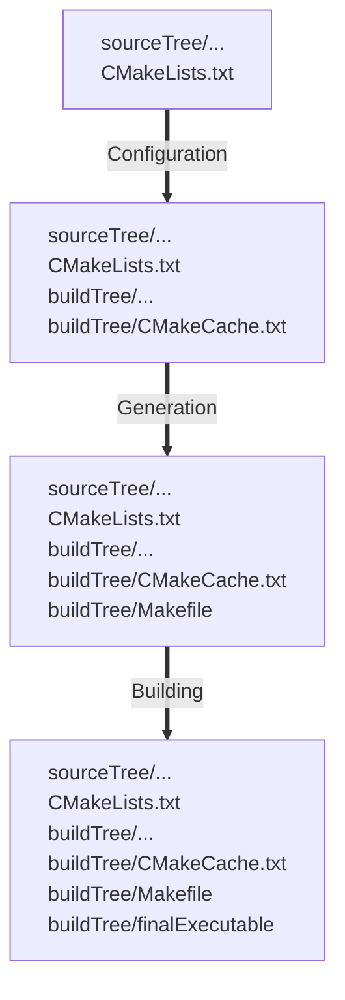
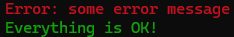

# make & cmake

**Last update**: 20251230-2


### Table of Contents

1. [Introduction](#introduction)
2. [Makefile](#makefile)
3. [Shared libraries](#shared.libraries)
4. [The final step: **cmake**](#the.final.step.cmake)
5. [References](#references)


### 1. Introduction <a name="introduction"></a>
The command-line utility **make** is used in the development of large-scale projects consisting of multiple source files, which must be compiled and linked together to create a single executable file. One finds such a modus operandi, for instance, in major collaborations at the Large Hadron Collider, where several hundred developers concurrently develop the analysis framework for a given experiment. 

One can immediately see a potential caveat — would it be necessary to recompile all source files if there were a change in only one of them? This would result in a significant loss of efficiency during code development, as recompiling a large-scale project from scratch typically takes several hours, even on the most powerful computers. An obvious solution (that existed already in the 1970s) would be to use a **linker**: recompile only the changed files, and link with the previously compiled files. However, in practice, this approach is error-prone because if several source files are modified, it is frequently forgotten to recompile at least one of them, which leads to either compilation errors or pointless debugging sessions (a bug is fixed, but the code is not recompiled). In the past, solving this problem was accomplished through carefully written shell scripts, which were always specific to the project in question. Since this problem was recurring in all large-scale projects, there was a need for a general solution. This is precisely how the command-line utility **make** originated. 

**Historical note**

The first version of **make** was developed by Stuart Feldman in April 1976, in the C programming language, after he and one of his colleagues at Bell Labs (New Jersey, US) spent several hours in the same week debugging the correct source code, by simply forgetting to recompile it after the bug was fixed. Motivated by endless frustration, Stuart Feldman immediately implemented the first version of **make** over the weekend, featuring the infamous "tab-in-column-1" syntax (more on this below!). The very next weekend, the second version of **make** was rewritten from scratch. However, by then, 10+ collaborators at Bell Labs had already picked up the idea and started using the first version of **make** during the week &mdash; "tab-in-column-1" syntax remained in the code, ensuring backward compatibility was not broken.

There are several major implementations of **make** nowadays:
- GNU **make** &mdash; used in this lecture
- BSD **make**
- Microsoft **nmake**

While all implementations of **make** share the same basic ideas and goals, their syntax is frequently incompatible.

**The key idea behind 'make'**

Automatic detection of source files that have been modified can be accomplished by examining the file's metadata, particularly the file's _mtime_ flag. File metadata refers to any information related to a file beyond its content. There are three _timestamps_ as a part of the file's metadata, with the following meaning:  

* **Access (atime)** : last time a file was accessed (opened) and read without any modification   
* **Modify (mtime)** : last time a file was modified (i.e. its content has been edited)
* **Change (ctime)** : last time a file's metadata was changed (e.g. file's permissions)  

These three timestamps are not overkill &mdash; in fact, they enable many compelling features. For each file, its metadata can be displayed with the **stat** command:

 ```bash
 $ stat Lecture_2.md # specify the abs. or rel. path to file as an argument
   File: Lecture_2.md
   Size: 97805           Blocks: 384        IO Block: 4096   regular file
 Device: 2h/2d   Inode: 12947848928707821  Links: 1
 Access: (0666/-rw-rw-rw-)  Uid: ( 1000/abilandz)   Gid: ( 1000/abilandz)
 Access: 2020-04-15 21:05:26.002857000 +0200
 Modify: 2020-04-28 11:44:53.454187100 +0200
 Change: 2020-04-28 11:45:14.515681300 +0200
  Birth: -
 ```

To get specifically only the _mtime_ ('Modify') flag, one can use the following syntax:

```bash
# Print time of last data modification, in human-readable format:
$ stat -c %y Lecture_2.md
2020-04-28 11:44:53.454187100 +0200

# Print time of last data modification, in seconds since Unix epoch:
$ stat -c %Y Lecture_2.md
1588067093
```

These flags are instantly updated for each file by the underlying operating system. This can cause significant stress on the system, however, and to improve overall performance and to prevent disk wear, most Linux distributions disable the _atime_ ('Access') flag from being regularly updated.

The key benefits of **make**:

- Compilation is as efficient as possible — only modified source files are recompiled;
- Trivial errors of forgetting to recompile the modified source file (for instance, files with important bugs fixed) are completely eliminated;
- Solution for automation is general, and it can be used for any programming language whose compiler can be run with a shell command (or more generically, for any project where some files must be updated automatically from others whenever the others change);
- Declarative specification language written in the so-called _makefiles_.


### 2. Makefile <a name="makefile"></a>

Before using **make**, one must write a file called *makefile* that describes the relationships among files in your project and provides commands for updating each file. Once the _makefile_ is written, **make** uses that information and compares the modification time _mtime_ flags of two files against each other. In **make**'s parlance, these two files are called _source_ and _target_. If the _source_'s _mtime_ flag is greater than the _target_'s _mtime_ flag (i.e., the _source_ was modified more recently than the _target_), then the _target_ needs to be rebuilt. 

The content of the _makefile_ may look as follows:

```makefile
target : source1 source2 ...
	commands to make target (a.k.a. recipes for this target)
```

This syntax essentially says: For the *target* to be up to date, it must be newer than all the _source_ files 'source1', 'source2', etc. If it is not, run the specified commands to bring the _target_ up to date. The commands are specified on one or more lines that must start with TABs (not with an equivalent number of spaces &mdash; this is a common mistake!). This is the infamous "tab-in-column-1" syntax, introduced with the very first version of **make**, and it remained afterward to preserve backward compatibility for the original users, who started using **make** within days of its initial release.

A _target_ is usually the name of a file generated by **make** when it automatically recompiles all specified source files that have changed. However, it can also represent an _action_ that **make** will be carried out directly. In that case, the _source_ does not need to be specified, and the typical syntax of a _makefile_ may look as follows:

```makefile
action : 
	commands executed for this action (a.k.a. recipes for this action)
```

By default, when **make** looks for the _makefile_, the **GNU** version of **make** tries the following names, with the following precedence: 'GNUmakefile', 'makefile' or 'Makefile'. In practice, you should call your _makefile_ either 'makefile' or 'Makefile'. However, if necessary, a custom name can be used with **make -f customMakeFile** or **make --file customMakeFile**. In what follows next, the content of the _makefile_ is stored for simplicity in the file named 'makefile'. 

As it is customary, we can start with the 'Hello World' example for **make**, by having the following content in the _makefile_:

```makefile
# this is a comment
hello : 
	echo "Hello World"
```

If we are in the same directory where this _makefile_ was saved, we execute:

```bash
$ make hello
echo "Hello World"
Hello World
```

We can implement more commands under the same action 'hello':

```bash
$ cat makefile
# this is a comment
hello : 
	echo "Hello World"
	date

$ make hello
echo "Hello World"
Hello World
date
Sat Oct 11 15:34:23 CEST 2025
```

Or we can separate commands across multiple actions:

```bash
$ cat makefile
# this is a comment
hello : 
	echo "Hello World"
time :
	date
	
$ make hello
echo "Hello World"
Hello World

$ make time
date
Sat Oct 11 15:35:54 CEST 2025
```

We now illustrate what happens if the command for a given action is specified on a line that does not start with TAB:

```bash
$ cat makefile
hello : 
 echo "Hello World"

$ make hello
makefile:3: *** missing separator.  Stop.
```

This limitation can be overcome, if necessary, by using the special variable ```.RECIPEPREFIX```, more on this later. 

We now demonstrate how to, in a real-case scenario, write a _makefile_ and use **make** for the following simple project, which consists of two source files, named 'test1.C' and 'test2.C'. The content of 'test1.C' is:

```C++
#include <stdio.h>
int main()
{
 printf("\n Hi from test1! Compilation time was: on %s at %s \n", __DATE__, __TIME__);
 return 0;
}
```

The content of 'test2.C' is:

```C++
#include <stdio.h>
int main()
{
 printf("\n Hi from test2! Compilation time was: on %s at %s \n", __DATE__, __TIME__);
 return 0;
}
```

In the _makefile_, we implement the following content:

```makefile
all : test1 test2
test1 : test1.C
	gcc test1.C -o test1 && echo "compilation of test1 succeeded"
	ls -alt test1
test2 : test2.C
	gcc test2.C -o test2 && echo "compilation of test2 succeeded"
	ls -alt test2	
run :
	./test1 && ./test2
clean :
	rm test1 test2
```

All three files are placed in the same working directory:

```bash
# Show the current working directory:
$ ls
makefile  test1.C  test2.C
```

First, as an example, we compile separately only 'test1.C' into an object file 'test1'. From the above _makefile_, the relevant part is: 

```makefile
test1 : test1.C
	gcc test1.C -o test1 && echo "compilation of test1 succeeded"
	ls -alt test1
```

The **make** will interpret this as follows:

1. Compare the _mtime_ flags of a compiled object file 'test1' (_target_) and a specified file 'test1.C' (_source_);
2. If the _mtime_ flag of the file 'test1.C' is greater than the _mtime_ flag of the object file 'test1', execute the specified commands, namely:
   * Execute: ```gcc test1.C -o test1 && echo "compilation of test1 succeeded"```
   * Execute: ```ls -alt test1```

To achieve that, on the command line we execute:

```bash
$ make test1
gcc test1.C -o test1 && echo "compilation of test1 succeeded"
compilation of test1 succeeded
ls -alt test1
-rwxr-xr-x 1 abilandz abilandz 15960 Oct 11 15:50 test1
```

However, if we re-execute the same command immediately, nothing will happen:

```bash
$ make test1
make: 'test1' is up to date.
```

We can either change something explicitly in the source code of 'test1.C', or simply directly update its _mtime_ flag with the **touch** command:

```bash
$ touch test1.C
$ make  test1
gcc test1.C -o test1 && echo "compilation of test1 succeeded"
compilation of test1 succeeded
ls -alt test1
-rwxr-xr-x 1 abilandz abilandz 15960 Oct 11 15:51 test1
```

As we can see from the above printout, **make** is printing both the commands and the output of those commands. We can silent the printout of commands by using the flag ```--silent``` or its shorter version ``-s``:

```bash
$ touch test1.C
$ make --silent test1
compilation of test1 succeeded
-rwxr-xr-x 1 abilandz abilandz 15960 Oct 11 15:52 test1 
```

Alternatively, if we want to silence differentially only specific commands, we can prefix only those commands with ```@```  in the _makefile_:

```makefile
test1 : test1.C
	gcc test1.C -o test1 && echo "compilation of test1 succeeded"
	@ls -alt test1
```

With such a modification in the _makefile_, we get:

```bash
$ touch test1.C
$ make test1
gcc test1.C -o test1 && echo "compilation of test1 succeeded"
compilation of test1 succeeded
-rwxr-xr-x 1 abilandz abilandz 15960 Oct 11 15:53 test1
```

The line ```ls -alt test1``` is no longer shown in the printout, only its output, because we have silenced it by prepending ```@``` in front of it in the _makefile_.

To compile both 'test1.C' and 'test2.C', we proceed as follows:

```bash
$ touch test1.C test2.C
$ make all
gcc test1.C -o test1 && echo "compilation of test1 succeeded"
compilation of test1 succeeded
ls -alt test1
-rwxr-xr-x 1 abilandz abilandz 15960 Oct 11 15:54 test1
gcc test2.C -o test2 && echo "compilation of test2 succeeded"
compilation of test2 succeeded
ls -alt test2
-rwxr-xr-x 1 abilandz abilandz 15960 Oct 11 15:54 test2
```

Now we change the _mtime_ flag only of test1.C:

```bash
$ touch test1.C
$ make all
compilation of test1 succeeded
ls -alt test1
-rwxr-xr-x 1 abilandz abilandz 15960 Oct 11 15:55 test1
```

As we can see, only the object file 'test1' was recompiled, because only the _mtime_ flag of the source code 'test1.C' has changed, and **make** has automatically determined this — this is the main benefit of using **make**.

Now we change the _mtime_ flag only of test2.C:

```bash
$ touch test2.C
$ make all
gcc test2.C -o test2 && echo "compilation of test2 succeeded"
compilation of test2 succeeded
ls -alt test2
-rwxr-xr-x 1 abilandz abilandz 15960 Oct 11 15:56 test2
```

In this case, only the object file 'test2' was recompiled, because only the _mtime_ flag of the source code 'test2.C' has changed.

We have implemented two additional actions in the makefile: **run** and **clean**. For the action **run**, we have in the _makefile_ the following definition:

```make
run :
	./test1 && ./test2
```

That means:

```bash
$ make run
./test1 && ./test2

 Hi from test1! Compilation time was: on Oct 11 2025 at 15:55:33

 Hi from test2! Compilation time was: on Oct 11 2025 at 15:56:38
```

And finally, to clean up the compiled object files, we have implemented the action **clean** in the _makefile_ via the following definition:

```makef
clean :
        rm test1 test2
```

We can execute this action as follows:

```bash
# List the content of the current working directory:
$ ls 
makefile  test1  test1.C  test2  test2.C

# Remove the object files:
$ make clean
rm test1 test2

# List again the content of the current working directory:
$ ls
makefile  test1.C  test2.C
```

Finally, one can list all implemented actions in the _makefile_ by executing **make** + TAB + TAB:

```bash
$ make + TAB +TAB
all    clean    run    test1    test2
```


####  Variables and wildcards in the makefile

Variables are defined and later used in the _makefile_ with the following syntax:

```makefile
someVariable = "Hello World"
hello :
	echo $(someVariable)
```

After executing:

```bash
$ make hello
echo "Hello World"
Hello World
```

Variable names are case-sensitive, and can be any sequence of characters not containing ```:```, ```#```, ```=```, or whitespace. An exception are variables beginning with ```.``` and an uppercase letter, which can have a special meaning to **make** itself (e.g. special variable ```.RECIPEPREFIX```).


The wildcard characters that can be used in a _makefile_ are ```*```, ```?``` and ```[ ... ]```, with the same meaning as in the Bash shell. For instance:

```makefile
# Remove all files with an extension .o:
clean:
	rm -f *.o
```


### 3. Shared libraries <a name="shared.libraries"></a>

Libraries are pre-existing code that is compiled and ready to use. When a logically distinct set of functions is available, it is helpful to build a library from that set of functions, so that the same source code doesn't have to be copied into the current project and recompiled repeatedly. If a bug fix or new feature needs to be implemented in a given function, it must be done only in one place. There are two types of libraries:

- _static_ &mdash; the actual library is placed in the final program during compilation;
- _shared_ &mdash; only a reference to the library is placed inside the final program (i.e. the program is _linked_ with a library).

A static library is commonly stored in a file with the extension ```.a```, while a shared library is stored in a file with the ```.so``` extension. The main disadvantage of static libraries is code bloat and the resulting waste of disk space, as the same code with pre-compiled functions appears in multiple programs. In addition, if a change is introduced in a static library, all programs using that library must be recompiled. On the other hand, programs linked with shared libraries do not need to be recompiled when changes are introduced in those libraries &mdash; only the libraries themselves need to be recompiled. When it comes to performance, programs using static libraries will run slightly faster, because all the symbols in the library are already resolved at compile time (with shared libraries, they need to be resolved at run time). Once compiled, programs using static libraries no longer depend on those libraries, which removes the external dependency on library version (this is particularly relevant when a major upgrade of the underlying operating system is performed, during which most libraries are updated to a newer version). In what follows next, we focus on shared libraries, using as an example code written in the C/C++ programming language, and compiled using the open-source **gcc** compiler (originally, _GNU C Compiler_, later renamed into _GNU Compiler Collection_).

The stages needed in the project development utilizing shared libraries can be delineated as follows:

1. _Source code_ &mdash; the standard code development from scratch.
2. _Preprocessor_ &mdash; this stage deals with all the preprocessor directives, to programmatically modify the source code and prepare it for compilation. For instance, in the C/C++ programming language, this step involves processing all lines in the source code that start with a ```#```, such as ```#define```, ```#include```, etc. If the source code contains a line in the preamble ```#include <someHeaderFile.h>```, the preprocessor will literally inline the content of the header file ```someHeaderFile.h``` into that source code. No code compilation occurs at this stage, only programmatic manipulation of source code via the preprocessor. 
3. _Compilation_ &mdash; once the source file has been preprocessed, the compilation takes place over the modified source code. In the C/C++ programming language, at this stage, the **gcc** compiler turns the source code from ```.c``` or ```.cxx``` files into an ```.o``` (object) files. An object file contains machine code specific to the underlying hardware, and it is ready to be included via linking in a final executable (but typically cannot be executed directly).
4. _Linking_ &mdash; at this stage, all of the object files and shared libraries are linked together to make the final executable, which is ready to run. The executable can be started in the terminal from the shell, and is then handed off to the loader.
5. _Loading_ &mdash; this stage happens when the program starts up. The program is scanned for references to shared libraries, and any references found are resolved; the shared libraries are then mapped into the program. This way, only at runtime, different programs re-use exactly the same pre-compiled code stored in the shared libraries.
6. _Build_ &mdash; All stages above combined.

All stages above are now illustrated with a simple example, in which a shared library is created for specific functions and then used in a program afterward.


**Step 1: Source code**

First, we place all function declarations in the header file ```functions.h```, with the following content:

```C
void Hello();
void Bye();
```

For each function declared in the header file, we provide its implementation in the corresponding file ```functions.cxx```:

```c
#include <stdio.h>
#include "functions.h"

void Hello() {
  printf("\n Hello, how is life? \n");
}
void Bye() {
  printf("\n See you later! \n");
}
```

We had to add a line ```#include <stdio.h>```, so that we can use the function **printf** from the standard library ```stdio.h```. With the notation ```< ... >``` we indicate that this header will be taken from one of the standard locations in the filesystem where header files are stored (typically, ```/usr/include```). On the other hand, with the notation ```" ... "```, we indicate that the header file is located in the current working directory. In case of doubt, we can always specify the full path to the header file in the source code instead. 

Finally, the main program (executable) is in the file ```test.cxx```, and it is implemented as follows:

```c
#include <stdio.h>
#include "functions.h"

int main() {
  puts("This is a shared library test...");
  Hello();
  Bye();  
  return 0;
}
```

In this exercise, we will make a library for functions implemented in ```functions.cxx```, and demonstrate how to use that library in the executable **test** obtained after compiling ```test.cxx```.


**Step 2: Compilation**

For compilation of the source code, we use the **gcc** compiler, and we have to compile using the flag ```-fpic``` to create position-independent code (this flag is mandatory for shared libraries, because the generated machine code will not be dependent on a specific address in memory, which is important when several shared libraries are loaded simultaneously in the memory):

```bash
# Check the content of current working directory:
$ ls
functions.cxx  functions.h

# Compile:
$ gcc -c -Wall -Werror -fpic functions.cxx

# Check again the content of current working directory:
$ ls 
functions.cxx  functions.h  functions.o 
```

The compilation step produced a new object file named _functions.o_, which contains the machine (or binary) code, and whose content cannot be inspected with the standard editors (if curious, try nevertheless **cat functions.o** &mdash; you will get a mostly incomprehensible sequence of non-printable characters on the screen).


**Step 3: Creating a shared library from an object file**

This step is straightforward:

```bash
$ gcc -shared -o libfunctions.so functions.o
$ ls
functions.cxx  functions.h  functions.o  libfunctions.so
```

As it can be seen above, this step produced a shared library in the file _libfunctions.so_, which contains the machine code.

  

**Step 4: Linking with a shared library**

Let us compile our main program from the source code _test.C_, by linking it with the shared library in the file _libfunctions.so_, to create our final executable named **test**:

```bash
# Compile and link:
$ gcc -Wall -o test test.cxx -l functions
/usr/bin/ld: cannot find -lfunctions
collect2: error: ld returned 1 exit status
```

The first attempt failed, but we use this failure to clarify a few non-trivial things which are happening at this step. First, note that the option **-l functions** is not looking for a file _functions.o_, but instead for a file _libfunctions.so_. Namely, **gcc** assumes that all libraries start with prefix ```lib``` and end with a file extension ```.so``` (for shared libraries) or ```.a``` (for static libraries). That being written, the option **-l functions.so** would also lead to an error, because **gcc** will be looking for shared library in a file _libfunctions.so.so_. 

We got a compilation error, because the linker **ld** does not know where to find the shared library _libfunctions.so_ (Remark: **gcc** compiler merely acts as a front-end to the linker **ld** at link time). The **gcc** has a list of directories it looks by default for the libraries, but our current working directory which contains the library _libfunctions.so_ is not on that list. By default, **gcc** searches for libraries first in ```/usr/local/lib```, and then in ```/usr/lib``` (but this may vary from one operating system to another). After that, it searches for libraries in the directories specified by the **-L** option, in the order specified on the command line. From documentation:

```bash
 -l LIBNAME, --library LIBNAME
               Search for library LIBNAME

 -L DIRECTORY, --library-path DIRECTORY
               Add DIRECTORY to library search path
```

Since our shared library _libfunctions.so_ is in the current working directory, we can disclose its location to **gcc** with the option **-L $PWD**:

```bash
# Compile and link, telling gcc that the shared library
# "libfunctions.so" is in PWD:
gcc -L $PWD -Wall -o test test.cxx -l functions
```

We have now successfully linked our executable **test** with the pre-compiled shared library _libfunctions.so_.


**Step 5: Loading the shared library at runtime and executing the main programme**

Before a program can be executed, the executable must be loaded from the disk into the primary memory (RAM). This is accomplished by the _loader_, an essential part of an underlying operating system that is responsible for loading programs and libraries into memory. However, if we attempt after compilation and linking to execute our final executable **test**, we get yet another error:

```bash
$ ./test
./test: error while loading shared libraries: libfunctions.so: cannot open shared object file: No such file or directory
```

Now the loader cannot find the shared library. Again, the problem is that the shared library is not in any of the standard locations, so we need to pass to the loader an information about the custom location of our library. The easiest way to accomplish this is to use the environment variable **LD_LIBRARY_PATH**, for instance:

```bash
# Add new location, in this example PWD, to LD_LIBRARY_PATH:
export LD_LIBRARY_PATH=${PWD}:${LD_LIBRARY_PATH}
```

In the above re-definition of environment variable **LD_LIBRARY_PATH**, we have appended its previous content. Otherwise, its redefinition may cause problems with other programs that also rely on **LD_LIBRARY_PATH**.

Finally, after redefinition of **LD_LIBRARY_PATH** we are ready to run:

```bash
# Start the main programme:
$ ./test
This is a shared library test...

 Hello, how is life? 

 See you later! 
```

In the next step, we illustrate the main point of using shared libraries.


**Step 6: Introduce a change in the shared library**

We now introduce some change in the source code of functions in the file _functions.cxx_:

```c
#include <stdio.h>
#include "functions.h"

void Hello() {
 // printf("\n Hello, how is life? \n"); // old version
 puts(" Hello from new version!");
}
void Bye() {
  // printf("\n See you later! \n"); // old version
  puts(" Hasta la vista!");
}
```

We recompile again only the functions:

```bash
# Recompile the object file:
$ gcc -c -Wall -Werror -fpic functions.cxx

# Recompile the shared library:
$ gcc -shared -o libfunctions.so functions.o
```

And finally, the main point &mdash; we can execute the main programme without recompiling it:

```bash
$ ./test
This is a shared library test...
 Hello from new version!
 Hasta la vista! 
```

This becomes particularly beneficial if we have compiled our main programme against many external shared libraries.

Finally, all the above steps are automated with the following example _makefile_:

```bash
workDir = ${PWD}

test : test.cxx
        gcc -L $(workDir) -Wall -o test test.cxx -l functions

fun : functions.o

functions.o : functions.cxx functions.h
        gcc -c -Wall -Werror -fpic functions.cxx
        gcc -shared -o libfunctions.so functions.o
        gcc -L $(workDir) -Wall -o test test.cxx -l functions
        export LD_LIBRARY_PATH=$(workDir):${LD_LIBRARY_PATH}
        ls -alt functions*

all : functions.o test

clean :
        cd $(workDir) && rm *.o

run :
        ./test
```

With such _makefile_, we can simply execute:

```bash
make all
```

If the source code of either 'functions.cxx' or 'functions.h' has been changed, **make** will automatically go through all steps needed to build a share library 'libfunctions.so', but the executable **test** won't be recompiled, because there were no changes in 'test.cxx'.

Vice versa, if there were changes only in the 'test.cxx', the executable **test** will be recompiled from scratch, but the same precompiled shared library 'libfunctions.so' will be used and linked at runtime, since there were no changes in neither 'functions.cxx' nor 'functions.h', 


### 4. The final step: **cmake** <a name="the.final.step.cmake"></a>

CMake ('cross-platform make') is an advanced software development tool used primarily to automate the creation of configuration files for standard native build tools, such as _makefiles_ for the **make** tool. It was originally designed by Bill Hoffman and released in 2000 by Kitware, Inc., a technology company headquartered in Clifton Park, New York, with an initial focus on 3D biomedical imaging of the human body. 

As its name suggests, CMake is cross-platform, meaning it can be used transparently to build projects in an automated manner on various underlying operating systems, including Linux, Windows, and macOS. By default, CMake assumes that the project is written in C or C++, but upon reconfiguration, it can also build projects written in other languages, including Fortran, Objective-C/C++, C#, Java, and others.

CMake consists of five native executables: **cmake**, **ctest**, **cpack**, **cmake-gui**, and **ccmake**. In this lecture, only **cmake** is covered in detail, and therefore CMake and **cmake** in what follows next will be used interchangeably.

#### Installing cmake

By default, **cmake** is not installed on Linux distributions. To install the currently supported version for a given Linux distribution, one can proceed by using the standard packaging tools for that distribution, e.g. **apt** ("Advanced Package Tool") on Ubuntu:

```bash
# Install cmake as a root:
$ sudo apt install cmake

# Check your cmake version:
$ cmake --version
cmake version 3.22.1

CMake suite maintained and supported by Kitware (kitware.com/cmake).
```

In a case when the custom **cmake** version needs to be compiled (e.g. when a newer version is required than the one currently shipped by default on a given Linux distribution), one proceeds as follows:

```bash
# In case you have admin privileges, uninstall the default outdated 
# version which was shipped by the Linux package manager. 
# Othwerwise, skip this step:
$ sudo apt remove --purge --auto-remove cmake

# Download the custom version, e.g. 3.23.1, in some directory:
$ mkdir $HOME/cmake && cd $HOME/cmake
$ wget https://cmake.org/files/v3.23/cmake-3.23.1.tar.gz

# Decompress the downloaded tarball:
$ tar -xzvf cmake-3.23.1.tar.gz
$ cd cmake-3.23.1

# Configure:
$ ./bootstrap
---------------------------------------------
CMake 3.23.1, Copyright 2000-2022 Kitware, Inc. and Contributors
Found GNU toolchain
C compiler on this system is: gcc 

... many more lines ...

-- Configuring done
-- Generating done
-- Build files have been written to: /home/abilandz/cmake/cmake-3.23.1
---------------------------------------------
CMake has bootstrapped.  Now run make.

# Compile cmake using e.g. 4 CPUs:
$ make -j 4
[  0%] Building C object Source/kwsys/CMakeFiles/cmsys_c.dir/ProcessUNIX.c.o
[  0%] Building C object Source/kwsys/CMakeFiles/cmsys.dir/ProcessUNIX.c.o
[  1%] Building CXX object Utilities/std/CMakeFiles/cmstd.dir/cm/bits/fs_path.cxx.o
[  2%] Building C object Utilities/KWIML/test/CMakeFiles/kwiml_test.dir/test.c.o

... many more lines ...

[100%] Building CXX object Tests/CMakeLib/CMakeFiles/CMakeLibTests.dir/testCMExtAlgorithm.cxx.o
[100%] Linking CXX executable CMakeLibTests
[100%] Built target CMakeLibTests

# Check your custom cmake version:
$ ./bin/cmake --version
cmake version 3.23.1

CMake suite maintained and supported by Kitware (kitware.com/cmake).

# a) In case you have admin privilages, execute the command below,
# othwerwise, skip this step:
$ sudo make install

# b) If you do not have admin privilages, simply add a new 
# install directory to PATH with higher precedence:
$ export PATH=$HOME/cmake/cmake-3.23.1/bin:$PATH
$ which cmake
/home/abilandz/cmake/cmake-3.23.1/bin/cmake

# In case the call to old version is still hashed by Bash 
# for quicker access, simply execute (this step is harmless in any case):
$ hash -d cmake

# Check which version of cmake is now the default one:
$ cmake --version
cmake version 3.23.1

CMake suite maintained and supported by Kitware (kitware.com/cmake).
```


#### Executive summary of cmake design

Conceptually, when building a project, **cmake** goes through three different stages:

1. _Configuration_:
   * collects all details about the underlying environment (e.g. which compilers are available for the languages **cmake** supports);
   * performs simple tests (e.g. whether a simple program can be compiled with found compilers);
   * parses through the mandatory configuration file "CMakeLists.txt" (written in **cmake**'s native scripting language!), and executes it line-by-line;
   * all gathered information is stored in a new output directory, the _build tree_, which is used in the generation stage (e.g. paths to found compilers are stored permanently within the _build tree_ in a file called "CMakeCache.txt"). 
2. _Generation_ &mdash; at this stage, **cmake** generates for the current environment automatically the suitable configuration files for native build tools (e.g. _makefiles_ for **make**). 
3. _Building_ &mdash; native build tools (e.g. **make**) are run to produce the final executables or libraries for this project. Everything that is created (e.g. object files, the final executable or library, build logs, etc.) during the build process by the native build tool is also stored within the _build tree_. 

Diagrammatically, the evolution of the project after all stages of **cmake** are executed can be described as follows:



Before running **cmake**, one needs to prepare a mandatory configuration file "CMakeLists.txt". At least one such file needs to be prepared and placed in the root directory of the project, before **cmake** can be executed for that project. 

After the configuration file "CMakeLists.txt" is written, the configuration and generation stages are accomplished by executing the following command in the same directory where "CMakeLists.txt" is placed:

```bash
cmake -B buildTree -S sourceTree
```

where "sourceTree" is the name or path of a directory in which the source code of the project is placed (the most frequent naming convention is simply "src"), and "buildTree" is a name (the most frequent naming convention is simply "build") of new directory created by **cmake** in which the output of configuration and generation stage is stored (e.g. the file "CMakeCache.txt" and _makefiles_ for **make**, etc.). 

The final building stage commences after executing:

```bash
cmake --build buildTree
```

The name or path of "buildTree" must be the same as in the previous step. One can profile and optimize this stage with additional flags, for instance:

```bash
# build the project using 10 cores and provide verbose output:
cmake --build buildTree -j 10 -v
```

It is also possible via **cmake** to supply options for the native build tool which will be used (e.g. **make**) with the following syntax:

```bash
# build the project using non-default settings for 'make':
cmake --build buildTree -- someFlagsForMake
```

If the build succeeded, the final executable will be in the "buildTree" directory, and can be immediately tested with:

```bash
./buildTree/finalExecutable
```

Typically, the project's code is added under a version control system (e.g. using Git), and therefore it is important to maintain the content of "sourceTree" clean and separate from the content of "buildTree". 

Before we start discussing the **cmake** projects in detail, a quick passage through its native scripting language is provided in the next section.


#### The native scripting language in cmake

A "Hello World!" example in the native scripting language in **cmake** amounts to the following code saved in the script file named "hello.cmake":

```cmake
# An example of a 'cmake' script:
cmake_minimum_required(VERSION 3.22)
message("Hello World!")
```

This script has to be executed in the following way:

```bash
$ cmake -P hello.cmake
Hello World!
```

The flag ```-P``` is important, and it instructs **cmake** that no configuration or generation step needs to be performed when the script is executed. Without using this flag, **cmake** expects the mandatory configuration file "CMakeLists.txt"  to be available, and in addition **cmake** will automatically perform a lot of additional actions behind the scene. A few other general remarks:

1. _Command invocation_ &mdash; In general, in scripts or in configuration files, **cmake** commands use the following syntax:

    ```cmake
    command_name(command arguments)
    ```

    To name the commands, wide-spread convention is to follow _snake_case_ naming convention. Command arguments _can not_ be replaced with a call to another command, whose output will be in-lined as arguments to the current command, i.e. this syntax is not supported:

    ```cmake
    # this is NOT supported in 'cmake' scripting language:
    command_name(some_other_command_name(command arguments))
    ```

    There can be only one command per line, therefore terminating semi-colon ```;``` is not needed.

2. The command **cmake_minimum_required()** is not mandatory in the scripts, but it is mandatory in the configuration file "CMakeLists.txt". This command checks the version of the currently installed **cmake**, and to ensure consistent behaviour of all commands across different **cmake** versions, it is strongly recommended to be used in scripts as well. If the used version of **cmake** is older than the one specified via this command in the script or configuration file, the following error message will be printed:

    ```cmake
    CMake Error at CMakeLists.txt:3 (cmake_minimum_required):
      CMake 3.23 or higher is required.  You are running version 3.22.1
    ```
    This can happen frequently, in fact, when running remotely on large-scale computing facilities, on which software is not updated too regularly. In that case, one needs to install the custom **cmake** version from source in the personal home directory, as explained in the previous section, to ensure consistent behaviour of all commands used in the scripts.

3. _Comments_ &mdash; The **cmake** scripting language supports two types of comments: single-line and multi-line. Single-line comments start with the hash symbol ```#``` and behave similarly as in shell. Multi-line comments are started with the two opening brackets ```[``` with any number of ```=``` characters between them, and closed with the same compound delimiter, just each ```[``` is replaced with ```]```. For instance, multi-line comments can be embedded within

    ```cmake	   
    #[[
    this line is commented out
    this line is commented out as well
    #]]
    ```

    or within:

    ```cmake
    #[==[
    this line is commented out
    this line is commented out as well
    #]==]
    ```

4. _Line endings_ &mdash; Being a cross-platform tool, **cmake** will transparently read scripts and configuration files whether lines are terminated with ```\n``` (Linux style) or ```\r\n``` (Windows style).

The main purpose of this section is to introduce the basic syntax and commands of **cmake** language by executing simple standalone scripts, as the one provided above, without building any project. All these commands can be used later in a more elaborate case as part of the configuration file "CMakeLists.txt" when the actual project is built.


##### Writing to a file

Naively, one would attempt to save the output of **cmake** script by using the redirection operator **>** or the **tee** command in Linux, by executing for instance:

```bash
$ cmake -P hello.cmake > hello.txt
```

While this would work on Linux, it will not work on any GUI-based project on Windows, and the main point of using **cmake**, namely to have platform-independent configuration files for the build, is lost.

Instead, one can use the command **file** from the **cmake** scripting language as follows:

```cmake
# An example of a 'cmake' script:
cmake_minimum_required(VERSION 3.22)
file(WRITE hello.txt "\n I am writing to a file... \n\n")
```

If the above script is saved in the file "hello_2.cmake" and executed as:

```bash
$ cmake -P hello_2.cmake
```

the requested new file "hello.txt" is automatically created, with the following content:

```bash
$ cat hello.txt

 I am writing to a file...

```

On whichever platform this script is executed, **cmake** will ensure transparently that the file "hello.txt" is created and the requested content is written into it with the **cmake**'s command **file**. Otherwise, the above script would have to be written separately for each operating system, using directly native tools available on that operating system.


##### Variables

In the **cmake**'s scripting language, variables are set with the internal command **set()** using the following syntax:

```cmaks
set(varName "some content")
```

The content of variable is referenced later in a similar way as in a shell, using ```${varName}```. For instance, if the content of **cmake** script "var_1.cmake" is:

```cmake
cmake_minimum_required(VERSION 3.22)
set(Var "hi there")
message(${Var})
```

upon execution it follows:

```bash
$ cmake -P var_1.cmake
hi there
```

Double quotes are important as they preserve the empty characters. Unlike in shell, single quotes have to special meaning in this context, i.e. the definition ```set(Var 'hi there')``` would reference the content of variable ```Var``` as ```'hithere'```. Also, when referencing the content of variables curly braces are mandatory, without them, the printout of ```message($Var)``` would be ```$Var```, even if ```Var``` was set to some value. All variables in **cmake** are stored internally as strings.

On evaluation of variable content, **cmake** will recursively perform all variable references. To illustrate that, we store the following code in the script named "var_2.cmake":

```cmake
cmake_minimum_required(VERSION 3.22)
set(Variable "hi there")
set(tmp "iable")
message(${Var${tmp}})
```

If we execute this script, it follows:

```bash
$ cmake -P var_2.cmake
hi there
```

In the first recursive step, **cmake** referenced the content of variable ```tmp``` and replaced it with "iable". In the second recursive step, **cmake** referenced the content of variable ```Variable``` and replaced it with "hi there".

In case variable needs to be removed, that can be achieved with the command **unset(someVar)**.

There are three categories of variables in **cmake**:

1. _normal_ &mdash; the standard default variables, their content is referenced with ```${VarName}```

2. _environment_ &mdash; when **cmake** is started in a particular environment, it automatically extracts and stores internally variables defined in that environment. After that, in that running **cmake** instance, their content is referenced with the syntax ```$ENV{VarName}```. Their content can be changed using **set(ENV{someVar})** command or unset via **unset(ENV{someVar})**, but when that instance of **cmake** terminates, those changes won't be propagated globally into the environment in which **cmake** is running. By analogy with a shell, **cmake**'s environment variables behave like shell environment variables which were not exported. For instance, if we have the following script "var_3.cmake":

   ```cmake
   cmake_minimum_required(VERSION 3.22)
   set(ENV{HOSTNAME} "nidoqueen")
   message($ENV{HOSTNAME})
   ```

   we can test its behavior and scope definition on a hostname "napalm" as follows:

   ```bash
   # shell is printing the content of env. variable HOSTNAME:
   $ echo $HOSTNAME
   napalm
   
   # cmake is printing the content of env. variable HOSTNAME,
   # valid only internally in this instance of cmake:
   $ cmake -P var_3.cmake
   nidoqueen
   
   # shell is printing the content of env. variable HOSTNAME:
   $ echo $HOSTNAME
   napalm
   ```

   Some environment variables have a special meaning to **cmake**, and changing their values will change **cmake**'s behavior during build. A list of all such environment variables can be found in the official **cmake** documentation under [cmake-env-variables(7)](https://cmake.org/cmake/help/latest/manual/cmake-env-variables.7.html). For instance, the content of environment variable ```CXX``` determines the executable which will be used to compile C++ source code. The ```CXX``` variable is used by **cmake** only in the first configuration to determine C++ compiler &mdash; after that, the value of `CXX` is stored in the cache as another variable ```CMAKE_CXX_COMPILER```.  Similar variables exist for other languages which **cmake** supports, e.g. ```FC``` is used for Fortran compiler found in configuration stage, whose value is stored in cache as ```CMAKE_Fortran_COMPILER```, etc.

   Once **cmake**'s environment variables are stored during the configuration stage in the cache variables (like ```CMAKE_CXX_COMPILER``` or ```CMAKE_Fortran_COMPILER```), their content is persistent afterward during build (i.e. changing manually the content of ```CXX``` will have no effect during build, because the information about C++ compiler is retrieved later only from ```CMAKE_CXX_COMPILER```). 

3. _cache_ &mdash; these variables are permanently stored within a build tree of particular project, in a file named "CMakeCache.txt". Therefore, they have relevance only during the build of the project, when the build tree is automatically generated by **cmake**. In particular, cache variables cannot be used in standalone **cmake** scripts, like normal and environment variables. In essence, cache variables hold permanently information gathered during the project configuration stage (e.g. path to compilers, linkers, etc.), which is referenced from them in the subsequent stages in the build of the project. Their content is referenced either with the standard syntax ```${variableName}```, or equivalently with a more specific syntax ```$CACHE{variableName}```. However, to set them, a special syntax has to be used:

   ```cmake
   set(variableName variableValue CACHE variableType variableComment [FORCE])
   ```

   Typically, after the configuration stage is done, one can use the above command to overwrite manually content of some cache variables before the project build starts. For instance, if after configuration stage the outdated **gcc** compiler was found by **cmake** and stored in the cache variable ```CMAKE_CXX_COMPILER```, one can manually this way set the content of that variable to the newer **gcc** version available. 

   In the above general syntax, "CACHE" is a keyword and it has to be always there. The supported "variableType" includes most importantly "BOOL", "FILEPATH", "PATH" (the directory path), "STRING", etc. The final mandatory entry, "variableComment", sets the comment next to definition of this variable in the file "CMakeCache.txt", and it serves as tool-tip message when **cmake** is used with GUIs in Windows. Finally, the last argument "FORCE" is an optional keyword, and if used it will force overwriting permanently the already existing cache variable with the same name in the file "CMakeCache.txt".

   For instance, if after the configuration stage, the cache variable ```CMAKE_CXX_COMPILER``` is set in the file "CMakeCache.txt" to the outdated C++ compiler:

   ```bash 
   //CXX compiler
   CMAKE_CXX_COMPILER:FILEPATH=/usr/bin/c++
   ```

   one can add the following line to "CMakeLists.txt" and redo the configuration step:

   ```bash
   set(CMAKE_CXX_COMPILER "/usr/local/bin/c++" CACHE FILEPATH "latest CXX compiler" FORCE)
   ```

   One finds now in the file "CMakeCache.txt" after configuration step the following entry for the cache variable ```CMAKE_CXX_COMPILER```:

   ```bash
   //latest CXX compiler
   CMAKE_CXX_COMPILER:FILEPATH=/usr/local/bin/c++
   ```


##### Command and script arguments

Arguments are passed to the **cmake** script similarly to a shell script, using the following syntax:

```bash
cmake arg1 arg2 ... argN
```

All arguments are stored in **cmake**'s internal variables ```CMAKE_ARGV1```, ```CMAKE_ARGV2```, ..., ```CMAKE_ARGVN```.  There is also a special variable ```CMAKE_ARGVC```, which counts the total number of arguments. If the content of **cmake** script "arg_1.cmake" is:

```cmake  
cmake_minimum_required(VERSION 3.22)

message(${CMAKE_ARGV0})
message(${CMAKE_ARGV1})
message(${CMAKE_ARGV2})
message(${CMAKE_ARGV3})
message(${CMAKE_ARGV4})
message(${CMAKE_ARGV5})
message("Total number of arguments: " ${CMAKE_ARGC})
```

Upon execution, it follows:

```bash
$ cmake -P arg_1.cmake -- "abc" "44"
cmake
-P
arg_1.cmake
--
abc
44
Total number of arguments: 6
```

There are three conceptually different types of arguments in **cmake**:

1. _bracket arguments_ &mdash; used to pass multi-line strings to commands, preserving all empty characters, new lines, etc. For instance, if we save in the file "bracket.cmake" the following **cmake** script:

   ```cmake	 
   cmake_minimum_required(VERSION 3.22)
   
   message([[
   some  text
   
     some    other text
   ]])
   ```

   after execution it follows:

   ```bash
   $ cmake -P bracket.cmake 
   some  text
   
     some    other text
   ```

   The delimiters ```[[ ... ]]``` can be replaced with any other combination ```[=[ ... ]=]```, ```[==[ ... ]==]```, etc. Within bracket arguments, all symbols are interpreted literally, i.e. all symbols lose their metacharacter meaning. This means that content within bracket arguments cannot be modified dynamically (i.e. it is interpreted as verbatim).

2. _quoted arguments_ &mdash; delimiters are double quotes ```" ... "```, and within double quotes the standard escape sequences (e.g. ```\n``` for new line) and variable referencing (e.g. ```${CMAKE_VERSION}```) are evaluated. For instance, if we have in the script "quoted.cmake" the following content:

   ```cmake
   cmake_minimum_required(VERSION 3.22)
   message("Current cmake version is:\n${CMAKE_VERSION}")
   ```
   
   after execution it follows:
   
   ```bash
   $ cmake -P quoted.cmake 
   Current cmake version is:
   3.22.1
   ```
   
3. _unquoted arguments_ &mdash; when using unquoted arguments, one has to pay special attention to the metacharacter semicolon ```;``` which **cmake** uses to make lists. Each non-empty element within semicolons is given to the command invocation as a separate argument. For more details on how to define a list, see the **set()** command, and for information on working with lists, refer to the **list()** command.


In the next section, we introduce the basic control structures in the **cmake** scripting language, like conditional blocks, loops, etc.


##### Control structures

The only available conditional block in **cmake** is given with the following schematic syntax:

```cmake
if(someCondition)
  ... some commands ...
elseif(someOherCondition) # can be repeated
  ... some other commands ...
else()
  ... yet another commands ...
endif()
```

The meaning of above conditional block is similar to other languages and it is self-explanatory.

As a part of the condition to be tested, the following standard _logical_ operators are supported: ```NOT```, ```AND```, ```OR```. The strings that act as standard booleans are ```TRUE``` and ```FALSE```. The conditions can be grouped with round braces ```( ... )```. If we have the following content in the script "if.cmake":

```cmake
cmake_minimum_required(VERSION 3.22)
if( TRUE AND ( TRUE OR FALSE ) )
  message("It's true.")
endif()
```

we get after execution:

```bash
$ cmake -P if.cmake
It's true.
```

The strings which **cmake** will evaluate as a Boolean true are ```ON```, ```YES```, ```Y```, ```TRUE``` (all of them are case insensitive), and any non-zero number (including floating point numbers). This is illustrated by the following script named "bool.cmake":

```cmake
cmake_minimum_required(VERSION 3.22)
if(ON)
  message("It's ON")
endif()

if(oN)
  message("It's oN")
endif()

if(YES)
  message("YES")
endif()

if(YeS)
  message("YeS")
endif()

if(Y)
  message("Y")
endif()

if(YY)
  message("YY")
endif()

if(0)
  message("0")
endif()

if(1)
  message("1")
endif()

if(-1)
  message("-1")
endif()

if(0.1)
  message("0.1")
endif()
```

After execution, it follows:

```bash
$ cmake -P bool.cmake
It's ON
It's oN
YES
YeS
Y
1
-1
0.1
```

Analogously, the strings which **cmake** will evaluate as a Boolean false are ```OFF```, ```NO```, ```N```, ```FALSE```, ```IGNORE```, ```NOTFOUND```, suffix ```NOTFOUND``` (all of them are case insensitive), an empty string, and a zero. 

The **cmake** scripting language offers several operators for comparison, which can be grouped as follows:

* _number comparison_ &mdash; ```EQUAL```, ```LESS```, ```LESS_EQUAL```, ```GREATER```, and ```GREATER_EQUAL```. These operators can be used to compare integers and real numbers. The two operands are parsed and interpreted as a type _double_ in the C programming language, which means that also the scientific notation can be used:

  ```cmake
  if(0.01 EQUAL 1.e-2)
    message("yes")
  endif()
  # prints "yes"
  ```

* _version comparison_ &mdash; ```VERSION_EQUAL```, ```VERSION_LESS```, ```VERSION_LESS_EQUAL```, ```VERSION_GREATER```, and ```VERSION_GREATER_EQUAL```. The version identifier has to follow the standard syntax convention "major.minor.patch.tweak". If the "tweak" number is missing, that is interpreted in comparison as "major.minor.patch.0", if "patch" and "tweak" numbers are missing, that is interpreted in comparison as "major.minor.0.0", etc. For instance, the code snippet:

  ```cmake
  if (2.3.4 VERSION_LESS_EQUAL 2.3)
  ```

  will evaluate to false, the code snippet:

  ```cmake
  if (2.2.4 VERSION_LESS_EQUAL 2.3)
  ```

  will evaluate to true, while the code snippet:

  ```cmake
  if (2.3.0 EQUAL 2.3)
  ```

  will evaluate to true.

* _string comparison_ &mdash; ```STREQUAL```. The operator is case sensitive. The code snippet

  ```cmake  
  if ("AA" STREQUAL "AA")
  ```

  will evaluate to true, while the code snippet

  ```cmake
  if ("AA" STREQUAL "Aa")
  ```

  will evaluate to false.

* _regex comparison_ &mdash; **cmake** supports a set of regex metacharacters, but there are some differences with respect to the standard BRE ("Basic Regular Expression") and ERE ("Extended Regular Expression"), therefore regex has to be used in **cmake** with some care. More details can be found in the official documentation under the section "Regex specification", available at this [link](https://cmake.org/cmake/help/latest/command/string.html#regex-matchall).


Finally, the **cmake** scripting language offers several operators to inspect the status of files or directories directly. Their meaning and usage are the same as in a shell, only the syntax differs: 

* ```EXISTS``` &mdash; checks if a file or directory exists:

  ```cmake
  set(File "/home/abilandz/git/lectures/NAT3054/Lecture_3/make.md")
  if(EXISTS ${File})
    message("File ${File} exists")
  endif()
  ```

* ```IS_NEWER_THAN``` &mdash; checks which file is newer:

  ```cmake
  set(File_1 "/home/abilandz/git/lectures/NAT3054/Lecture_3/make.md")
  set(File_2 "/home/abilandz/git/lectures/NAT3054/Lecture_2/git.md")
  if(${File_1} IS_NEWER_THAN ${File_2})
    message("${File_1} is newer than ${File_2}")
  else()
    message("${File_2} is newer than ${File_1}")
  endif()
  ```

  Warning: the operator ```IS_NEWER_THAN``` evaluates to ```TRUE``` even if one or both files in a comparison do not exist.

* ```IS_DIRECTORY``` &mdash; checks if a specified path points to an existing directory:

  ```cmake
  set(Path "/home/abilandz/git/lectures/NAT3054/Lecture_3")
  if(IS_DIRECTORY ${Path})
    message("${Path} is a directory")
  endif()
  ```

In a similar manner, one can use other operators in this category, e.g. ```IS_SYMLINK```, ```IS_ABSOLUTE```, etc.


##### Loops

The **cmake** scripting language supports two types of loops: **while** and **foreach** loops. Their syntax and usage are illustrated with a few concrete examples. 

In general, one uses **while** loop as follows:

```cmake
while(condition)
  command-1
  command-2
    ...
  command-N
endwhile()  
```

Within the body of a **while()** loop, one can use the commands **break()** and **continue()** with their standard meanings. This loop is typically used when the _condition_ evaluates to a simple boolean expression directly.

It is possible to use a **while()** loop to work with the explicit counters, but the syntax is somewhat cumbersome. If the following script is saved in the file "while.cmake":

````cmake
cmake_minimum_required(VERSION 3.22)

set(Counter 0)
set(Max 4)
while(${Counter} LESS_EQUAL ${Max})

 # some message:
 message("Counter = ${Counter}")
 
 # increment (yes, this is the simplest syntax!):
 math(EXPR Counter ${Counter}+1)

endwhile()
````

upon execution it follows:

```bash
$ cmake -P while.cmake
Counter = 0
Counter = 1
Counter = 2
Counter = 3
Counter = 4
```

This syntax is cumbersome because even to execute a simple increment, we had to execute the mathematical expressions in a special environment, with the following general syntax:

```cmake
math(EXPR outputVariable "mathExpression")
```

For instance:

```cmake
set(Var 4)
set(Square 0)
math(EXPR Square "${Var}*${Var}")
message("Square of ${Var} is ${Square}") 
# Square of 4 is 16
```

One should not take mathematical operations in **cmake** too far, as the above built-in **math()** command supports only basic and rudimentary mathematical operations. For instance, floating-point arithmetic is not supported. Similar to shell, whenever more involved mathematical operations need to be performed in a **cmake** script, one can call an external utility (more on this later!).

Another loop supported by **cmake** is the **foreach()** loop, and this version is much more versatile than the **while()** loop. It comes in several variants, each of which is more suitable for a specific use case than the others. 

The simplest version of the **foreach()** loop is a so-called _C-style for loop_, with the following general syntax:

```cmake
foreach(loopIndex RANGE maxValue)
  command-1
  command-2
    ...
  command-N
endforeach()
```

Within the body of a **foreach()** loop, one can use the commands **break()** and **continue()** with their standard meanings. 

For instance, the following **cmake** script implemented in a file "for.cmake":

```cmake
cmake_minimum_required(VERSION 3.22)

set(Max 4)
foreach(Index RANGE ${Max})
  message("Index: ${Index}")
endforeach()
```

evaluates into:

```bash
$ cmake -P for.cmake
Index: 0
Index: 1
Index: 2
Index: 3
Index: 4
```

The loop variable (e.g. named "Index" in the above example) has a local scope to **foreach()**, and it is automatically initialized to 0.  

A slightly more general version of **foreach()** loop is given by the following general syntax:

```cmake
foreach(loopIndex RANGE minValue maxValue step)
  command-1
  command-2
    ...
  command-N
endforeach()
```

In the above code, the last argument "step" is optional. For instance, the script:

```cmake
cmake_minimum_required(VERSION 3.22)

set(Min 0)
set(Max 10)
set(Step 2)
foreach(Index RANGE ${Min} ${Max} ${Step})
  message("Index: ${Index}")
endforeach()
```

will print

```bash
Index: 0
Index: 2
Index: 4
Index: 6
Index: 8
Index: 10
```

Finally, one can use **foreach()** loop to parse the list of elements directly. The general syntax for this variant of **foreach()** loop is:

```cmake
foreach(Var listElement-1 listElement-2 ... listElement-N)
```

The following script:

```cmake
cmake_minimum_required(VERSION 3.22)

foreach(Var "a" "b" "ab" "a  b" 1 2)
  message("Var: ${Var}")
endforeach()
```

will print:

```bash
Var: a
Var: b
Var: ab
Var: a  b
Var: 1
Var: 2
```

In each variant of the **foreach()** loop, the scope of the loop variable is local to the loop in which that variable is used:

```cmake
set(Var "44")
message("Var before loop: ${Var}")
foreach(Var "a" "b" "c")
  message("Var in the loop: ${Var}")
endforeach()
message("Var after loop:  ${Var}")
```

will print:

```bash
Var before loop: 44
Var in the loop: a
Var in the loop: b
Var in the loop: c
Var after loop:  44
```


##### Functions

The **cmake** scripting language supports functions. The commonly used design and syntax are:

````cmake
function(functionName)
  ... function body ...
endfunction()
````

An executive summary of the main design decisions: 

* _scope_ &mdash; all variables defined in the function body are local to that function. The following scripts

  ```cmake
  cmake_minimum_required(VERSION 3.22)
  
  function(fun)
    set(Var "123")
    message("in function: Var = ${Var}")
  endfunction()
  
  fun()
  message("outside of function: Var = ${Var}")
  ```

  after execution produces:

  ```bash
  in function: Var = 123
  outside of function: Var =
  ```

* _environment_ &mdash; function inherits variables set already in the global environment, can change their content locally, but those changes are not propagated into the global environment. That is illustrated with the following script:

  ```cmake 
  cmake_minimum_required(VERSION 3.22)
  
  set(Var "123")
  message("before function: Var = ${Var}")
  
  function(fun)
    message("in function (before redefinition): Var = ${Var}")
    set(Var "abc")
    message("in function (after redefinition): Var = ${Var}")
  endfunction()
  
  fun()
  message("after function: Var = ${Var}")
  ```

  which executes as follows:

  ```bash
  before function: Var = 123
  in function (before redefinition): Var = 123
  in function (after redefinition): Var = abc
  after function: Var = 123
  ```

  With respect to the environment, **function()** in **cmake** scripting language behaves similarly as a subshell ```( ... )``` in Bash. 

  It is possible to change the global environment by executing a call to the function &mdash; for that sake, one can use an alternative implementation in the **cmake** scripting language named **macro()**, but its usage is not recommended, because one can realize which variables in the global environment will be potentially changed, only by inspecting the source code of **macro()**.

* _arguments_ &mdash; arguments _argument-1 argument-2 ... argument-N_ passed in a function call **fun(_argument-1 argument-2 ... argument-N_)** can be referenced programmatically in the function body with the following built-in variables, which resembles the classical C-style definition and usage:

  * ```ARGC``` : the total number of arguments ("argument count");
  * ```ARGV``` : list of all arguments;
  * ```ARGV0```, ```ARGV1```, ...  : value of the 1st argument passed to the function, value of the 2nd argument passed to the function, etc;

  Their usage is illustrated with the following function implementation:

  ```cmake
  cmake_minimum_required(VERSION 3.22)
  
  # function implementation:
  function(fun)
    message("number of arguments: ${ARGC}")
    message("list of arguments:   ${ARGV}")
  
    message("argument 1: ${ARGV0}")
    message("argument 2: ${ARGV1}")
    message("argument 3: ${ARGV2}")
  
    # special treatment for the last argument:
    set(LA -1)
    math(EXPR LA "${ARGC}-1")
    message("last argument: ${ARGV${LA}}")
  
  endfunction()
  
  # call the function:
  fun("a" "b c" 44)
  ```

  The call to the function gives the following output:

  ```cmake
  number of arguments: 3
  list of arguments:   a;b c;44
  argument 1: a
  argument 2: b c
  argument 3: 44
  last argument: 44
  ```

  There is no special built-in variable to retrieve the last argument directly, but as the above example illustrates, this can be achieved easily. 

  Alternatively, one can define the formal arguments explicitly in the function definition and retrieve them in the function body by their name:

  ```cmake
  function(functionName someArg)
    message("someArg: ${someArg}")
  endfunction()
  ```

  but this is less flexible and powerful than working with the built-in variables for arguments.

* _return_ &mdash; one can terminate a function call with **return()**, for instance:

  ```cmake
  cmake_minimum_required(VERSION 3.22)
  
  function(fun)
    if(NOT ${ARGC} EQUAL 2)
      message("exactly two arguments expected")
      return()
    endif()
    message("okay, let's do something...")
  endfunction()
  
  fun("a" "b" "c") # prints: "exactly two arguments expected"
  fun("a" "b") # prints: "okay, let's do something..."
  ```

* _debugging_ &mdash; mostly for debugging purposes, one case use a few more built-in variables within functions, which are set each time a function is called, and can be used only in the function body:

  * ```CMAKE_CURRENT_FUNCTION``` &mdash; the name of the function;
  * ```CMAKE_CURRENT_FUNCTION_LIST_DIR``` &mdash; path to the directory holding the file in which the function is implemented;
  * ```CMAKE_CURRENT_FUNCTION_LIST_FILE``` &mdash; path to the file in which the function is implemented;
  * ```CMAKE_CURRENT_FUNCTION_LIST_LINE``` &mdash; in the file in which the function is implemented, this variable holds the line number at which the implementation of the function begins.

  There usage is illustrated with the following example, which is saved in the file "/home/abilandz/NAT3054/cmake/functions/debugging.cmake":

  ```cmake
  cmake_minimum_required(VERSION 3.22)
  
  function(fun_1)
    message("hello from function ${CMAKE_CURRENT_FUNCTION}")
    message("hello from function ${CMAKE_CURRENT_FUNCTION_LIST_DIR}")
    message("hello from function ${CMAKE_CURRENT_FUNCTION_LIST_FILE}")
    message("hello from function ${CMAKE_CURRENT_FUNCTION_LIST_LINE}")
  endfunction()
  
  function(fun_2)
    message("hello from function ${CMAKE_CURRENT_FUNCTION}")
    message("hello from function ${CMAKE_CURRENT_FUNCTION_LIST_DIR}")
    message("hello from function ${CMAKE_CURRENT_FUNCTION_LIST_FILE}")
    message("hello from function ${CMAKE_CURRENT_FUNCTION_LIST_LINE}")
  endfunction()
  
  fun_1()
  fun_2()
  ```

  After executing this script, we obtain:

  ```bash
  $ cmake -P debugging.cmake
  hello from function fun_1
  hello from function /home/abilandz/NAT3054/cmake/functions
  hello from function /home/abilandz/NAT3054/cmake/functions/debugging.cmake
  hello from function 3
  hello from function fun_2
  hello from function /home/abilandz/NAT3054/cmake/functions
  hello from function /home/abilandz/NAT3054/cmake/functions/debugging.cmake
  hello from function 10
  ```

* _cmake function libraries_ &mdash; it is possible to group **cmake** function implementations across different files and use only the ones that are needed. For instance, one defines the project with the following directory structure:

  ```bash
  ├── someProject
  │   ├── cmakeFunctions
  │       ├── io.cmake
  │       ├── math.cmake
  │       ├── ...
  ```

  The content of "io.cmake" could be:

  ```cmake
  function(Green)
    string(ASCII 27 Esc)
    message("${Esc}[32m${ARGV0}${Esc}[m")
  endfunction()
  
  function(Red)
    string(ASCII 27 Esc)
    message("${Esc}[31m${ARGV0}${Esc}[m")
  endfunction()
  ```

  In the main configuration file "CMakeLists.txt" or in some **cmake** script one first loads the function definitions with **include(...)**, and then simply use the functions, for instance:

  ```cmake
  cmake_minimum_required(VERSION 3.22)
  
  # Load personal cmake functions:
  include(./cmakeFunctions/io.cmake)
  
  # Call some personal cmake functions:
  Red("Error: some error message") 
  Green("Everything is OK!")
  ```

  If the above script is executed, we obtain the coloured printout:

    

In the examples above, we have used some predefined **cmake** commands, without introducing them in detail. In the next section, the overview of the most frequently used commands in that category is provided. 


##### Predefined scripting commands in cmake

In this section, the most frequently used predefined scripting commands in **cmake** are covered in more detail. These commands are always available, and their full list can be found in the official documentation at the following [link](https://cmake.org/cmake/help/latest/manual/cmake-commands.7.html#id3).

* **message()** &mdash; Besides default printout of the text message to the _stdout_ stream, this command offers a lot of other functionalities, through the usage of one of supported keywords as its first argument. For instance:

  ```cmake
  message(FATAL_ERROR "terminating execution due to fatal error")
  ```

  If the keyword ```FATAL_ERROR``` is used, **cmake** will abort processing and skip generation stage, and it will return a non-zero exit code.

  On the other hand:

  ```cmake
  message(SEND_ERROR "error encountered, generation stage will be skipped")
  ```

  If the keyword ```SEND_ERROR``` is used, **cmake** will continue processing, but it will skip the generation stage.

  If the keyword is not specified as a first argument, it defaults to ```NOTICE```:

  ```cmake
  message(NOTICE "some message written to stderr stream")
  message("some message written to stderr stream") # same as above
  ```

  It is important to remember that **message()** writes by default to _stderr_ stream. For instance, if the script is saved in the file "message.cmake":

  ```cmake
  cmake_minimum_required(VERSION 3.22)
  message("some message")
  ```

  it follows:

  ```bash
  $ cmake -P message.cmake 1>stdout.log 2>stderr.log
  $ cat stdout.log
  $ cat stderr.log
  some message
  ```

  Other supported keywords by the **message()** command can be found in the official documentation at this [link](https://cmake.org/cmake/help/latest/command/message.html).

* **include()** &mdash; This command loads and in-lines the **cmake** code from a separate file. The relative paths will be resolved by default from the current working directory. Its usage is illustrated with a few code snippets:

  ```cmake 
  # Load personal cmake functions:
  include(myCmakeFunctions.cmake) # error, if file doesn't exist
  
  # Load personal cmake functions, if the file with their implementation exist:
  include(myCmakeFunctions.cmake OPTIONAL) # no error if file doesn't exist
  
  # Load personal cmake functions. If the file with their implementation exist,
  # store the file path in 'Var', otherwise store NOTFOUND in 'Var':
  include(myCmakeFunctions.cmake OPTIONAL RESULT_VARIABLE Var)
  
  # Search for a file relative to the script, not to the current working directory:
  include("${CMAKE_CURRENT_LIST_DIR}/myCmakeFunctions.cmake")
  ```

* **file()** &mdash; This command enables working directly with the file content in the underlying filesystem, but also fetching the content from online resources. Few general examples of its usage, with self-explanatory syntax:

  ```cmake
  # read the content of "someFile", and store it in variable "Var":
  file(READ someFile Var)
  
  # write "someContent" to an external file "someFile". If the file
  # doesn't exist, it's automatically created. If the file exists,
  # its content will be overwritten:
  file(WRITE someFile "someContent")
  
  # same as WRITE, just the content is appended, not overwritten:
  file(APPEND someFile "someContent")
  
  # download online file from "someUrl" locally to "localPath"
  file(DOWNLOAD someUrl localPath)
  ```

* **execute_process()** &mdash; By using this command, one can, in **cmake** scripts or configuration files, execute external commands available on the underlying system. Since not all commands are available on all systems, and even if they are, their implementation details can differ, the **cmake**'s command **execute_process()** has to be used with care, as it typically leads to the loss of portability. Its general syntax is:

  ```cmake 
  execute_process(COMMAND someExternalCommand arg1 ... argN option1 ... optionN)
  ```

  Arguments "arg1", ..., "argN " are optional, and they are passed to an external command "someExternalCommand". On the other hand, options "option1", ..., "optionN" are interpreted directly by the **cmake**'s command **execute_process()**.

  For instance, to obtain a timestamp in seconds since Unix epoch (1970-01-01 00:00 UTC), the following command and options can be executed on Linux:

  ```bash
  $ date +%s
  1765262578
  ```

  Within **cmake**, that command can be executed with:

  ```cmake
  execute_process(COMMAND date +%s)
  ```

  Below we provide some of the most frequently used options to modify or extend the default behavior of **execute_process()**:

  * ```OUTPUT_VARIABLE``` &mdash; The output is not printed on the _stdout_ stream, but instead stored in a variable;
  * ```ERROR_VARIABLE``` &mdash; The command error message is not printed on the _stderr_ stream, but instead stored in a variable;

  * ```RESULT_VARIABLE``` &mdash; The exit status of last executed command is stored in a variable.

    For instance:

    ```cmake
    cmake_minimum_required(VERSION 3.22)
    
    execute_process(COMMAND date +%s OUTPUT_VARIABLE output ERROR_VARIABLE error RESULT_VARIABLE exit_status)
    
    if(${exit_status} EQUAL 0)
     message("The current timestamp: ${output}")
    else()
     message("Error message: ${error}")
    endif()
    ```

    will execute as:

    ```bash
    The current timestamp: 1765263952
    ```

    On the other hand, if the command fails, like in the following slightly modified script in which an error was intentionally introduced by passing to the **date** command the flag ```-a``` which that command doesn't support:

    ```cmake
    make_minimum_required(VERSION 3.22)
    
    execute_process(COMMAND date -a OUTPUT_VARIABLE output ERROR_VARIABLE error RESULT_VARIABLE exit_status)
    
    if(${exit_status} EQUAL 0)
     message("The current timestamp: ${output}")
    else()
     message("Error message: ${error}")
    endif()
    ```

    The execution now gives:

    ```bash
    Error message: date: invalid option -- 'a'
    Try 'date --help' for more information.
    ```

    Other supported options for the command **execute_process()** can be found in the official documentation at the following [link](https://cmake.org/cmake/help/latest/command/execute_process.html).

* **string()** &mdash; This command is used for programmatic string manipulations. Here only basic examples are illustrated, while the full documentation of this powerful command can be found at the following [link](https://cmake.org/cmake/help/latest/command/string.html). 

  * ```REPLACE``` &mdash; To replace all occurrences of one pattern with another, the following syntax can be used:

    ```cmak
    string(REPLACE OldPattern NewPattern OutputVariable SomeInputContent)
    ```

    For instance, the following code snippet:

    ```cmake
    set(InputVar "a bb c bb")
    set(OutputVar "")
    set(OldPattern "bb")
    set(NewPattern "123")
    
    string(REPLACE ${OldPattern} ${NewPattern} OutputVar ${InputVar})
    
    message("${OutputVar}")
    ```

    will produce:

    ```bash
    a 123 c 123
    ```

  * ```LENGTH``` &mdash; To get the length of the string, the following syntax can be used:

    ```cmake
    string(LENGTH someString OutputVariable)
    ```

    For instance:

    ```cmake
    set(Var "abcd")
    set(Length "")
    string(LENGTH ${Var} Length)
    message("${Length}") # prints 4
    ```

  * ```COMPARE``` &mdash; Two compare two strings, the following general syntax is used:

    ```cmake
    string(COMPARE WhichComparison FirstString SecondString OutputVariable)
    ```

    The supported comparisons "WhichComparison" are ```LESS```, ```GREATER```, ```EQUAL```,
    ```NOTEQUAL```, ```LESS_EQUAL```, or ```GREATER_EQUAL```. The outcome of the comparison is either ```TRUE``` or ```FALSE```, and it is stored in "OutputVariable". 

    For instance:

    ```cmake
    set(Str_1 "abcd")
    set(Str_2 "abcd")
    set(OutputVar "")
    string(COMPARE EQUAL ${Str_1} ${Str_2} OutputVar)
    if(${OutputVar})
      message("two strings are equal")
    endif()
    ```

    will print:

    ```bash
    two strings are equal
    ```

  * ```TIMESTAMP``` &mdash; the current date and time, by default local time is used:

    ```cmake
    string(TIMESTAMP OutputVariable SomeOptionalFormat)
    ```

    For instance, this code snippet:

    ```cmake
    set(OutputVar "")
    string(TIMESTAMP OutputVar)
    message(${OutputVar})
    string(TIMESTAMP OutputVar %s)
    message(${OutputVar})
    ```

    will produce:

    ```bash
    2025-12-16T09:26:05
    1765873565
    ```

    The first line displays the default formatting of a timestamp, in the format ```YYYY-MM-DDTHH:MM:SS```. In the second line, with the non-default format option %s, the timestamp is printed in seconds since midnight (UTC) 1-Jan-1970 (UNIX epoch).

  * _hashing_ &mdash; It is possible in the **cmake** scripting language to hash a string directly with several supported hashing algorithms (e.g. "MD5", "SHA1", etc.), by using the following general syntax:

    ```cmake
    string(WhichAlgorithm OutputVariable SomeString)
    ```

    For instance,

    ```cmake
    set(OutputVar "")
    string(SHA1 OutputVar "abcdef")
    message(${OutputVar})
    ```

    will print:

    ```bash
    1f8ac10f23c5b5bc1167bda84b833e5c057a77d2
    ```

  There are many more non-trivial operations one can perform with the command **string()** (e.g. querying the JSON format directly) &mdash; we refer to the full documentation at the following [link](https://cmake.org/cmake/help/latest/command/string.html). 

* **math()** &mdash; The **cmake** scripting language provides support only for elementary mathematical operations. They can be performed with the following general syntax:

  ```cmake	
  math(EXPR OutputVariable "some math. expression")
  ```

  The string "some math. expression" contains the expression that **cmake** will evaluate and store the final result in the variable "OutputVariable". Only elementary operators are supported, with their standard meaning as in other languages (for instance ```+```, ``` -```, ```*```, ```/```, ```%``` (modulo division), etc.). The following code snippet:

  ```cmake
  cmake_minimum_required(VERSION 3.22)
  
  math(EXPR Result "6/2")
  message("Result = ${Result}")
  
  math(EXPR Result "6%4")
  message("Result = ${Result}")
  
  math(EXPR Result "6*(2+3)")
  message("Result = ${Result}")
  ```

  will produce the following output:

  ```bash
  Result = 3
  Result = 2
  Result = 30
  ```

  The floating-point arithmetic is not supported directly within the **cmake** scripting language, but can be performed by calling external core utilities, like **awk** on Linux:

  ```cmake
  execute_process(COMMAND awk "BEGIN {print 4./7.}" OUTPUT_VARIABLE Result)
  message("Result = ${Result}")
  # Result = 0.571429
  ```

  The full documentation of the **math()** command can be found at the following [link](https://cmake.org/cmake/help/latest/command/math.html).


##### Command-line tools in cmake
Similar to **git**, **cmake** also offers several command-line tools, which can be executed using the flag ```-E``` and the following general syntax:

```bash
cmake -E someCommand someOptions
```

To get the full list and brief documentation of available command-line tools, one can execute:

```bash
$ cmake -E
CMake Error: cmake version 3.22.1
Usage: cmake -E <command> [arguments...]
Available commands:
  capabilities              - Report capabilities built into cmake in JSON format
  cat <files>...            - concat the files and print them to the standard output
  chdir dir cmd [args...]   - run command in a given directory
  compare_files [--ignore-eol] file1 file2
                              - check if file1 is same as file2
  copy <file>... destination  - copy files to destination (either file or directory)#
  
... many more lines ...

  sleep <number>...         - sleep for given number of seconds
  tar [cxt][vf][zjJ] file.tar [file/dir1 file/dir2 ...]
                            - create or extract a tar or zip archive
  time command [args...]    - run command and display elapsed time
  touch <file>...           - touch a <file>.
  touch_nocreate <file>...  - touch a <file> but do not create it.
  create_symlink old new    - create a symbolic link new -> old
  create_hardlink old new   - create a hard link new -> old
  true                      - do nothing with an exit code of 0
  false                     - do nothing with an exit code of 1
```

The **cmake** command-line tools ensure platform-independent behavior of the most important standard utilities when they are used in **cmake** scripts or configuration files. 

For instance, if one wants to execute an infinite **while** loop with periodicity 1 hour, on Linux one can use the core utility **sleep**, and write that code snippet as follows:

```cmake
while(TRUE)
 ... some commands ... 
 execute_process(COMMAND sleep 3600)
endwhile()
```

However, this code snippet may not work on other platforms, as it relies on the fact that the command **sleep** is available in the current environment outside of **cmake** installation. To circumvent that, we can use **cmake**'s command-line tool **sleep** in the following way:

```cmake
while(TRUE)
 ... some commands ... 
 execute_process(COMMAND cmake -E sleep 3600)
endwhile()
```

The above code snippet is fully portable because **cmake** ensures that its internal implementation of the command-line tool **sleep** behaves in the same way across different platforms.


#### Building a standalone executable

As is customary, we start with the "Hello World!" example also for **cmake**. For that sake, the following C/C++ code snippet is used in the file "hello.cxx":

```c++
#include <stdio.h>
int main() {
  printf("\n Hello World! \n\n");
  return 0;
}
```

The directory structure of the project named "someProject" is organized as follows:

```
├── someProject
│   ├── CMakeLists.txt
│   ├── src
│       ├── hello.cxx
```

From the very beginning, even in elementary examples, we advocate placing the source code to be compiled in its own separate directory, like "src" in the above example, and performing a project build and compilation in a separate directory.

Therefore, we proceed as follows:

```bash
$ mkdir someProject
$ mkdir someProject/src # subdirectory for source code 
```

In the subdirectory "someProject/src", we place the above source code saved in the file "hello.cxx", while in the top directory "someProject", we place the **cmake** configuration file _CMakeLists.txt_ (or "CML" file for short) with the following content:

```cmake
# Set the oldest 'cmake' version with which the project can be built:
cmake_minimum_required(VERSION 3.22)

# Project name:
project(HelloWorld)

# Define a target:
add_executable(hello src/hello.cxx)
```

There are two new project-specific commands, namely **project()** and **add_executable()**, which we now introduce briefly.

* **project()** &mdash; This command is mandatory, and it tells **cmake** that what follows is the definition of a software project. In addition, it will steer **cmake** to perform various checks on the settings in the current environment (most notably, whether the necessary compilers are available, etc.). If that command is not present in the _CMakeLists.txt_, **cmake** will literally pretend there is a command **project(Project)** in the configuration file, and it will proceed nevertheless with the warning. As a direct consequence, the dummy name "Project" will be used by default in many environment variables pertaining to this project build (for instance, the content of the variable _PROJECT_NAME_ is set to "Project", then there will be a variable named _Project_SOURCE_DIR_, etc.). If the project is written in any other language besides C or C++, one has to indicate that explicitly, for instance, with the following syntax for Fortran:

  ```cmake
  project(HelloWorld Fortran)
  ```

  The keywords for all supported languages are: ```C```, ```CXX```, ```CUDA```, ```Fortran```, ```OBJC``` (Objective-C), ```OBJCXX``` (Objective C++), ```ISPC```, ```ASM```, ```CSharp``` (C#) and ```Java```. If the project is written in C++, it is advisable nevertheless to specify ```CXX``` as an argument to **project()**, to avoid all unnecessary checks in the configuration which are relevant only for the C programming language, and vice versa.

* **add_executable()** &mdash; This command defines via its first argument the _target_ to be built, for instance, the final executable of the project, which is obtained by compiling the specified source files via its subsequent arguments. In the above example, the final executable is named "hello", and there is only one source file to be compiled, namely "src/hello.cxx".

Given the above content of the configuration file _CMakeLists.txt_, we can proceed with configuring **cmake** by executing:

```bash
$ cd someProject
$ cmake -B build
-- The C compiler identification is GNU 11.4.0
-- The CXX compiler identification is GNU 11.4.0
-- Detecting C compiler ABI info
-- Detecting C compiler ABI info - done
-- Check for working C compiler: /usr/bin/cc - skipped
-- Detecting C compile features
-- Detecting C compile features - done
-- Detecting CXX compiler ABI info
-- Detecting CXX compiler ABI info - done
-- Check for working CXX compiler: /usr/bin/c++ - skipped
-- Detecting CXX compile features
-- Detecting CXX compile features - done
-- Configuring done
-- Generating done
-- Build files have been written to: /home/abilandz/someProject/build
```

The flag ```-B``` instructs **cmake** to make a new subdirectory named "build" in the current project as the directory to generate and store files during the build process. In general, it is an important step to keep the source tree in the subdirectory "src" clean.

If we now inspect the content of "build" directory, we find the following:

```bash
$ ls build
CMakeCache.txt  CMakeFiles  cmake_install.cmake  Makefile
```

As we can see, **cmake** generates automatically a lot of files related to the build process &mdash; most importantly, the _Makefile_ is generated automatically for the native build tool **make**.

Finally, we can build the project, and we have to use the same "build" directory as the command argument, as in the previous configuration step:

```bash
$ cd someProject
$ cmake --build build
[ 50%] Building CXX object CMakeFiles/hello.dir/src/hello.cxx.o
[100%] Linking CXX executable hello
[100%] Built target hello
```

Executable **hello** was built successfully, and is ready to be run:

```bash
$ ./build/hello 

 Hello World! 

```

Before moving on, we remark that the content of "CMakeCache.txt" shall never be modified manually, instead, **cmake** provides special options for its modifications (e.g. using the **set()** command with option "CACHE" as discussed in the previous sections). All settings in "CMakeCache.txt" are divided into two sections, namely "EXTERNAL cache entries" (maintained by the user), and "INTERNAL cache entries" (maintained by **cmake** itself). Its content can be retrieved programmatically with:

```bash
$ cd someProject 
$ cmake -LAH .
... many more lines ...

// CXX compiler
CMAKE_CXX_COMPILER:FILEPATH=/usr/bin/c++

... many more lines ...

// C compiler
CMAKE_C_COMPILER:FILEPATH=/usr/bin/cc

... many more lines ...
```

Alternatively, we can retrieve all settings for the current environment and project with:

```bash
$ cmake --system-information
Avoid ctest truncation of output: CTEST_FULL_OUTPUT
========================================================
=== MAIN VARIABLES
========================================================
CMAKE_STATIC_LIBRARY_PREFIX == "lib"
CMAKE_STATIC_LIBRARY_SUFFIX == ".a"
CMAKE_SHARED_LIBRARY_PREFIX == "lib"
CMAKE_SHARED_LIBRARY_SUFFIX == ".so"
CMAKE_SHARED_MODULE_PREFIX == "lib"
CMAKE_SHARED_MODULE_SUFFIX == ".so"

... many more lines ...
```

Finally, one call literally trace back all steps through which **cmake** went during build of the project:

```bash
$ cd someProject 
$ cmake --trace .
Running with trace output on.
/home/abilandz/NAT3054/cmake/executable/someProject/CMakeLists.txt(2):  cmake_minimum_required(VERSION 3.22 )
/home/abilandz/NAT3054/cmake/executable/someProject/CMakeLists.txt(5):  project(HelloWorld )
/home/abilandz/NAT3054/cmake/executable/someProject/CMakeFiles/3.22.1/CMakeSystem.cmake(1):  set(CMAKE_HOST_SYSTEM Linux-6.6.87.2-microsoft-standard-WSL2 )

... many more lines ...
```

In the next section, we cover more elaborate examples of using **cmake**, which will demonstrate its full power.


#### Building a shared library

To build a shared library using **cmake**, we structure the project in the following way:

```
├── library
│   ├── CMakeLists.txt
│   ├── src
│       ├── hello.h
│       ├── hello.cxx
│       ├── bye.h
│       ├── bye.cxx
```

The content of configuration file "CMakeLists.txt" is now as follows:

```cmake
# Set the oldest 'cmake' version with which the project can be built:
cmake_minimum_required(VERSION 3.22)

# Project name:
project(ExampleSharedLibrary)

# Define a target:
add_library(MyFunctions SHARED)

# Specify all source files needed to build the library:
target_sources(MyFunctions
  PRIVATE
    src/hello.cxx
    src/bye.cxx
  PUBLIC
    src/hello.h
    src/bye.h
)
```

TBI 20251230 check and refurbish the paragraph, I just copied it here from previous section. Most notably, add explanation for **PUBLIC** + blend with the next paragraph. 

Finally, the command **target_sources()** specifies all source files to be used when building an executable, which was already defined in the configuration file with the **add_executable()** command. The _scope keyword_ **PRIVATE** in the body of the command **target_sources()** indicates that the specified source files belong only to the executable "hello" in this example (i.e. they are not shared or inherited).

We have to introduce one new command, namely **add_library()**, instead of **add_executable()**. The content of all source files is:

```bash
$ cat hello.h
void Hello();

$ cat hello.cxx
#include <stdio.h>
#include "hello.h"

void Hello() {
  printf("\n Hello, how is life? \n");
}

$ cat bye.h
void Bye();

$ cat bye.cxx
#include <stdio.h>
#include "bye.h"

void Bye() {
  printf("\n See you later! \n");
}
```

Building of shared library is straightforward:

```bash
$ cd library
$ cmake -B build
-- The C compiler identification is GNU 11.4.0
-- The CXX compiler identification is GNU 11.4.0
-- Detecting C compiler ABI info
-- Detecting C compiler ABI info - done
-- Check for working C compiler: /usr/bin/cc - skipped
-- Detecting C compile features
-- Detecting C compile features - done
-- Detecting CXX compiler ABI info
-- Detecting CXX compiler ABI info - done
-- Check for working CXX compiler: /usr/bin/c++ - skipped
-- Detecting CXX compile features
-- Detecting CXX compile features - done
-- Configuring done
-- Generating done
-- Build files have been written to: /home/abilandz/CMAKE/library/build

$ cmake --build build
[ 33%] Building CXX object CMakeFiles/MyFunctions.dir/src/hello.cxx.o
[ 66%] Building CXX object CMakeFiles/MyFunctions.dir/src/bye.cxx.o
[100%] Linking CXX shared library libMyFunctions.so
[100%] Built target MyFunctions
```

We can find the shared library "libMyFunctions.so" within the "build" directory:

```bash
$ ls build
CMakeCache.txt  CMakeFiles  cmake_install.cmake  libMyFunctions.so  Makefile
```

If we now change the code in only one file, e.g. "bye.cxx", only that file will be recompiled when the whole library is rebuilt:

```bash
$ cd library
$ touch src/bye.cxx
$ cmake --build build
[ 33%] Building CXX object CMakeFiles/MyFunctions.dir/src/bye.cxx.o
[ 66%] Linking CXX shared library libMyFunctions.so
[100%] Built target MyFunctions
```


#### Building a project

Finally, we demonstrate how the full-scale project consisting of the main executable and shared libraries can be built using **cmake**. To facilitate the procedure, we reuse the same project as in the previous sections, which was built by using **make**.

The project is structured as follows:

```
├── someProject
│   ├── CMakeLists.txt
│   ├── test
│       ├── CMakeLists.txt
│       ├── test.cxx
│   ├── mySharedLibrary
│       ├── CMakeLists.txt
│       ├── functions.cxx
│       ├── functions.h
```

The source code of the main executable is in the file "test.cxx", and it will use at run time the shared library from the directory "mySharedLibrary". 

The content of "test.cxx" looks now as follows:

```C++
#include <stdio.h>
#include "mySharedLibrary/functions.h"

int main() {
  puts("This is a shared library test...");
  Hello();
  Bye();
  return 0;
}
```

The source code of functions to be compiled in a shared library are stored in subdirectory "mySharedLibrary". The file "functions.h" is a header file and contains only declarations:

```c++
void Hello();
void Bye();
```

On the other hand, the implementation of all functions is in the file "functions.cxx":

```c++
#include <stdio.h>
#include "functions.h"

void Hello() {
  printf("\n Hello, how is life? \n");
}
void Bye() {
  printf("\n See you later! \n");
}
```

In this project, we have 3 configuration files "CMakeLists.txt". The content of the main "CMakeLists.txt" file in the top-level directory is:

```cmake
# Set the oldest 'cmake' version with which the project can be built:
cmake_minimum_required(VERSION 3.22)

# Project name:
project(someProjectName)

add_subdirectory(test)
add_subdirectory(mySharedLibrary)
```

If some "CMakeLists.txt" files are located in subdirectories of the project, the **add_subdirectory()** command will incorporate them when **cmake** is executed for the main "CMakeLists.txt" file. The relative paths used in "CMakeLists.txt" file in a subdirectory are relative to that subdirectory.

The content of "test/CMakeLists.txt" is:

```cmake
add_executable(test test.cxx)
target_link_libraries(test PUBLIC mySharedLibrary)
```

The command **target_link_libraries()** specifies shared libraries which are used in the linking stage during a compilation of a target.

Finally, the content of "mySharedLibrary/CMakeLists.txt" is:

```cmake
add_library(
    mySharedLibrary SHARED
    functions.h
    functions.cxx
)
target_include_directories(mySharedLibrary PUBLIC "${PROJECT_SOURCE_DIR}")
```

The command **target_include_directories()** specifies include directories to use when compiling a given target. The internal variable ```PROJECT_SOURCE_DIR``` is set when the command **project()** is called in the main "CMakeLists.txt" file, and in this example it will be set to the path of "someProject" directory.

Given the above structure and content of all files, the project can be readily built with:

```bash
$ cmake -B build
-- The C compiler identification is GNU 11.4.0
-- The CXX compiler identification is GNU 11.4.0
-- Detecting C compiler ABI info
-- Detecting C compiler ABI info - done
-- Check for working C compiler: /usr/bin/cc - skipped
-- Detecting C compile features
-- Detecting C compile features - done
-- Detecting CXX compiler ABI info
-- Detecting CXX compiler ABI info - done
-- Check for working CXX compiler: /usr/bin/c++ - skipped
-- Detecting CXX compile features
-- Detecting CXX compile features - done
-- Configuring done
-- Generating done
-- Build files have been written to: /home/abilandz/NAT3054/cmake/project/build

$ cmake --build build
[ 25%] Building CXX object mySharedLibrary/CMakeFiles/mySharedLibrary.dir/functions.cxx.o
[ 50%] Linking CXX shared library libmySharedLibrary.so
[ 50%] Built target mySharedLibrary
[ 75%] Building CXX object test/CMakeFiles/test.dir/test.cxx.o
[100%] Linking CXX executable test
[100%] Built target test
```

Executable is in the build directory, and can be run as follows:

```bash
$ ./build/test/test
This is a shared library test...

 Hello, how is life?

 See you later!
```

Changing the source code either of executable or libraries will only recompile them differentially.


#### Compiling ROOT from source with cmake

In this example, it is demonstrated how the ROOT v6.32.06 can be built from source using **cmake**.  

```bash
# Make a directory where ROOT source code will be downloaded:
$ RootDir=$HOME/ROOT_v6-32-06
$ mkdir $RootDir && cd $RootDir

# Checkout the desired ROOT version:
$ git clone https://github.com/root-project/root.git
Cloning into 'root'...
remote: Enumerating objects: 1060392, done.
remote: Counting objects: 100% (1315/1315), done.
remote: Compressing objects: 100% (702/702), done.
remote: Total 1060392 (delta 886), reused 616 (delta 613), pack-reused 1059077 (from 3)
Receiving objects: 100% (1060392/1060392), 1.41 GiB | 39.94 MiB/s, done.
Resolving deltas: 100% (772069/772069), done.
Updating files: 100% (31068/31068), done.

$ cd root
$ git checkout v6-32-06
Updating files: 100% (22591/22591), done.
Note: switching to 'v6-32-06'.
... more information ...

# Make a build directory:
$ cd .. && mkdir build && cd build

# Configure with cmake before starting compilation:
$ cmake ../root
-- The C compiler identification is GNU 11.4.0
-- The CXX compiler identification is GNU 11.4.0
-- Detecting C compiler ABI info
... more information ...
-- Configuring done
-- Generating done
-- Build files have been written to: /home/abilandz/ROOT_v6-32-06/build

# Finally, start building using e.g. 4 CPUs:
$ cmake --build . -- -j 4
[  0%] Creating directories for 'AFTERIMAGE'
[  0%] Creating directories for 'VDT'
[  0%] Creating directories for 'OPENUI5'
... many more lines ...
```


### 5. References <a name="references"></a>
* _"UNIX A History and a Memoir"_, Brian Kernighan
  * Section 5.2: "Yacc, Lex, Make"
* "GNU make" Manual is available at this [link](https://www.gnu.org/software/make/)
* "_Modern CMake for C++_", Rafal Swidzinski
  * This book is the main reference used in preparing **cmake** part of this lecture
* ["CMake Tutorial"](https://cmake.org/cmake/help/latest/guide/tutorial/index.html)
* "Mastering CMake Textbook" &mdash; an open source version is available at this [link](https://cmake.org/cmake/help/book/mastering-cmake/)
* Online resources on shared libraries can be found at this [link](https://www.cprogramming.com/tutorial/shared-libraries-linux-gcc.html )
