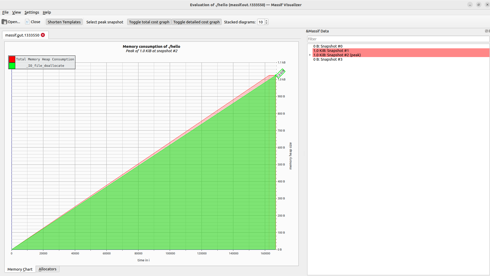
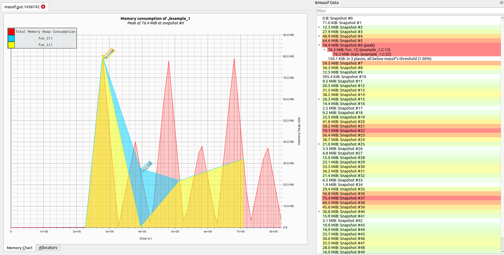
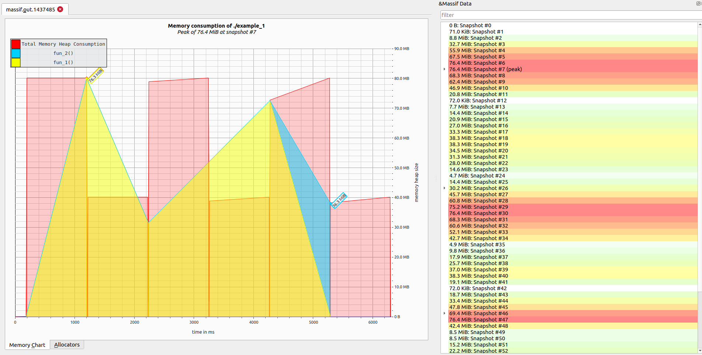
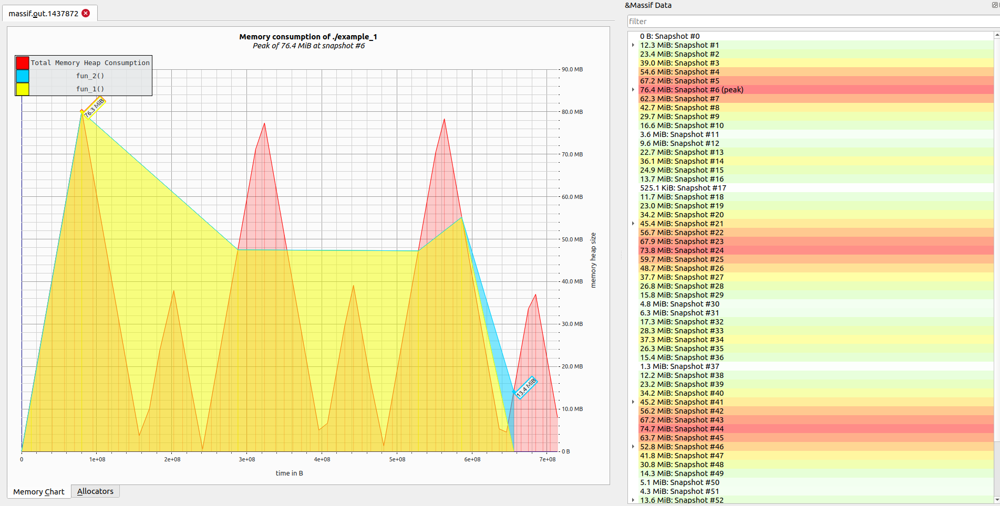
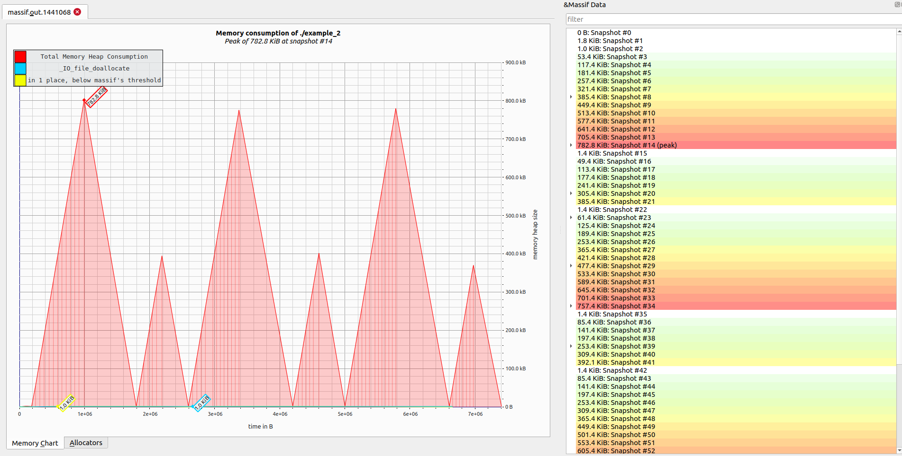

# Valgrind

**Last update**: 20260128-1


### Table of Contents

1. [Introduction](#introduction)
2. [A bit of history](#history)
3. [Installation](#installation)
4. [Memory management: **Memcheck**](#memcheck)
	* ["Hello World!" example](#memcheck.hello)
	* [Out-of-bounds indexing](#memcheck.bounds)
	* [Use after free and dangling pointers](#memcheck.after)
	* [Uninitialized memory access](#memcheck.unitialized)
	* [Double-free](#memcheck.double)
	* [Memory leak](#memcheck.leak)
5. [Heap profiling: **Massif**](#massif)
	* ["Hello World!" example](#massif.hello)
	* [Real-life scenario: heap allocation](#massif.real.heap)	
	* [Real-life scenario: stack allocation](#massif.real.stack)
6. [References](#references)


### 1. Introduction <a name="introduction"></a>

Valgrind is an advanced programming tool for debugging, memory management, memory-leak detection, and profiling of Linux programs. Its primary use case is to detect any sort of memory-related problems, but it also can be used to optimize and speed up program execution by determining bottlenecks at runtime. 

Valgrind uses the _dynamic binary instrumentation (DBI)_ technique, meaning that any executable can be inspected with Valgrind as it is (i.e. no code modification or recompilation is necessary). This particularly means that Valgrind can also be used for proprietary programs for which we do not have access to the source code at all. This comes with a price, however: when a program is examined by Valgrind, it will run slower by a factor of 5-100, depending which Valgrind tool is used. Nevertheless, this still pays off compared to endless manual debugging sessions ("guess and try recompilation", etc.).

A few additional remarks:

- **Supported programming languages** &mdash; Valgrind works with programs written in any programming language (compiled, just-in-time compiled, or interpreted), because its starting point are program binaries. In practice, however, it is mostly used for programs written in C and C++.

* **Supported platforms** &mdash; Primarily Unix descendants, including Linux, BSD, MacOS, Android, Solaris, etc., as supported operating systems by Valgrind (see the full list at this [link](https://valgrind.org/info/platforms.html)). Windows OS is not supported because porting the existing code to it is neither easy nor straightforward.

* **Tools** &mdash; The most important Valgrind tools are **Memcheck**, **Cachegrind**, **Callgrind**, and **Massif**, but many others are available (see the full list at this [link](https://valgrind.org/info/tools.html)). For instance, memory-management problems (e.g. memory leaks) can be detected with the **Memcheck** tool, and it can be used within Valgrind with the following example syntax:

  ```bash
  $ valgrind --tool=memcheck someExecutable
  ```

  On the other hand, to detect with **Massif** which parts of the program are responsible for the most memory allocation (so-called _heap profiling_), one can use the following syntax:

  ```bash
  $ valgrind --tool=massif someExecutable
  ```

  and so on for other tools. In this lecture, Valgrind will primarily be demonstrated through **Memcheck** and **Massif**.


### 2. A bit of history <a name="history"></a>

The original author of Valgrind is Julian Seward, and the initial release appeared in 2002. The name is pronounced as "val-grinned" and originates in Nordic mythology: Valgrind is the name of the main entrance to Valhalla (the Hall of the Chosen Slain in Asgard, "grind" means "gate" in Norwegian). Contrary to frequent misconception, the name Valgrind is not short for "value grinder" (even though one can see it that way...).

Valgrind is written in C and is actively maintained and developed &mdash; its online source code repository can be found at this [link](https://sourceware.org/git/valgrind.git). As of October 2025, the latest stable release is version ```3.26.0```.


### 3. Installation <a name="installation"></a>

By default, **valgrind** is not installed on Linux distributions. To install the currently supported version for a given Linux distribution, one can proceed by using the standard packaging tools for that distribution, e.g. **apt** ("Advanced Package Tool") on Ubuntu:

```bash
# Install default valgrind version with admin privileges:
$ sudo apt install valgrind

# Check your valgrind version:
$ valgrind --version
valgrind-3.18.1
```

However, there are cases when the custom **valgrind** version needs to be compiled from source (e.g. when a newer version is required than the one currently shipped by default on a given Linux distribution). The list of available **valgrind** versions and the latest releases can be obtained from the following [link](https://valgrind.org/downloads/) on the Valgrind official website, or from the Valgrind [online](https://sourceware.org/git/?p=valgrind.git;a=summary) source code repository.

For instance, to compile the custom **valgrind** 3.26.0 from source, one proceeds as illustrated below, depending on whether one has admin privileges.

* In case you do have admin privileges, follow this step-by-step procedure:

    ```bash
    # Uninstall the default outdated version which was shipped 
    # by the Linux package manager. 
    $ sudo apt remove --purge --auto-remove valgrind
    
    # In case the call to the old version is still hashed by Bash 
    # for quicker access, simply execute (this step is harmless in any case):
    $ hash -d valgrind
    
    # Download the custom version, e.g. 3.26.0, in some directory:
    $ mkdir $HOME/valgrind && cd $HOME/valgrind
    $ wget https://sourceware.org/pub/valgrind/valgrind-3.26.0.tar.bz2
    
    # Decompress the downloaded tarball:
    $ tar xvf valgrind-3.26.0.tar.bz2
    $ cd valgrind-3.26.0
    
    # Configure:
    $ ./configure
    # Remark: valgrind executable will be installed
    # by default in /usr/local/bin , see ./configure --help
    
    # Compile valgrind using e.g. 8 CPUs:
    $ make -j 8
    
    # Install system-wide:
    $ sudo make install
    
    # Check your custom valgrind version:
    $ valgrind --version
    valgrind-3.26.0
    ```


* Alternatively, in case you do not have admin privileges, follow this procedure:

    ```bash
    # In case the call to the old version is still hashed by Bash 
    # for quicker access, simply execute (this step is harmless in any case):
    $ hash -d valgrind
    
    # Download the custom version, e.g. 3.26.0, in some directory:
    $ mkdir $HOME/valgrind && cd $HOME/valgrind
    $ wget https://sourceware.org/pub/valgrind/valgrind-3.26.0.tar.bz2
    
    # Decompress the downloaded tarball:
    $ tar xvf valgrind-3.26.0.tar.bz2
    $ cd valgrind-3.26.0
    $ InstallDir=$PWD 
    # This way, valgrind executable will be installed locally
    # in $HOME/valgrind/valgrind-3.26.0/bin
    # Otherwise, specify another path instead of $PWD
    
    # Configure as follows:
    $ ./configure --prefix=$InstallDir
    
    # Compile valgrind using e.g. 8 CPUs:
    $ make -j 8
    
    # Install locally:
    $ make install
    
    # Add installation directory to PATH with higher precedence:
    $ export PATH=$InstallDir/bin:$PATH
    # To make this installation working persistently, you will need to add
    # to ~/.bashrc this line, with fully expanded $InstallDir 
    
    $ which valgrind
    /home/abilandz/valgrind/valgrind-3.26.0/bin/valgrind
    
    # Check which version of cmake is now the default one:
    $ valgrind --version
    valgrind-3.26.0
    ```


### 4. Memory management: **Memcheck** <a name="memcheck"></a>

The **valgrind** main tool for memory error detection is **memcheck**. Without going into the technical details of its internal implementation, below we summarize the most important parts of its design: 

* _shadow memory_ &mdash; **memcheck** creates a replica of the application's memory space, typically defined with a mapping function from application memory addresses to shadow memory addresses. It contains metadata for every byte of the application's addressable memory, encoding information about the initialization state and accessibility permissions of the corresponding application's data. Each byte of the application's memory is associated with two main pieces of information:
  * _addressability tag_ &mdash; allocated, freed, unavailable, etc.;
  * _definedness tag_ &mdash; initialized or uninitialized.
* _interception of memory instructions_ &mdash; similar to the design of virtual machine.

**Memcheck** stores for each byte of the application's memory its addressability and definedness tags into the shadow memory, using its own representation. This is achieved by intercepting every memory read and write instruction of the application and using the dynamic binary instrumentation (DBI) technique to dynamically translate and rewrite the executing program into shadow memory. During this process, additional code may be injected into the shadow memory. 

Schematically, each memory access instruction of the application maps corresponds to the following action in the shadow memory:
1. map the application memory address in the corresponding shadow memory address;
2. for a **read** operation, load and verify addressability and definedness tags from shadow memory;
3. for a **write** operation, mark the corresponding shadow memory byte as initialized and ensure it's addressable.

The above actions are the main underlying cause of a significant performance penalty.  For a **read** operation, the way **Memcheck** works by using the shadow memory can be represented with the following pseudo-code:

```C
shadow_addr = map_to_shadow(addr);
addressable = load_addressability_tag(shadow_addr);
if (!addressable) {
	report_error("Invalid read: memory not addressable!");    
}
defined = load_definedness_tag(shadow_addr);
if (!defined) {
	report_error("Use of unitialized memory!");    
}
load_real_memory(addr);
```

and similarly for a **write** operation.


#### "Hello World!" example <a name="memcheck.hello"></a>

Firstly, the following and perfectly regular code snippet is saved in a file _hello.C_ and used merely as a demonstration how to run **valgrind**'s tool  **memcheck**:

```C
#include <stdio.h>
int main(void) {
  printf("\n Hello World! \n\n");
  return 0;
}
```

The code is compiled into an executable **hello** in the standard way (using **gcc** for programs written in ```C```, and **g++** for programs written in the ```C++``` programming language):

```bash
$ gcc -o hello hello.C
```

The executable produces the expected output:

```bash
$ ./hello

 Hello World!
 
```

We can now inspect the executable **hello** with **valgrind**'s tool **memcheck**:

```bash 
$ valgrind --tool=memcheck ./hello
==369== Memcheck, a memory error detector
==369== Copyright (C) 2002-2024, and GNU GPL'd, by Julian Seward et al.
==369== Using Valgrind-3.26.0 and LibVEX; rerun with -h for copyright info
==369== Command: ./hello
==369==

 Hello World!

==369==
==369== HEAP SUMMARY:
==369==     in use at exit: 0 bytes in 0 blocks
==369==   total heap usage: 1 allocs, 1 frees, 1,024 bytes allocated
==369==
==369== All heap blocks were freed -- no leaks are possible
==369==
==369== For lists of detected and suppressed errors, rerun with: -s
==369== ERROR SUMMARY: 0 errors from 0 contexts (suppressed: 0 from 0)
```

We use this simple "Hello World!" example to make a few general statements:

1. If the flag ```--tool``` is not used to specify the tool explicitly, it defaults to **memcheck**. Therefore, executing the bare **valgrind** command or **valgrind --tool=memcheck** gives the same result.

2. The number "369" at the beginning of each line above indicates the PID of the process in which **valgrind** has run.

3. The performance penalty of executing **valgrind** can be demonstrated with the following comparison, using the built-in functionalities of **bash** shell:

    ```bash
    # measure the execution time of standalone executable:
    $ time for i in {1..100}; do ./hello &>/dev/null; done
    real	0m0.124s
    user	0m0.089s
    sys		0m0.039s
    
    # measure the execution time of standalone executable run within valgrind,
    # using the default tool 'memcheck':
    $ time for i in {1..100}; do valgrind ./hello &>/dev/null; done
    real	0m26.531s
    user	0m24.887s
    sys		0m1.636s
    
    # measure the execution time of standalone executable run within valgrind,
    # without using any tool for memory checking:
    $ time for i in {1..100}; do valgrind --tool=none ./hello &>/dev/null; done
    real	0m11.558s
    user	0m10.400s
    sys		0m1.046s
    ```

    From above examples, we see there are several orders of magnitude of difference in performance when memory checks are performed with **memcheck**, even for a simple executable like **hello**. Even after disabling all checks with ```--tool=none``` option, when the code is merely executed in **valgrind**'s virtual machine, there is still a non-negligible performance penalty.    

4. Since we used the canonical "Hello World!" example without any errors in the code, **memcheck** did not find any errors, but the printout was nevertheless very verbose. We can instruct **valgrind** to provide its specific printout only in case of errors with the flag ```-q``` (for "quiet"):

    ```bash 
    $ valgrind -q ./hello
    
     Hello World!
    ```

In what follows next, various examples are provided of invalid memory accesses, i.e. of invalid read and write operations, which can be detected by the **memcheck** tool, even though they lead to no obvious errors neither during compilation nor execution.


​	


#### Out-of-bounds indexing <a name="memcheck.bounds"></a>

This error typically occurs when an array index is used beyond the array's boundaries. It can be detected by **memcheck** but only if memory for that array was allocated on the heap (i.e. memory is allocated persistently, by using the operator **new** in ```C++``` or **malloc()** in ```C```). That is demonstrated with the following code snippet _outOfBound.C_:

```c++
int main(void) {

  float *arr = new float[2];
  arr[0] = 1.23;
  arr[1] = -1.44;
  arr[2] = 22.123; // out-of-bound indexing
  delete [] arr;

  return 0;
}
```

The above code snippet uses functionalities of the ```C++``` programming language, and is compiled with **g++** instead of **gcc** compiler. The code compiles without any error or warning into an executable: 

```bash
$ g++ -o outOfBound outOfBound.C
```

Also, there is no error at execution:

```bash
$ ./outOfBound
$ echo $?
0 
# the exit status is 0, set via 'return 0' in the source code
```

However, **memcheck** will report an error:

```bash
$ valgrind ./outOfBound
==8663== Memcheck, a memory error detector
==8663== Copyright (C) 2002-2024, and GNU GPL'd, by Julian Seward et al.
==8663== Using Valgrind-3.26.0 and LibVEX; rerun with -h for copyright info
==8663== Command: ./outOfBound
==8663==
==8663== Invalid write of size 4
==8663==    at 0x40011B7: main (in /home/abilandz/valgrind/examples/memcheck/outOfBound)
==8663==  Address 0x4de3c88 is 0 bytes after a block of size 8 alloc'd
==8663==    at 0x484F723: operator new[](unsigned long) (vg_replace_malloc.c:730)
==8663==    by 0x400117E: main (in /home/abilandz/valgrind/examples/memcheck/outOfBound)
==8663==
==8663==
==8663== HEAP SUMMARY:
==8663==     in use at exit: 0 bytes in 0 blocks
==8663==   total heap usage: 2 allocs, 2 frees, 72,712 bytes allocated
==8663==
==8663== All heap blocks were freed -- no leaks are possible
==8663==
==8663== For lists of detected and suppressed errors, rerun with: -s
==8663== ERROR SUMMARY: 1 errors from 1 contexts (suppressed: 0 from 0)
```

Looking at the above output report from **memcheck**, it is not clear which line in the source code is causing this error. Ideally, one would also like to get immediately in the **memcheck** output the line number of the source code that is causing an error. This can be achieved in some cases by using the ```-g``` option when the code is compiled. In the **gcc** manual, one finds the following documentation for the option ```-g```:

```bash
-g 		Produce debugging information in the operating systems native format (stabs, COFF, XCOFF, or DWARF).  
		GDB can work with this debugging information.
```

If we recompile the previous example with the option ```-g``` enabled, it follows:

```bash
$ g++ -g -o outOfBound outOfBound.C

$ valgrind ./outOfBound
==1175163== Memcheck, a memory error detector
==1175163== Copyright (C) 2002-2017, and GNU GPL'd, by Julian Seward et al.
==1175163== Using Valgrind-3.18.1 and LibVEX; rerun with -h for copyright info
==1175163== Command: ./outOfBound
==1175163== 
==1175163== Invalid write of size 4
==1175163==    at 0x1091B7: main (outOfBound.C:6)
==1175163==  Address 0x4de6c88 is 0 bytes after a block of size 8 alloc'd
==1175163==    at 0x484A2F3: operator new[](unsigned long) (in /usr/libexec/valgrind/vgpreload_memcheck-amd64-linux.so)
==1175163==    by 0x10917E: main (outOfBound.C:3)
==1175163== 
==1175163== 
==1175163== HEAP SUMMARY:
==1175163==     in use at exit: 0 bytes in 0 blocks
==1175163==   total heap usage: 2 allocs, 2 frees, 72,712 bytes allocated
==1175163== 
==1175163== All heap blocks were freed -- no leaks are possible
==1175163== 
==1175163== For lists of detected and suppressed errors, rerun with: -s
==1175163== ERROR SUMMARY: 1 errors from 1 contexts (suppressed: 0 from 0)
```

We see the important piece of new information in the line:

```bash
==1175163==    at 0x1091B7: main (outOfBound.C:6)
```

This line in the **memcheck** output report indicates that within the _main()_ function, at line 6 in the source-code file _outOfBound.C_, there is a problem. Indeed, that line number corresponds to the following erroneous code in the above code snippet:

```C++
 arr[2] = 22.123; // out-of-bound indexing
```

As a side remark, on Linux, the lines in a file can be printed enumerated with the core utility **cat** and its option ```-n```, for instance:

```bash
# print on the screen the file content enumerated line-by-line:
$ cat -n 
     1	int main() {
     2	
     3	  float *arr = new float[2];
     4	  arr[0] = 1.23;
     5	  arr[1] = -1.44
     6	  arr[2] = 22.123; // out-of-bound indexing
     7	  delete [] arr;
     8	
     9	  return 0;
    10	}
```

Alternatively, one can directly isolate and print only the requested line number with another core utility **sed**, for instance:

```bash
# print the 6th line of file outOfBound.C: 
$ sed -n 6p outOfBound.C 
  arr[2] = 22.123; // out-of-bound indexing
```

The above example demonstrates that **memcheck** can very precisely determine the cause of out-of-bounds indexing for dynamically allocated memory, when we have access to the source code and can recompile it with the option ```-g```.

Note, however, that **memcheck** doesn't check for out-of-bounds indexing of global arrays, or of array variables stored in a stack area, as the following code snippet demonstrates:

```C
int globalArr[5];

int main(void)
{
  int stackArr[5];

  globalArr[5] = 0;
  stackArr[5] = 0;

  return 0;
}
```

If the above code snippet is saved in a file _globalArray.C_ and compiled, neither the **gcc** compiler nor **memcheck** finds any error:

```bash 
$ gcc -g -o globalArray globalArray.C
$ valgrind ./globalArray
==8577== Memcheck, a memory error detector
==8577== Copyright (C) 2002-2024, and GNU GPL'd, by Julian Seward et al.
==8577== Using Valgrind-3.26.0 and LibVEX; rerun with -h for copyright info
==8577== Command: ./globalArray
==8577==
==8577==
==8577== HEAP SUMMARY:
==8577==     in use at exit: 0 bytes in 0 blocks
==8577==   total heap usage: 0 allocs, 0 frees, 0 bytes allocated
==8577==
==8577== All heap blocks were freed -- no leaks are possible
==8577==
==8577== For lists of detected and suppressed errors, rerun with: -s
==8577== ERROR SUMMARY: 0 errors from 0 contexts (suppressed: 0 from 0)
```

In general, this particular category of problems related to out-of-bounds indexing cannot be tackled with the tool **memcheck**. There exists, however, a new experimental tool **exp-sgcheck**, designed as an out-of-bounds detector for stack and global arrays, which is still under development (see its official documentation and status at this [link](https://valgrind.org/docs/manual/sg-manual.html)).


#### Use after free and dangling pointers <a name="memcheck.after"></a>

This case happens when a pointer is referencing a memory which was already deallocated (i.e. freed, or returned back to the underlying operating system). Such a pointer is called a _dangling pointer_. It can be illustrated with the following code snippet saved in the file _free.C_:

```C++
int main(void)
{
  float *arr = new float[2];
  arr[0] = 1.23; // ok  

  delete [] arr; // deallocate memory back
  arr[0] = 1.23; // use after free, this will work only accidentally, i.e.
                 // until the memory relased back in the previous line 
                 // wasn't overwritten by something else
  return 0;
}
```

The above code can be compiled and executed, but **memcheck** will spot and report the problem:

```bash
# No compilation error:
$ g++ -g -o free free.C

# No execution error (accidentally):
$ ./free 

# However, 'memcheck' spots the problem:
$ valgrind -q ./free 
==12013== Invalid write of size 4
==12013==    at 0x40011B2: main (free.C:7)
==12013==  Address 0x4de3c80 is 0 bytes inside a block of size 8 free'd
==12013==    at 0x48539A3: operator delete[](void*) (vg_replace_malloc.c:1413)
==12013==    by 0x40011A5: main (free.C:6)
==12013==  Block was alloc'd at
==12013==    at 0x484F723: operator new[](unsigned long) (vg_replace_malloc.c:730)
==12013==    by 0x400117E: main (free.C:3)
==12013==
```

And it fact, this output report is very punctual, as its correctly highlights all relevant lines in the source code to fix this problem!  

As a side remark, if an object which is deleted doesn't have a destructor (like built-in types), it's a good programming practice to set it to ```NULL``` explicitly, to force an execution error it if is used after it was deleted:

```C++
delete [] arr; // deallocate array memory back    
arr = NULL;    // set pointer to NULL explicitly after 'delete'
```


#### Uninitialized memory access <a name="memcheck.unitialized"></a>

This case happens when an object was declared but it was never initialized, and it was used later in the code uninitialized. We first illustrate this case with the following correct code snippet saved in the file _initilized.C_:

```C++
#include <stdio.h>
int main(void)
{
  float *arr = new float[2]{1.23, -44.}; // array is declared and initialized 
  printf("\n %f ", arr[0]);  
  printf("\n %f \n\n", arr[1]);  

  delete [] arr; // deallocate memory back    
  arr = NULL;    // set pointer to NULL explicitly after 'delete'

  return 0;
}
```

This code snippet can be compiled and executed without any errors, and **memcheck** doesn't report any error either:

```bash
# No compilation error:
$ g++ -g -o initilized initilized.C

# No execution error:
$ ./initilized 

 1.230000 
 -44.000000 

# Finally, the clearance from 'memcheck':
$ valgrind ./initilized 
==1080261== Memcheck, a memory error detector
==1080261== Copyright (C) 2002-2017, and GNU GPL'd, by Julian Seward et al.
==1080261== Using Valgrind-3.18.1 and LibVEX; rerun with -h for copyright info
==1080261== Command: ./initilized
==1080261== 

 1.230000 
 -44.000000 

==1080261== 
==1080261== HEAP SUMMARY:
==1080261==     in use at exit: 0 bytes in 0 blocks
==1080261==   total heap usage: 3 allocs, 3 frees, 73,736 bytes allocated
==1080261== 
==1080261== All heap blocks were freed -- no leaks are possible
==1080261== 
==1080261== For lists of detected and suppressed errors, rerun with: -s
==1080261== ERROR SUMMARY: 0 errors from 0 contexts (suppressed: 0 from 0)
```

We now re-use the above example but without initializing array elements, and save it in the file _uninitialized.C_ the following code snippet:

```C++
#include <stdio.h>
int main(void)
{
  float *arr = new float[2]; // array is declared, but NOT initialized 
  printf("\n %f ", arr[0]);  
  printf("\n %f \n\n", arr[1]);  

  delete [] arr; // deallocate memory back    
  arr = NULL;    // set pointer to NULL explicitly after 'delete'

  return 0;
}
```

This code snippet can be compiled without any errors. When executed, it doesn't produce any errors either, but only accidentally, because built-in types, like ```float``` in this example, can get initialized to ```0.0``` by a specific compiler. In general, however, this leads to an undefined behavior. But **memcheck** does report an error when declared and uninitialized objects are used:

```bash
# No compilation error:
$ g++ -g -o uninitilized uninitilized.C

# No execution error:
$ ./uninitilized 

 0.000000 
 0.000000 

# However, 'memcheck' is alert (and surprisingly verbose!):
$ valgrind -q ./uninitilized 
==12065== Conditional jump or move depends on uninitialised value(s)
==12065==    at 0x4AF7CB8: __printf_fp_l (printf_fp.c:396)
==12065==    by 0x4B1392C: __printf_fp_spec (vfprintf-internal.c:354)
==12065==    by 0x4B1392C: __vfprintf_internal (vfprintf-internal.c:1558)
==12065==    by 0x4AFD79E: printf (printf.c:33)
==12065==    by 0x40011D0: main (uninitilized.C:5)
==12065==

... many more lines ...

==12065== Syscall param write(buf) points to uninitialised byte(s)
==12065==    at 0x4BB18F7: write (write.c:26)
==12065==    by 0x4B27EEC: _IO_file_write@@GLIBC_2.2.5 (fileops.c:1180)
==12065==    by 0x4B299E0: new_do_write (fileops.c:448)
==12065==    by 0x4B299E0: _IO_new_do_write (fileops.c:425)
==12065==    by 0x4B299E0: _IO_do_write@@GLIBC_2.2.5 (fileops.c:422)
==12065==    by 0x4B286D4: _IO_new_file_xsputn (fileops.c:1243)
==12065==    by 0x4B286D4: _IO_file_xsputn@@GLIBC_2.2.5 (fileops.c:1196)
==12065==    by 0x4B1214C: outstring_func (vfprintf-internal.c:239)
==12065==    by 0x4B1214C: __vfprintf_internal (vfprintf-internal.c:1263)
==12065==    by 0x4AFD79E: printf (printf.c:33)
==12065==    by 0x4001202: main (uninitilized.C:6)

... many more lines ...

==12065== Conditional jump or move depends on uninitialised value(s)
==12065==    at 0x4AF8EFB: __printf_fp_l (printf_fp.c:1230)
==12065==    by 0x4B1392C: __printf_fp_spec (vfprintf-internal.c:354)
==12065==    by 0x4B1392C: __vfprintf_internal (vfprintf-internal.c:1558)
==12065==    by 0x4AFD79E: printf (printf.c:33)
==12065==    by 0x4001202: main (uninitilized.C:6)
==12065==
 0.000000
```


#### Double-free <a name="memcheck.double"></a>

This case occurs when the same memory is deallocated multiple times. It can be illustrated with the following code snippet saved in the file _doubleFree.C_:

```C++
int main(void)
{
  float *arr = new float[2]{1.23, -44.}; // array is declared and initialized 

  // ... do something with this array ...
    
  delete [] arr; // deallocate memory back    
  delete [] arr; // deallocate memory back again    
    
  return 0;
}
```

The code can be compiled without any error. On the other hand, we will get an error at execution, but the error message is rather terse and incomprehensible. When the code is checked with **memcheck**, we get a punctual report with the problematic lines of the code clearly highlighted.

```bash
# No compilation error:
$ g++ -g -o doubleFree doubleFree.C 

# Execution error:
$ ./doubleFree 
free(): double free detected in tcache 2
Aborted (core dumped)

# Diagnosics from 'memcheck':
$ valgrind -q ./doubleFree 
==12088== Invalid free() / delete / delete[] / realloc()
==12088==    at 0x48539A3: operator delete[](void*) (vg_replace_malloc.c:1413)
==12088==    by 0x40011C7: main (doubleFree.C:8)
==12088==  Address 0x4de3c80 is 0 bytes inside a block of size 8 free'd
==12088==    at 0x48539A3: operator delete[](void*) (vg_replace_malloc.c:1413)
==12088==    by 0x40011B4: main (doubleFree.C:7)
==12088==  Block was alloc'd at
==12088==    at 0x484F723: operator new[](unsigned long) (vg_replace_malloc.c:730)
==12088==    by 0x400117E: main (doubleFree.C:3)
==12088==
```


#### Memory leak <a name="memcheck.leak"></a> 

Memory leaks occur when dynamically allocated memory (e.g. using **malloc()** in ```C``` or operator **new** in the ``C++`` programming language) is not properly deallocated (e.g. using **free()** in ```C``` or operator **delete** in ```C++```). As a consequence, a programme at runtime persistently claims memory it no longer needs. If such faulty memory allocation occurs within a loop, a programme at runtime persistently claims more and more memory it no longer needs, eventually exhausting all available memory on a computer (as a consequence, the computer starts to slow down until it eventually freezes). 

To illustrate memory leak, consider the following "classical" erroneous code snippet saved in the file _leak.C_:

```C++
#include <stdio.h>
int main(void)
{
  float *arr = NULL;
  for(int i=0; i<10; i++) {
    arr = new float[2]{1.23, -44.};
  }
  delete [] arr;

  return 0;
}
```

The code compiles and executes correctly, but only accidentally. If we increase the number of loop iterations and exacerbate the problem with faulty memory deallocation that way, the program would eventually be terminated ungraciously by the underlying operating system at runtime after claiming persistently too much memory. But **memcheck** is particularly suitable to detect such memory leaks, as the following example demonstrates:

```bash
$ g++ -g -o leak leak.C

$ valgrind --leak-check=full ./leak 
==12111== Memcheck, a memory error detector
==12111== Copyright (C) 2002-2024, and GNU GPL'd, by Julian Seward et al.
==12111== Using Valgrind-3.26.0 and LibVEX; rerun with -h for copyright info
==12111== Command: ./leak
==12111==
==12111==
==12111== HEAP SUMMARY:
==12111==     in use at exit: 72 bytes in 9 blocks
==12111==   total heap usage: 11 allocs, 2 frees, 72,784 bytes allocated
==12111==
==12111== 72 bytes in 9 blocks are definitely lost in loss record 1 of 1
==12111==    at 0x484F723: operator new[](unsigned long) (vg_replace_malloc.c:730)
==12111==    by 0x400118F: main (leak.C:6)
==12111==
==12111== LEAK SUMMARY:
==12111==    definitely lost: 72 bytes in 9 blocks
==12111==    indirectly lost: 0 bytes in 0 blocks
==12111==      possibly lost: 0 bytes in 0 blocks
==12111==    still reachable: 0 bytes in 0 blocks
==12111==         suppressed: 0 bytes in 0 blocks
==12111==
==12111== For lists of detected and suppressed errors, rerun with: -s
==12111== ERROR SUMMARY: 1 errors from 1 contexts (suppressed: 0 from 0)
```

In the above example, we used the **valgrind**'s command-line option ```--leak-check=full``` to get more verbose details of leaked memory. The documentation of all supported command-line options with their default settings can be found in the official documentation at the following [link](https://valgrind.org/docs/manual/manual-core.html). 

The problematic code is at line 6:

```bash
$ sed -n 6p leak.C
    arr = new float[2]{1.23, -44.};
```

Indeed, at each loop iteration, the new chunk of memory was claimed persistently at this line in the source code from the underlying operating system, without releasing that memory back.

As the above output indicates, **memcheck** distinguishes between several categories of memory leaks:

* _definitely lost_ &mdash; these are memory blocks over which the program has lost all pointers. They can be allocated to another program only when the current one terminates.
* _indirectly lost_ &mdash; memory blocks which can only be reached through the definitely lost memory blocks.
* _possibly lost_ &mdash; memory blocks for which pointers still exist, but point only to the middle (i.e. interior) of an allocated memory block. For instance, this could just be a random value in memory that happens to point into a memory block.
* _still reachable_ &mdash; memory block that remains allocated at program termination, with a valid pointer to it. In general, this does not indicate an error, but it nevertheless hints to the programmer that such a memory block could be released back at the program's termination.

For completeness sake, the corrected corresponding source code without memory leak is saved in _noLeak.C_:

```C++
#include <stdio.h>
int main(void)
{
  float *arr = NULL;
  for(int i=0; i<10; i++) {
    arr = new float[2]{1.23, -44.};
     
    // ... do something with 'arr' ...  
      
    delete [] arr; // release the memory back, each time after it was claimed
  }

  return 0;
}
```

The **memcheck** detects no errors now:

```bash
$ g++ -g -o noLeak noLeak.C 
$ valgrind --leak-check=full ./noLeak
==1182881== Memcheck, a memory error detector
==1182881== Copyright (C) 2002-2017, and GNU GPL'd, by Julian Seward et al.
==1182881== Using Valgrind-3.18.1 and LibVEX; rerun with -h for copyright info
==1182881== Command: ./noLeak
==1182881== 
==1182881== 
==1182881== HEAP SUMMARY:
==1182881==     in use at exit: 0 bytes in 0 blocks
==1182881==   total heap usage: 11 allocs, 11 frees, 72,784 bytes allocated
==1182881== 
==1182881== All heap blocks were freed -- no leaks are possible
==1182881== 
==1182881== For lists of detected and suppressed errors, rerun with: -s
==1182881== ERROR SUMMARY: 0 errors from 0 contexts (suppressed: 0 from 0)
```


### 5. Heap profiling: **Massif** <a name="massif"></a>

When memory usage needs to be profiled and optimized, **valgrind** provides the tool called **massif**. By default, **massif** produces output showing the time dependence of dynamically allocated memory (heap profiling, or memory footprint), and identifies the function calls that allocated most memory. Time dependence is provided in the final output file through snapshots of memory usage at specified time intervals. This raw output file can be visualized with tools such as **ms_print** (no graphics) and **massif-visualizer** (with graphics).


#### "Hello World!" example <a name="massif.hello"></a>

As always, we start with a simple example to illustrate how to use **valgrind**'s tool **massif**. The following code snippet is saved in a file _hello.C_:

```C
#include <stdio.h>
int main(void) {
  printf("\n Hello World! \n\n");
  return 0;
}
```

The code is compiled into an executable **hello** in the standard way (using **gcc** for programs written in ```C```, and **g++** for programs written in the ```C++``` programming language):

```bash
$ gcc -o hello hello.C
```

The executable produces the expected output:

```bash
$ ./hello

 Hello World!
 
```

We can now inspect the executable **hello** with **valgrind**'s tool **massif**:

```bash
$ valgrind --tool=massif ./hello
==1333550== Massif, a heap profiler
==1333550== Copyright (C) 2003-2017, and GNU GPL'd, by Nicholas Nethercote
==1333550== Using Valgrind-3.18.1 and LibVEX; rerun with -h for copyright info
==1333550== Command: ./hello
==1333550== 

 Hello World! 

==1333550== 
```

The tool **massif** saves its raw output in the file named "massif.out.somePID". Since the PID of the process in the above example is "1333550", **massif** saved its raw output in the file "massif.out.1333550", with the following content:

```bash
$ cat massif.out.1333550
desc: (none)
cmd: ./hello
time_unit: i
#-----------
snapshot=0
#-----------
time=0
mem_heap_B=0
mem_heap_extra_B=0
mem_stacks_B=0
heap_tree=empty
#-----------
snapshot=1
#-----------
time=162599
mem_heap_B=1024
mem_heap_extra_B=8
mem_stacks_B=0
heap_tree=empty
#-----------
snapshot=2
#-----------
time=166739
mem_heap_B=1024
mem_heap_extra_B=8
mem_stacks_B=0
heap_tree=peak
n1: 1024 (heap allocation functions) malloc/new/new[], --alloc-fns, etc.
 n1: 1024 0x48E8BA3: _IO_file_doallocate (filedoalloc.c:101)
  n1: 1024 0x48F7CDF: _IO_doallocbuf (genops.c:347)
   n1: 1024 0x48F6F5F: _IO_file_overflow@@GLIBC_2.2.5 (fileops.c:744)
    n1: 1024 0x48F56D4: _IO_new_file_xsputn (fileops.c:1243)
     n1: 1024 0x48F56D4: _IO_file_xsputn@@GLIBC_2.2.5 (fileops.c:1196)
      n1: 1024 0x48EAF1B: puts (ioputs.c:40)
       n0: 1024 0x10915F: main (in /home/abilandz/examples/massif/hello)
#-----------
snapshot=3
#-----------
time=166739
mem_heap_B=0
mem_heap_extra_B=0
mem_stacks_B=0
heap_tree=empty
```

This raw data is not easy to decipher. Instead, one can process the content of this raw output file with **massif** visualizers **ms_print** and **massif-visualizer**, which are introduced next:

* **ms_print** &mdash; This is a **Perl** script that is a part of the main Valgrind software suite, and it doesn't have to be installed separately. Its documentation and example use cases can be found at the following [link](https://valgrind.org/docs/manual/ms-manual.html#ms-manual.running-ms_print). It is primarily used in an environment in which graphics is not available (e.g. when running remotely), in the following way:

  ```bash
  $ ms_print massif.out.1333550
  --------------------------------------------------------------------------------
  Command:            ./hello
  Massif arguments:   (none)
  ms_print arguments: massif.out.1333550
  --------------------------------------------------------------------------------
  
  
      KB
  1.008^                                                                      :#
       |                                                                      :#
       |                                                                      :#
       |                                                                      :#
       |                                                                      :#
       |                                                                      :#
       |                                                                      :#
       |                                                                      :#
       |                                                                      :#
       |                                                                      :#
       |                                                                      :#
       |                                                                      :#
       |                                                                      :#
       |                                                                      :#
       |                                                                      :#
       |                                                                      :#
       |                                                                      :#
       |                                                                      :#
       |                                                                      :#
       |                                                                      :#
     0 +----------------------------------------------------------------------->ki
       0                                                                   162.8
  
  Number of snapshots: 4
   Detailed snapshots: [2 (peak)]
  
  --------------------------------------------------------------------------------
    n        time(i)         total(B)   useful-heap(B) extra-heap(B)    stacks(B)
  --------------------------------------------------------------------------------
    0              0                0                0             0            0
    1        162,599            1,032            1,024             8            0
    2        166,739            1,032            1,024             8            0
  99.22% (1,024B) (heap allocation functions) malloc/new/new[], --alloc-fns, etc.
  ->99.22% (1,024B) 0x48E8BA3: _IO_file_doallocate (filedoalloc.c:101)
    ->99.22% (1,024B) 0x48F7CDF: _IO_doallocbuf (genops.c:347)
      ->99.22% (1,024B) 0x48F6F5F: _IO_file_overflow@@GLIBC_2.2.5 (fileops.c:744)
        ->99.22% (1,024B) 0x48F56D4: _IO_new_file_xsputn (fileops.c:1243)
          ->99.22% (1,024B) 0x48F56D4: _IO_file_xsputn@@GLIBC_2.2.5 (fileops.c:1196)
            ->99.22% (1,024B) 0x48EAF1B: puts (ioputs.c:40)
              ->99.22% (1,024B) 0x10915F: main (in /home/abilandz/examples/massif/hello)
                
  --------------------------------------------------------------------------------
    n        time(i)         total(B)   useful-heap(B) extra-heap(B)    stacks(B)
  --------------------------------------------------------------------------------
    3        166,739                0                0             0            0
  
  ```

  In the above example, 4 snapshots of memory usage were performed by **massif**. By default, there is always one snapshot made per heap memory  allocation or deallocation, plus a couple of extra snapshots. The maximum number of snapshots is 100, which means that **massif** will discard older snapshots as the program runs, but this limit can be increased with the option ```--max-snapshots```. Not all snapshots are detailed, by default each 10th snapshot is detailed (in the above example the 3rd one), and only for them **massif** will record details of memory allocations. Finally, there is always one special snapshot, the peak snapshot, which is a detailed snapshot recording the point where memory consumption was greatest. In the **ms_print** visualization, the following special symbols are used for these three categories of snapshots:

  *  ```:``` &mdash; ordinary snapshot (no information of where memory was allocated);
  * ```@``` &mdash; detailed snapshot (full information of where memory was allocated);
  * ```#``` &mdash; peak snapshot (detailed snapshot where memory consumption was greatest).

* **massif-visualizer** &mdash; This is an external tool, and it has to be installed separately, for instance on Linux Ubuntu with:

  ```bash
  $ sudo apt install massif-visualizer
  ```

  The usage of **massif-visualizer** is recommended only in an environment in which graphics is enabled and can be run easily. Its documentation and more details about its usage can be found at the following [link](https://apps.kde.org/massif_visualizer/). For the above "Hello World!" example, it is executed in a similar way as **ms_print**, simply as:

  ```bash
  $ massif-visualizer massif.out.1333550
  ```
  However, unlike **ms_print**, it produces a colorful graphical display of heap memory footprint in the left-hand side panel, and detailed call stack of all functions in the right-hand side panel:

  


Before moving on to real-case scenarios of **massif** usage, we make the following general remarks:

* In the output file, **massif** groups allocations per entire call stack, which enables identifying the specific function in which memory is allocated, as well as the whole chain of function invocations that preceded it. Schematically, in the **massif** output we can find:

  ```bash
  n bytes : someFunction() at someFile:someLine
  		  anotherFunction() at anotherFile:someLine
  		  main() at mainFile:someLine
  ```

  From the above schematic output, we can conclude that in the source code "_mainFile_" the **main()** function is called at the indicated line. Within the **main()** function, there is a call to **anotherFunction()** in the source file named "_anotherFile_" at the indicated line. Finally, within **anotherFunction()** there is a call to **someFunction()** in the source file named "_someFile_" at the indicated line, in which ```n``` bytes were dynamically allocated, at the time when this memory snapshot was made. We can clearly deduce the specific function, **someFunction()**, in which memory was allocated, as well as the whole chain of function invocations, **main() => anotherFunction() => someFunction()**, which preceded it.

* In the graphical plot, on the y-axis is heap size in bytes, while on the x-axis one can choose between three supported options using the flag ```--time-unit``` as follows:

  * _instruction counts_ &mdash; the default option, or specified with ```--time-unit=i```
  * _time_ &mdash; specified with the option ```--time-unit=ms``` (the real (wallclock) time in milliseconds)
  * _bytes_ &mdash; specified with the option ```--time-unit=B``` (the number of bytes allocated/deallocated)

* By default, **massif** provides only heap profiling, i.e. dynamically allocated memory usage via the operator **new** in ```C++``` or **malloc()** in ```C```. Instead, it can be instructed to provide profiling of stack and global variables with the non-default option ```--stack=yes```

* As for the other Valgrind tools, **massif** will be more punctual and performant if the executable was compiled with the `-g` option, for debugging purposes:

  ```bash
  # compile executable and save extra information for debugging:
  $ g++ -g -o someExecutable someExecutable.C
  ```


In the next section, we provide a few real-life examples of **massif** usage.


#### Real-life scenario: heap allocation  <a name="massif.real.heap"></a>

In this example, we use the following code snippet and save it in the file "_example_1.C_":

```C++
#include <stdio.h>
#include <unistd.h>

void fun_1() {

  int sizeX = 1000;
  int sizeY = 10000;

  // declare dynamically 2D array:
  double **arr2D = new double*[sizeY];
  for(int i = 0; i < sizeY; ++i) {
     arr2D[i] = new double[sizeX];
  }

  // do something with this 2D array:
  sleep(1);

  // release memory back:
  for(int i = 0; i < sizeY; ++i) {
    delete [] arr2D[i];
  }
  delete [] arr2D;

}

void fun_2() {

  int sizeX = 500;
  int sizeY = 10000;

  // declare dynamically 2D array:
  double **arr2D = new double*[sizeY];
  for(int i = 0; i < sizeY; ++i) {
     arr2D[i] = new double[sizeX];
  }

  // do something with this 2D array:
  sleep(1);

  // release memory back:
  for(int i = 0; i < sizeY; ++i) {
    delete [] arr2D[i];
  }
  delete [] arr2D;

}

int main(void) {

  for(int i=0; i<3; i++) {
    printf("\n Executing fun_1() ... \n");
    fun_1();

    printf("\n Executing fun_2() ... \n\n");
    fun_2();
  }

  return 0;
}
```

Basically, we have 2 functions, **fun_1()** and **fun_2()**, each of which allocates a lot of memory dynamically for 2D arrays. In function **fun_1()** twice as much  memory is allocated as in function **fun_2()** (simply by changing initialization of ```int sizeX``` by a factor of 2, everything else is kept the same). Both functions are called in the **main()** function three times within a loop, so we expect to see three large peaks in memory allocation/deallocation, each corresponding to one loop iteration.

The code is compiled in the following way:

```bash
$ g++ -g -o example_1 example_1.C
```

As before, the flag ```-g``` is used only to save more information during compilation for debugging purposes; under normal circumstances this flag shouldn't be used, as it prevents the compiler from optimizing the final executable.

For demonstration purposes, we inspect the memory allocations of executable **example_1** with the **massif** took by using three different options:

* _instruction counts_ &mdash; in this case, which is recommended for short-duration executables, the executable is inspected with **massif** in the following way:

  ```bash
  $ valgrind --tool=massif --time-unit=i ./example_1
  ```

  The output is stored in raw format in the file "massif.out.1436742", where "1436742" is the PID of the **valgrind** process above. Its content can be visualized with **massif_visualizer**:

  ```bash 
  $ massif_visualizer massif.out.1436742
  ```

  Finally, the output graph is:

  

	We see clearly 3 large memory allocations corresponding to the call to the **fun_1()** function, and about a factor of 2 smaller 3 memory allocations corresponding to the call to **fun_2()** function. In the expanded toggle on the RHS for peak snapshot (marked with the darkest color gradient), we can see that the maximum amount of memory was allocated in the call to function **fun_1()** at line 52 in the code. Indeed:
	
	```Bash
	$ cat -n example_1.C
	    ... some other lines ...
	    51	    printf("\n Executing fun_1() ... \n");
	    52	    fun_1();
	    53	
	    ... some other lines ...        
	```
	
	Reading further the content of this toggle, within function **fun_1()** the memory was allocated at line 12 in the source code:
	
	```Bash
	$ cat -n example_1.C
	    ... some other lines ...    
		11	  for(int i = 0; i < sizeY; ++i) {
	    12	     arr2D[i] = new double[sizeX];
	    13	  }
	    ... some other lines ...    
	```
	
	Indeed, at line 12, a lot of memory was allocated dynamically with the **new** operator.

* _time_ &mdash; with this option, on x-axis the real (wallclock) time in milliseconds is used in the visualizer:

  ```bash
  $ valgrind --tool=massif --time-unit=ms ./example_1
  ```

  The resulting graphical display is:

  

* _bytes_ &mdash; with this option, on x-axis the number allocated/deallocated bytes is shown:

  ```bash
  $ valgrind --tool=massif --time-unit=B ./example_1
  ```

  The resulting graphical display is:

  

For all 3 options, ```--time-unit=i``` , ```--time-unit=ms```, and ```--time-unit=B```,  we see clearly and consistently 3 large memory allocations corresponding to the call to **fun_1()** function, and about a factor of two smaller 3 memory allocations corresponding to the call to **fun_2()** function, albeit the details of graphical representation can differ, sometimes one offering more insights than another one. 

For completeness, we visualize the above **massif** raw output (produced with the option ```--time-unit=B```) with **ms_print** as well:

```bash
$ ms_print massif.out.1437872 
--------------------------------------------------------------------------------
Command:            ./example_1
Massif arguments:   --time-unit=B
ms_print arguments: massif.out.1437872
--------------------------------------------------------------------------------


    MB
76.52^        #                                                               
     |        #                       ::                      :               
     |        #                       :                       :               
     |       :#                      ::                      ::               
     |       :#::                    ::                      ::::             
     |       :#:                     :: :                    :::              
     |     :::#:                    ::: :                   ::::              
     |     : :#:                    ::: :                   :::: @            
     |     : :#:                    ::: ::                  :::: @            
     |     : :#: ::                @::: ::                 @:::: @            
     |    :: :#: :                 @::: ::                 @:::: @:           
     |    :: :#: :        :        @::: :::       :        @:::: @:        :  
     |    :: :#: :        :      ::@::: :::       :       :@:::: @:::     ::  
     |    :: :#: : :      :      : @::: ::::     ::       :@:::: @::      ::  
     |  :::: :#: : :      ::    :: @::: ::::     :::    :::@:::: @::      ::: 
     |  : :: :#: : :    ::::    :: @::: ::::     :::    : :@:::: @::     :::: 
     |  : :: :#: : ::   : ::    :: @::: :::::   ::::::  : :@:::: @::     :::::
     | @: :: :#: : ::   : :::: ::: @::: :::::   :::::  :: :@:::: @:: :  @:::::
     | @: :: :#: : ::  :: :::  ::: @::: :::::   :::::  :: :@:::: @:: :  @:::::
     | @: :: :#: : ::  :: :::  ::: @::: :::::::::::::  :: :@:::: @:: :::@:::::
   0 +----------------------------------------------------------------------->MB
     0                                                                   681.0

Number of snapshots: 59
 Detailed snapshots: [1, 6 (peak), 21, 41, 46, 52]

... skipping some lines ...

--------------------------------------------------------------------------------
  n        time(B)         total(B)   useful-heap(B) extra-heap(B)    stacks(B)
--------------------------------------------------------------------------------
  2     24,530,104       24,530,104       24,505,728        24,376            0
  3     40,930,488       40,930,488       40,889,728        40,760            0
  4     57,330,872       57,330,872       57,273,728        57,144            0
  5     70,528,056       70,528,056       70,457,728        70,328            0
  6     80,233,752       80,233,752       80,153,728        80,024            0
99.90% (80,153,728B) (heap allocation functions) malloc/new/new[], --alloc-fns, etc.
->99.71% (80,000,000B) 0x109252: fun_1() (example_1.C:12)
| ->99.71% (80,000,000B) 0x10940B: main (example_1.C:52)
|   
->00.19% (153,728B) in 1+ places, all below ms_print's threshold (01.00%)

... skipping some lines ...
```

With symbol ```:``` ordinary snapshots are represented, with symbol ```@``` detailed snapshots, and finally with symbol ```#``` the unique peak snapshot, at which the memory allocation was largest. Also, from the **ms_print** output, we can easily trace back to precisely where in the source code the large memory allocation occurred, for instance by inspecting these lines in the output:

```bash
99.90% (80,153,728B) (heap allocation functions) malloc/new/new[], --alloc-fns, etc.
->99.71% (80,000,000B) 0x109252: fun_1() (example_1.C:12)
| ->99.71% (80,000,000B) 0x10940B: main (example_1.C:52)
|   
->00.19% (153,728B) in 1+ places, all below ms_print's threshold (01.00%)
```

The meaning of information stored in other columns in the output of **ms_print** can be found in the official documentation at this [link](https://valgrind.org/docs/manual/ms-manual.html#ms-manual.thesnapshotdetails). We remark only on the "stacks" column, where all entries are 0, because stack profiling is off by default in **massif**, due to performance concerns. Stack profiling can be enabled with the `--stacks=yes` option, as illustrated with examples in the next section.


#### Real-life scenario: stack allocation  <a name="massif.real.stack"></a>

In this example, we use the following code snippet and save it in the file "_example_2.C_":

```C++
#include <stdio.h>
#include <unistd.h>

void fun_1() {

  int sizeX = 100;
  int sizeY = 1000;

  // declare dynamically 2D array:
  double arr2D[sizeX][sizeY] = {{0.}};

  // do something with this 2D array:
  sleep(1);

}

void fun_2() {

  int sizeX = 50;
  int sizeY = 1000;

  // declare dynamically 2D array:
  double arr2D[sizeX][sizeY] = {{0.}};
 
  // do something with this 2D array:
  sleep(1);

}

int main(void) {

  for(int i=0; i<3; i++) {
    printf("\n Executing fun_1() ... \n");
    fun_1();

    printf("\n Executing fun_2() ... \n\n");
    fun_2();
  }

  return 0;
}
```
As in the previous example, we have 2 functions, **fun_1()** and **fun_2()**, each of which now allocates a lot of memory for 2D arrays on the stack. To trace down stack memory consumption using **massif**, the code is compiled in the same was as before:

```bash
$ g++ -g -o example_2 example_2.C
```

For demonstration purposes, we inspect the stack memory allocations of executable **example_2** with the **massif** took by using an option ```--time-unit=B```, and additionally we have to use the option ```--stacks=yes```:

* _instruction counts_ &mdash; in this case, which is recommended for short-duration executables, the executable is inspected with **massif** in the following way:

  ```bash
  $ valgrind --tool=massif --time-unit=B --stacks=yes ./example_2
  ```

  The output is stored in raw format in the file "massif.out.1441068", where "1441068" is the PID of the **valgrind** process above. Its content can be visualized with **massif_visualizer**:

  ```bash 
  $ massif_visualizer massif.out.1441068
  ```

  Finally, the output graph is:

  

	The interpretation of this graph is the same as in the previous examples for heap memory allocation. For completeness, we provide the output of **ms_print** as well for the above example:
	
	```bash
	$ ms_print massif.out.1441068
	--------------------------------------------------------------------------------
	Command:            ./example_2
	Massif arguments:   --time-unit=B --stacks=yes
	ms_print arguments: massif.out.1441068
	--------------------------------------------------------------------------------
	
	
	    KB
	782.8^         ########                                                       
	     |         #                      @@@@@@@@                ::::::::        
	     |        :#                      @                      ::               
	     |        :#                      @                      ::               
	     |        :#                     :@                      ::               
	     |        :#                     :@                     :::               
	     |       ::#                     :@                     :::               
	     |      :::#                    ::@                     :::               
	     |      :::#                    @:@                    ::::               
	     |      :::#                    @:@                    ::::               
	     |      :::#                   :@:@           ::::     ::::               
	     |     @:::#           ::::   ::@:@           :       :::::          :::: 
	     |     @:::#           :      ::@:@           :       :::::          :    
	     |     @:::#          @:      ::@:@          ::      ::::::          :    
	     |    :@:::#         :@:     :::@:@          @:      ::::::         ::    
	     |    :@:::#         :@:     :::@:@         :@:     :::::::         ::    
	     |   ::@:::#         :@:     :::@:@         :@:     :::::::         ::    
	     |   ::@:::#         :@:    ::::@:@         :@:     :::::::        :::    
	     |   ::@:::#        ::@:    ::::@:@        ::@:    ::::::::        :::    
	     |  :::@:::#       :::@:   @::::@:@        ::@:    ::::::::       @:::    
	   0 +----------------------------------------------------------------------->MB
	     0                                                                   7.062
	
	Number of snapshots: 65
	 Detailed snapshots: [8, 14 (peak), 20, 23, 29, 34, 39, 57]
	
	... skipping some lines ...
	
	--------------------------------------------------------------------------------
	  n        time(B)         total(B)   useful-heap(B) extra-heap(B)    stacks(B)
	--------------------------------------------------------------------------------
	  9        652,760          460,168            1,024             8      459,136
	 10        718,296          525,704            1,024             8      524,672
	 11        783,832          591,240            1,024             8      590,208
	 12        849,368          656,776            1,024             8      655,744
	 13        914,904          722,312            1,024             8      721,280
	 14        994,216          801,624            1,024             8      800,592
	00.13% (1,024B) (heap allocation functions) malloc/new/new[], --alloc-fns, etc.
	->00.13% (1,024B) in 1+ places, all below ms_print's threshold (01.00%)
	
	... skipping some lines ...
	```
	
	Most importantly, the "stacks" column is now filled. 
	
	


### 6. References <a name="references"></a>

* "_Valgrind Unlocked: Hands‑On Memory Debugging and Performance Profiling for C and C++_", William E. Clark
  * This book was the main reference used in preparing the **valgrind** part of this lecture
* Valgrind website: https://valgrind.org/
* Valgrind repository: https://sourceware.org/git/valgrind.git
* Wikipedia: https://en.wikipedia.org/wiki/Valgrind