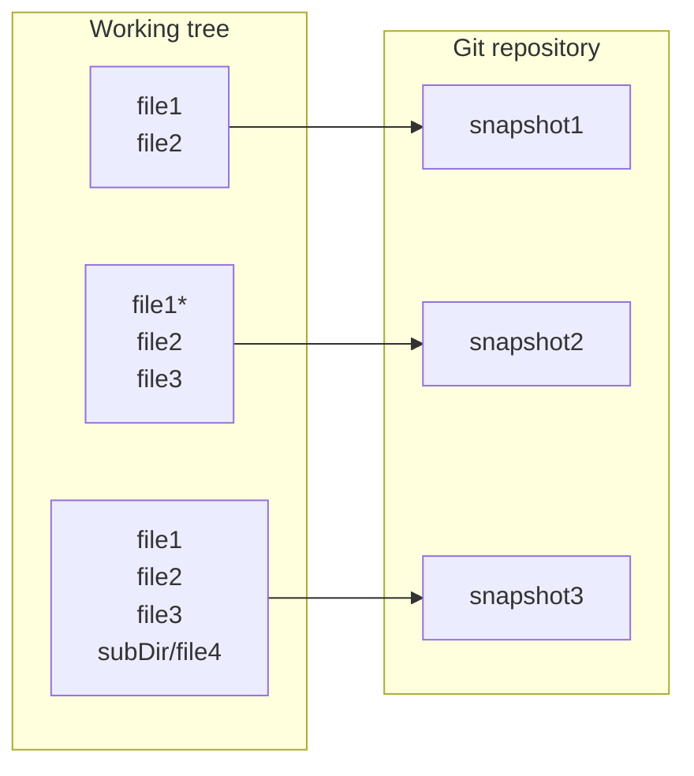

# Test suite

**Last update**: 20261003-2

#### 1. Rendering of native markdown tables

##### Example 1

| Student ID | #1   | #2   | #3   | #4   | #5   | #6   | #7   | #8   | #9   | #10  | Sum  |
| ---------- | :--- | :--- | :--- | :--- | :--- | :--- | :--- | :--- | :--- | :--- | :--- |
| 01234567   | 0.0  | 0.0  | 0.0  | 0.0  | 0.0  | 0.0  | 0.0  | 0.0  | 0.0  | 0.0  | 0.0  |
| 01234567   | 0.0  | 0.0  | 0.0  | 0.0  | 0.0  | 0.0  | 0.0  | 0.0  | 0.0  | 0.0  | 0.0  |
| 01234567   | 0.0  | 0.0  | 0.0  | 0.0  | 0.0  | 0.0  | 0.0  | 0.0  | 0.0  | 0.0  | 0.0  |
| 01234567   | 0.0  | 0.0  | 0.0  | 0.0  | 0.0  | 0.0  | 0.0  | 0.0  | 0.0  | 0.0  | 0.0  |

##### Example 2

| permission |  r   |  w   |  x   |  -   |
| :--------- | :--: | :--: | :--: | :--: |
| **value**  |  4   |  2   |  1   |  0   |


#### 2. Inlined mathematical formulas

The quadratic formula is $x = \frac{-b \pm \sqrt{b^2-4ac}}{2a}$. We all know that!


#### 3. Standalone mathematical formulas

The quadratic formula is:

$$
x = \frac{-b \pm \sqrt{b^2-4ac}}{2a}
$$

We all know that! 


#### 4. Resizing the figure size using the native html source code


#### 5. Mermaid diagrams




#### 6. Syntax highlighting


##### Bash
```bash
#!/bin/bash

echo "Welcome to PH8124 lecture"
# This is a comment...
echo "Today is:" 
date

return 
```

##### C
```C
#include <stdio.h>

int main() {
    printf("Hello, World!\n");
    return 0;
}
```

##### C++
```C++
#include <iostream>

int main() {
    std::cout << "Hello, World!" << std::endl;
    return 0;
}
```

##### make
```makefile
all : test1 test2
test1 : test1.C
	gcc test1.C -o test1 && echo "compilation of test1 succeeded"
	ls -alt test1
test2 : test2.C
	gcc test2.C -o test2 && echo "compilation of test2 succeeded"
	ls -alt test2	
run :
	./test1 && ./test2
clean :
	rm test1 test2
```

##### cmake

```cmake
cmake_minimum_required(VERSION 3.22)

set(Counter 0)
set(Max 4)
while(${Counter} LESS_EQUAL ${Max})

 # some message:
 message("Counter = ${Counter}")
 
 # increment (yes, this is the simplest syntax!):
 math(EXPR Counter ${Counter}+1)

endwhile()
```


#### 7. Special symbols

##### em-dash

* ```major``` &mdash; any backward incompatible change is introduced;
* ```minor``` &mdash; new backward compatible functionality is introduced;
* ```patch``` &mdash; new backward compatible fix (typically a minor bug fix) is introduced.

##### arows

a &rightarrow; b

a &Rightarrow; b
